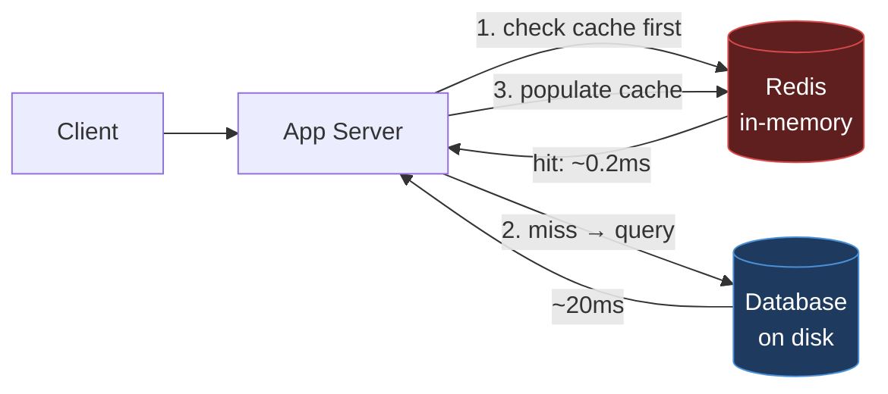

# Module 1.1 — What is Redis and why it exists

> **Goal:** Understand *what Redis actually is*, the problem it was built to solve, where
> it fits in a system, and how it differs from the databases and caches around it. This is
> the conceptual foundation everything else in the roadmap builds on.

---

## 1. The one-sentence definition

> **Redis is an in-memory data-structure store**, used as a **database**, **cache**,
> **message broker**, and **streaming engine**.

Unpack that phrase word by word, because every word is doing work:

- **In-memory** — the primary dataset lives in **RAM**, not on disk. This is the single
  biggest reason Redis is fast (microsecond-scale operations). Disk is used only for
  *persistence* (durability), not for serving reads.
- **Data-structure** — Redis doesn't just store opaque blobs by key. It stores **typed
  structures** — strings, lists, hashes, sets, sorted sets, streams — and gives you
  **operations** on them (e.g. "atomically increment this counter", "add to this sorted
  set and return the rank"). The server understands your data.
- **Store** — it's a server you talk to over the network; many clients share one logical
  dataset.

The name itself: **Redis = REmote DIctionary Server.** At its core it's a giant
dictionary (key → value) that you access remotely.

```
        ┌──────────────────────────────────────────────┐
        │                  REDIS SERVER                  │
        │  ┌────────────────────────────────────────┐   │
        │  │   Keyspace (one big dictionary in RAM)  │   │
        │  │                                          │   │
        │  │   "user:1"      → Hash   {name, email}   │   │
        │  │   "cart:42"     → List   [item, item]    │   │
        │  │   "leaderboard" → SortedSet {p1:99,...}  │   │
        │  │   "online"      → Set    {u1, u2, u3}    │   │
        │  │   "counter"     → String "1027"          │   │
        │  └────────────────────────────────────────┘   │
        └──────────────────────────────────────────────┘
              ▲            ▲             ▲
              │            │             │   (network: TCP, usually port 6379)
          App node     App node      App node
```

---

## 2. Why it exists — the problem it solves

Picture a typical web app backed by a relational database (Postgres, MySQL). It works,
until traffic grows and you notice:

1. **Reads are expensive.** Every page hits the DB; the DB does parsing, planning, disk
   I/O, locking. A query that takes 20 ms is fine once, deadly at 50,000 req/s.
2. **Some data is hot.** The same "top 10 products" or "user session" is read constantly.
   Re-computing or re-fetching it every time is wasteful.
3. **Some operations are awkward in SQL.** "Give me the global rank of player X by score",
   "atomically increment this counter under concurrency", "give me a queue", "expire this
   token in 15 minutes" — all clumsy or slow in a relational DB.

Redis answers all three:

- **Speed:** data in RAM + simple operations → **sub-millisecond latency**, hundreds of
  thousands of ops/sec on a single node.
- **Hot data:** put the hot subset in Redis as a **cache** in front of your DB.
- **Right tool for the job:** native **counters, queues, leaderboards, sets, TTLs** —
  operations that are first-class and atomic.



---

## 3. A tiny bit of history (and why it matters today)

- **2009** — Salvatore Sanfilippo ("antirez") created Redis to make a real-time analytics
  product fast. He needed flexible in-memory structures with persistence.
- It grew from a single-author project into one of the most popular databases in the world.
- **2024 licensing shake-up:** Redis Inc. changed the license from the permissive BSD to a
  source-available license (RSALv2 / SSPL). In response, the Linux Foundation forked the
  last BSD version into **Valkey**, which is now backed by AWS, Google, Oracle and others.
  Then in **2025**, Redis (from v8) re-added an open-source option (AGPLv3).
- **Practical takeaway:** "Redis" the protocol and data model is now implemented by
  multiple servers (Redis, Valkey, and others). Everything you learn in this roadmap —
  data types, RESP, replication, cluster — applies to **all of them**, because they share
  the same wire protocol and semantics. When this course says "Redis", read it as "Redis
  and Redis-compatible servers".

---

## 4. What Redis is *used as* (the four hats)

### 4.1 Cache (most common)
Sit Redis in front of a slower datastore. Store query results, rendered fragments,
sessions, with a **TTL** so stale data self-evicts. → Covered in depth in **Module 10**.

### 4.2 Primary database
With persistence (RDB/AOF — **Module 4**) and replication (**Module 6**), Redis can be the
system of record for data that fits in RAM and benefits from its structures: rate-limit
counters, feature flags, real-time leaderboards, presence/online state.

### 4.3 Message broker / queue
- **Pub/Sub** — fire-and-forget fan-out messaging (**Module 8.1**).
- **Lists** — simple work queues (you saw this in 2.2).
- **Streams** — durable, replayable logs with consumer groups, Kafka-like (**Module 8.2**).

### 4.4 Coordination layer
**Distributed locks**, **rate limiters**, **leader election helpers** — because Redis gives
you atomic operations and a single source of truth (**Module 9**).

---

## 5. What makes Redis *different* (the differentiators)

| Property | Why it matters |
|---|---|
| **In-memory first** | Microsecond ops; RAM is the dataset, disk is for durability only. |
| **Rich data structures** | Server-side operations, not just GET/SET of blobs. |
| **Single-threaded command execution** | Each command is atomic; no locks needed for "increment". (Module 1.3) |
| **Predictable low latency** | No query planner, no joins, simple O(1)/O(log n) ops. |
| **Versatile** | Cache + queue + DB + lock service in one tool. |
| **Simple protocol (RESP)** | Easy to implement clients; human-readable. (Module 1.4) |

---

## 6. Redis vs the neighbours

### Redis vs Memcached
| | **Redis** | **Memcached** |
|---|---|---|
| Data types | Many (lists, sets, hashes, sorted sets, streams…) | Strings/blobs only |
| Persistence | Yes (RDB/AOF) | No (pure cache) |
| Replication / HA | Yes (replicas, Sentinel, Cluster) | Limited |
| Threading | Single-threaded core (+ I/O threads) | Multi-threaded |
| Use when | You need structures, persistence, atomic ops | You need a dead-simple, multi-core memory cache |

### Redis vs a relational DB (Postgres/MySQL)
Not a replacement — a **complement**. RDBMS gives you durability, complex queries, joins,
transactions across rows, and disk-sized datasets. Redis gives you speed and structures for
the **hot path**. Most architectures use both: Redis in front, RDBMS as the source of truth.

### Redis vs Kafka
Both can move messages, but Kafka is a distributed, disk-based, high-throughput log built
for massive durable streaming pipelines. Redis Streams are lighter-weight and live
in-memory (with persistence). Detailed comparison in **Module 8.3**.

---

## 7. When NOT to use Redis (be honest)

- **Dataset far larger than RAM** and mostly cold — RAM is expensive; a disk-based DB is
  cheaper for cold bulk data.
- **You need complex ad-hoc queries / joins / strong relational integrity** — use an RDBMS.
- **You need full ACID across many keys with strict durability on every write** — Redis can
  get close (AOF `always`, `WAIT`), but it's not its sweet spot.
- **Huge individual values / huge collections ("big keys")** — these hurt a single-threaded
  server (Module 10.4).

---

## 8. Interview drills (junior → staff)

**Q1 (junior). What is Redis in one sentence?**
An in-memory data-structure store used as a cache, database, message broker, and streaming
engine — essentially a remote dictionary with rich typed values and atomic operations.

**Q2 (junior). Why is Redis so fast?**
Its primary dataset lives in RAM (no disk reads on the hot path), its operations are simple
and mostly O(1)/O(log n), and command execution is single-threaded so there's no locking
overhead.

**Q3 (mid). Redis vs Memcached — when would you pick each?**
Memcached for a simple, multi-threaded, blob-only memory cache. Redis when you need data
structures, persistence, replication/HA, TTLs, or atomic server-side operations.

**Q4 (mid). Is Redis a cache or a database?**
Both — it depends on configuration. With persistence and replication it can be a system of
record; most commonly it's deployed as a cache in front of a disk-based DB. The same engine
serves both roles.

**Q5 (senior). If Redis keeps everything in RAM, how can it be durable?**
RAM holds the working dataset; durability comes from persistence to disk — point-in-time
**RDB snapshots** and/or an append-only command log (**AOF**) — plus **replication** to other
nodes. The disk copy is for recovery, not for serving reads. (Details in Module 4.)

**Q6 (staff). Where does Redis fit in a large architecture, and what are its limits?**
As a low-latency layer for hot data and coordination: cache, sessions, counters, rate
limiters, queues, leaderboards, locks. Its limits stem from being in-memory and single-
threaded: dataset must fit (cost-effectively) in RAM, individual slow/big-key operations
can stall all clients, and it's not built for complex relational queries. Scale-out is via
replication (read scaling/HA) and Cluster (sharding), each with its own trade-offs (Modules
6 & 7).

---

## 9. Key takeaways

1. Redis = **in-memory, data-structure store** = a remote dictionary with typed values and
   atomic operations.
2. It exists to solve **latency**, **hot data**, and **awkward operations** that disk-based
   relational DBs handle poorly.
3. It wears four hats: **cache, database, message broker, coordination layer.**
4. It **complements** an RDBMS rather than replacing it.
5. "Redis" today means a family of compatible servers (Redis, Valkey, …) sharing one
   protocol and data model — everything here applies to all of them.

> **Next — 1.2 Installing & running Redis:** get a server up with Docker and start talking
> to it with `redis-cli`.
