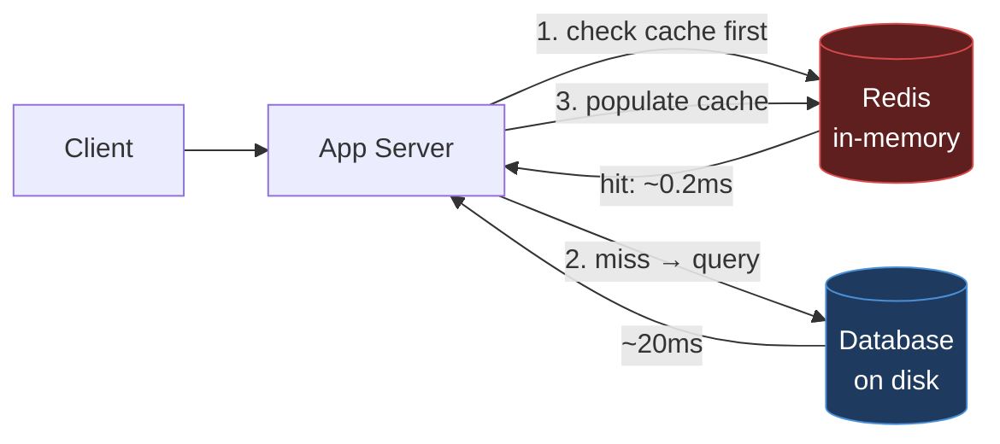

# Module 1.1 — What is Redis and why it exists

> **Goal:** Understand *what Redis actually is*, the problem it was built to solve, where
> it fits in a system, and how it differs from the databases and caches around it. This is
> the conceptual foundation everything else in the roadmap builds on.

---

## Section 1: The Big Picture

> **Redis is an in-memory data-structure store**, used as a **database**, **cache**,
> **message broker**, and **streaming engine**.

Unpack that phrase word by word, because every word is doing work:

- **In-memory** — the primary dataset lives in **RAM**, not on disk. This is the single
  biggest reason Redis is fast (microsecond-scale operations). Disk is used only for
  *persistence* (durability), not for serving reads.
- **Data-structure** — Redis doesn't just store opaque blobs by key. It stores **typed
  structures** — strings, lists, hashes, sets, sorted sets, streams — and gives you
  **operations** on them (e.g. "atomically increment this counter", "add to this sorted
  set and return the rank"). The server understands your data.
- **Store** — it's a server you talk to over the network; many clients share one logical
  dataset.

The name itself: **Redis = REmote DIctionary Server.** At its core it's a giant
dictionary (key → value) that you access remotely.

### Why it exists — the problem it solves

Picture a typical web app backed by a relational database (Postgres, MySQL). It works,
until traffic grows and you notice:

1. **Reads are expensive.** Every page hits the DB; the DB does parsing, planning, disk
   I/O, locking. A query that takes 20 ms is fine once, deadly at 50,000 req/s.
2. **Some data is hot.** The same "top 10 products" or "user session" is read constantly.
   Re-computing or re-fetching it every time is wasteful.
3. **Some operations are awkward in SQL.** "Give me the global rank of player X by score",
   "atomically increment this counter under concurrency", "give me a queue", "expire this
   token in 15 minutes" — all clumsy or slow in a relational DB.

Redis answers all three:

- **Speed:** data in RAM + simple operations → **sub-millisecond latency**, hundreds of
  thousands of ops/sec on a single node.
- **Hot data:** put the hot subset in Redis as a **cache** in front of your DB.
- **Right tool for the job:** native **counters, queues, leaderboards, sets, TTLs** —
  operations that are first-class and atomic.



### A tiny bit of history (and why it matters today)

- **2009** — Salvatore Sanfilippo ("antirez") created Redis to make a real-time analytics
  product fast. He needed flexible in-memory structures with persistence.
- It grew from a single-author project into one of the most popular databases in the world.
- **2024 licensing shake-up:** Redis Inc. changed the license from the permissive BSD to a
  source-available license (RSALv2 / SSPL). In response, the Linux Foundation forked the
  last BSD version into **Valkey**, which is now backed by AWS, Google, Oracle and others.
  Then in **2025**, Redis (from v8) re-added an open-source option (AGPLv3).
- **Practical takeaway:** "Redis" the protocol and data model is now implemented by
  multiple servers (Redis, Valkey, and others). Everything you learn in this roadmap —
  data types, RESP, replication, cluster — applies to **all of them**, because they share
  the same wire protocol and semantics. When this course says "Redis", read it as "Redis
  and Redis-compatible servers".

---

## Section 2: Mental Model

Think of Redis as a **super-powered whiteboard** shared by all your application servers:

- The whiteboard is in a room with the lights on (RAM) — you can read and write it in an instant.
- Your database is a filing cabinet in the basement (disk) — reliable, but slow to walk to.
- You copy the most-used pages from the filing cabinet onto the whiteboard so everyone can read them fast.
- When a page is no longer useful, it erases itself (TTL / expiry).

The whiteboard understands *what you're writing*. You can say "add 1 to this tally" or "keep only the top 10 scores" and the whiteboard does the work for you — you don't have to read the whole thing, modify it locally, and write it back.

### What Redis is *used as* (the four hats)

**Hat 1: Cache (most common)**
Sit Redis in front of a slower datastore. Store query results, rendered fragments,
sessions, with a **TTL** so stale data self-evicts. → Covered in depth in **Module 10**.

**Hat 2: Primary database**
With persistence (RDB/AOF — **Module 4**) and replication (**Module 6**), Redis can be the
system of record for data that fits in RAM and benefits from its structures: rate-limit
counters, feature flags, real-time leaderboards, presence/online state.

**Hat 3: Message broker / queue**
- **Pub/Sub** — fire-and-forget fan-out messaging (**Module 8.1**).
- **Lists** — simple work queues.
- **Streams** — durable, replayable logs with consumer groups, Kafka-like (**Module 8.2**).

**Hat 4: Coordination layer**
**Distributed locks**, **rate limiters**, **leader election helpers** — because Redis gives
you atomic operations and a single source of truth (**Module 9**).

### What makes Redis *different* (the differentiators)

| Property | Why it matters |
|---|---|
| **In-memory first** | Microsecond ops; RAM is the dataset, disk is for durability only. |
| **Rich data structures** | Server-side operations, not just GET/SET of blobs. |
| **Single-threaded command execution** | Each command is atomic; no locks needed for "increment". (Module 1.3) |
| **Predictable low latency** | No query planner, no joins, simple O(1)/O(log n) ops. |
| **Versatile** | Cache + queue + DB + lock service in one tool. |
| **Simple protocol (RESP)** | Easy to implement clients; human-readable. (Module 1.4) |

---

## Section 3: Practical Usage

### Redis vs the neighbours

**Redis vs Memcached**
| | **Redis** | **Memcached** |
|---|---|---|
| Data types | Many (lists, sets, hashes, sorted sets, streams…) | Strings/blobs only |
| Persistence | Yes (RDB/AOF) | No (pure cache) |
| Replication / HA | Yes (replicas, Sentinel, Cluster) | Limited |
| Threading | Single-threaded core (+ I/O threads) | Multi-threaded |
| Use when | You need structures, persistence, atomic ops | You need a dead-simple, multi-core memory cache |

**Redis vs a relational DB (Postgres/MySQL)**
Not a replacement — a **complement**. RDBMS gives you durability, complex queries, joins,
transactions across rows, and disk-sized datasets. Redis gives you speed and structures for
the **hot path**. Most architectures use both: Redis in front, RDBMS as the source of truth.

**Redis vs Kafka**
Both can move messages, but Kafka is a distributed, disk-based, high-throughput log built
for massive durable streaming pipelines. Redis Streams are lighter-weight and live
in-memory (with persistence). Detailed comparison in **Module 8.3**.

### Real-world use cases

| Workload | Redis role | Why Redis wins |
|---|---|---|
| User sessions | Primary DB (Hash per session, TTL) | Fast reads, automatic expiry |
| Leaderboards | Primary DB (Sorted Set) | `ZRANGEBYSCORE` gives rank in O(log n) |
| Rate limiting | Primary DB (counter + EXPIRE) | Atomic INCR + EXPIREAT in one roundtrip |
| Cache-aside | Cache (any type, TTL) | Offloads expensive DB queries |
| Job queues | Message broker (List + BLPOP) | Blocking pop, simple, no extra infra |
| Pub/Sub notifications | Message broker | Instant fan-out to N subscribers |
| Distributed locks | Coordination (SETNX + EXPIRE) | Atomic check-and-set semantics |
| Feature flags | Primary DB (Hash or Set) | Microsecond flag checks at scale |

---

## Section 4: Common Mistakes

### Mistake 1: Using `KEYS *` in production

```bash
# WRONG — blocks the entire server while it scans the keyspace
KEYS user:*

# RIGHT — cursor-based, non-blocking iteration
redis-cli --scan --pattern 'user:*'
# or in code:
SCAN 0 MATCH user:* COUNT 100
```

**Why it happens:** `KEYS *` is fine in development and convenient in a REPL. Engineers copy the habit to production scripts without realizing Redis is single-threaded — while `KEYS` runs (O(n) over all keys), every other client is frozen.

### Mistake 2: Treating Redis as your only database without enabling persistence

```bash
# WRONG — data vanishes on restart
docker run -d redis:7

# RIGHT — mount a volume and enable persistence
docker run -d -v redis-data:/data redis:7 redis-server --appendonly yes
```

**Why it happens:** Redis "just works" without persistence, and engineers don't notice data loss until they restart the container in staging and sessions/counters evaporate.

### Mistake 3: Not setting `maxmemory`

```conf
# WRONG — Redis will grow until the OS OOM-killer terminates it
# (default maxmemory is 0 = unlimited)

# RIGHT — always cap memory in production
maxmemory 2gb
maxmemory-policy allkeys-lru
```

**Why it happens:** Redis starts with no memory cap by default. Without a limit, a memory leak in your application (e.g., caching without TTLs) will eventually consume all server RAM and crash the process — or worse, cause the OS to kill other processes too.

### Mistake 4: Using numbered databases (SELECT) instead of key prefixes

```bash
# WRONG — numbered DBs don't work in Cluster mode, and provide no real isolation
SELECT 3
SET user:1 "alice"

# RIGHT — namespace with prefixes, always in DB 0
SET app:users:1 "alice"
SET cache:users:1 "alice"
```

**Why it happens:** Redis has 16 logical DBs (0–15). Engineers use them for "dev/staging/prod separation" locally, then discover that Redis Cluster only supports DB 0, breaking the pattern at scale.

### Mistake 5: Caching without TTLs

```bash
# WRONG — this key lives forever, consuming memory indefinitely
SET rendered:homepage "<html>..."

# RIGHT — always set a TTL on cached data
SET rendered:homepage "<html>..." EX 300
# or
SETEX rendered:homepage 300 "<html>..."
```

**Why it happens:** Developers forget that caches need expiration. Keys accumulate over time as the underlying data changes but the cached copies never evict.

### Mistake 6: Storing huge values (big keys)

```bash
# WRONG — storing a 10 MB serialized object as a single key
SET user:1:full-data <10MB JSON blob>

# RIGHT — break it into a Hash with fields, or store only what you need
HSET user:1 name "Alice" email "alice@example.com" plan "pro"
```

**Why it happens:** Redis makes it trivially easy to store anything. A single `SET` of a huge value ties up the single-threaded server for milliseconds during serialization/deserialization, stalling all other clients.

---

## Section 5: Production Considerations

### When NOT to use Redis

Be honest about Redis's limits before committing to it:

- **Dataset far larger than RAM** and mostly cold — RAM is expensive; a disk-based DB is cheaper for cold bulk data. Redis is for hot data only.
- **You need complex ad-hoc queries / joins / strong relational integrity** — use an RDBMS. Redis has no query language; you get exactly the operations each data structure supports.
- **You need full ACID across many keys with strict durability on every write** — Redis can approach this (AOF `always`, `WAIT`), but it's not its sweet spot. Postgres or a RDBMS is better here.
- **Huge individual values / huge collections ("big keys")** — these hurt a single-threaded server. A 10 MB value or a list with 1 million elements requires care.
- **Compliance requires encrypted-at-rest data** — Redis doesn't encrypt data at rest natively; you need Redis Enterprise or an alternative solution.

### Memory management

Redis memory management requires active attention in production:

```conf
maxmemory 2gb                    # hard cap — ALWAYS set this
maxmemory-policy allkeys-lru     # eviction policy when cap is hit
maxmemory-samples 10             # LRU sample size (higher = more accurate, slower)
```

**Eviction policies** (choose based on your use case):
| Policy | When evicted data was last used | Good for |
|---|---|---|
| `noeviction` | Never — returns error instead | When you can't afford silent data loss |
| `allkeys-lru` | Least recently used key | General-purpose cache |
| `volatile-lru` | LRU among keys with TTLs | Mixed cache + permanent data |
| `allkeys-random` | Random key | Uniform access patterns |
| `volatile-ttl` | Key with shortest TTL | When you control which data is most expendable |

### Single-threaded limitations

Redis processes commands one at a time in a single thread. This means:
- A single slow command (`KEYS *`, `LRANGE list 0 -1` on a huge list, Lua scripts) **blocks all clients**.
- Throughput is bounded by single-core CPU speed on the command-processing path.
- Redis 6+ added I/O threading for reading/writing network data, but command execution is still single-threaded.

**Mitigation:**
- Avoid O(n) operations on large collections.
- Use `SCAN` instead of `KEYS`.
- Keep Lua scripts short and fast.
- Split workloads across multiple Redis instances if CPU is the bottleneck.

### High availability concerns

A standalone Redis node is a **single point of failure**. Production deployments need:

- **Redis Sentinel** — monitors a primary + replicas, promotes a replica automatically on failure. Simple HA for most use cases. (Module 6)
- **Redis Cluster** — automatic sharding across nodes + HA. Required when data doesn't fit in RAM on one machine. (Module 7)
- **Managed services** (ElastiCache, Upstash, Redis Cloud) — offload HA and ops overhead.

### Persistence vs performance trade-off

| Configuration | Durability | Throughput impact |
|---|---|---|
| No persistence | None — data lost on restart | Fastest |
| RDB snapshots only | Up to minutes of data lost | Low impact (background fork) |
| AOF `everysec` | At most 1 second of data lost | Moderate impact |
| AOF `always` | No data loss | Significant throughput reduction |

Choosing persistence is a business decision: how much data loss can your application tolerate?

---

## Section 6: Internals Deep Dive

### The dictionary-of-dictionaries architecture

Redis's internal structure is simpler than most people expect:

```
redisServer
└── databases[]           (array of redisDb, default 16)
    └── redisDb
        ├── dict *dict    (the main keyspace: key → robj*)
        └── dict *expires (parallel dict: key → expiry timestamp)
```

Every key in the keyspace is a **sds string** (Simple Dynamic String — Redis's own string type). Every value is a **redisObject** (`robj`) — a wrapper that knows the object's type (string, list, hash, etc.), encoding (ziplist, hashtable, skiplist, etc.), and refcount.

```c
typedef struct redisObject {
    unsigned type:4;       // REDIS_STRING, REDIS_LIST, REDIS_HASH, etc.
    unsigned encoding:4;   // OBJ_ENCODING_ZIPLIST, OBJ_ENCODING_HT, etc.
    unsigned lru:LRU_BITS; // LRU clock for eviction
    int refcount;          // reference counting for memory sharing
    void *ptr;             // pointer to the actual data
} robj;
```

### How keys map to structures

When you do `SET user:1 "alice"`:
1. Redis hashes the key `"user:1"` using a hash function (djb2/siphash) to find the bucket in the keyspace dict.
2. Creates an `robj` with type=string, encoding=embstr (for short strings ≤44 bytes) or raw.
3. Stores the pointer in the dict.

When you do `HSET user:1 name "alice"`:
1. Creates an `robj` with type=hash.
2. For small hashes (≤128 fields, values ≤64 bytes), encoding is **listpack** (compact, memory-efficient).
3. When either limit is exceeded, Redis converts to a **hashtable** encoding automatically.

### Encoding transitions (automatic, transparent)

Redis silently upgrades encodings as data grows:

| Data type | Small encoding | Large encoding | Trigger |
|---|---|---|---|
| String | embstr (≤44 bytes) | raw sds | length > 44 |
| List | listpack | quicklist | > 128 elements or element > 64 bytes |
| Hash | listpack | hashtable | > 128 fields or field > 64 bytes |
| Set | listpack / intset | hashtable | > 128 members or non-integer |
| Sorted Set | listpack | skiplist + hashtable | > 128 members or member > 64 bytes |

This is how Redis achieves both memory efficiency at small scales and O(log n) performance at large scales.

---

## Section 7: Visual Diagrams

### The Redis keyspace

```
        ┌──────────────────────────────────────────────┐
        │                  REDIS SERVER                  │
        │  ┌────────────────────────────────────────┐   │
        │  │   Keyspace (one big dictionary in RAM)  │   │
        │  │                                          │   │
        │  │   "user:1"      → Hash   {name, email}   │   │
        │  │   "cart:42"     → List   [item, item]    │   │
        │  │   "leaderboard" → SortedSet {p1:99,...}  │   │
        │  │   "online"      → Set    {u1, u2, u3}    │   │
        │  │   "counter"     → String "1027"          │   │
        │  └────────────────────────────────────────┘   │
        └──────────────────────────────────────────────┘
              ▲            ▲             ▲
              │            │             │   (network: TCP, usually port 6379)
          App node     App node      App node
```

### Redis as a caching layer in front of a database

```
  ┌─────────┐        ┌─────────────┐        ┌──────────────────┐
  │ Client  │──────► │  App Server │──1──►  │  Redis (cache)   │
  └─────────┘        └─────────────┘        │  ~0.2ms latency  │
                            ▲               └──────────────────┘
                            │                        │
                            │           miss (2)     │ hit (1b)
                            │                        ▼
                            │               ┌──────────────────┐
                            └───────────────│  Database (disk) │
                                  (3)       │  ~20ms latency   │
                                populate    └──────────────────┘
                                  cache
```

### Redis internal object model

```
  redisDb
  ┌─────────────────────────────┐
  │ dict *dict (keyspace)       │
  │  ┌──────────────────────┐   │
  │  │ "user:1" ──────────► │ robj { type=HASH, enc=listpack, ptr → [...] }
  │  │ "counter" ─────────► │ robj { type=STRING, enc=int, val=1027 }
  │  │ "leaderboard" ─────► │ robj { type=ZSET, enc=skiplist, ptr → [...] }
  │  └──────────────────────┘   │
  │                             │
  │ dict *expires               │
  │  ┌──────────────────────┐   │
  │  │ "session:abc" ──────►│ 1704067200  (unix timestamp)
  │  └──────────────────────┘   │
  └─────────────────────────────┘
```

### The four hats of Redis

```
                          ┌─────────────┐
                          │    REDIS    │
                          └──────┬──────┘
              ┌───────────┬──────┴──────┬───────────┐
              ▼           ▼             ▼           ▼
         ┌─────────┐ ┌─────────┐ ┌──────────┐ ┌─────────────┐
         │  Cache  │ │Primary  │ │ Message  │ │Coordination │
         │         │ │   DB    │ │  Broker  │ │   Layer     │
         │Sessions │ │Counters │ │ Pub/Sub  │ │  Locks      │
         │Results  │ │Flags    │ │ Streams  │ │  Rate limit │
         │Fragments│ │Rankings │ │ Queues   │ │  Leader     │
         └─────────┘ └─────────┘ └──────────┘ └─────────────┘
```

---

## Section 8: Interview Questions

**Q1 (junior). What is Redis in one sentence?**
An in-memory data-structure store used as a cache, database, message broker, and streaming
engine — essentially a remote dictionary with rich typed values and atomic operations.

**Q2 (junior). Why is Redis so fast?**
Its primary dataset lives in RAM (no disk reads on the hot path), its operations are simple
and mostly O(1)/O(log n), and command execution is single-threaded so there's no locking
overhead.

**Q3 (mid). Redis vs Memcached — when would you pick each?**
Memcached for a simple, multi-threaded, blob-only memory cache. Redis when you need data
structures, persistence, replication/HA, TTLs, or atomic server-side operations.

**Q4 (mid). Is Redis a cache or a database?**
Both — it depends on configuration. With persistence and replication it can be a system of
record; most commonly it's deployed as a cache in front of a disk-based DB. The same engine
serves both roles.

**Q5 (senior). If Redis keeps everything in RAM, how can it be durable?**
RAM holds the working dataset; durability comes from persistence to disk — point-in-time
**RDB snapshots** and/or an append-only command log (**AOF**) — plus **replication** to other
nodes. The disk copy is for recovery, not for serving reads. (Details in Module 4.)

**Q6 (senior). What happens when Redis hits its maxmemory limit?**
Redis applies the configured `maxmemory-policy`. With `noeviction`, new writes return errors. With `allkeys-lru`, Redis evicts the least recently used keys to make room. Without a maxmemory limit, Redis grows until the OS OOM-killer terminates it.

**Q7 (staff). Where does Redis fit in a large architecture, and what are its limits?**
As a low-latency layer for hot data and coordination: cache, sessions, counters, rate
limiters, queues, leaderboards, locks. Its limits stem from being in-memory and single-
threaded: dataset must fit (cost-effectively) in RAM, individual slow/big-key operations
can stall all clients, and it's not built for complex relational queries. Scale-out is via
replication (read scaling/HA) and Cluster (sharding), each with its own trade-offs (Modules
6 & 7).

**Q8 (staff). How does Redis decide which encoding to use for a data structure?**
Redis automatically chooses between a compact encoding (listpack, intset, embstr) and a
full-featured one (hashtable, skiplist, raw sds) based on element count and element size
thresholds configured in `redis.conf` (e.g., `hash-max-listpack-entries 128`). The compact
encoding saves memory at small scales; the full encoding preserves O(log n) performance at
large scales. Transitions happen transparently when thresholds are exceeded and are
one-directional (compact → full, never back).

---

## Section 9: Key Takeaways

### Must Know as a Redis User

1. Redis = **in-memory, data-structure store** = a remote dictionary with typed values and
   atomic operations.
2. It exists to solve **latency**, **hot data**, and **awkward operations** that disk-based
   relational DBs handle poorly.
3. It wears four hats: **cache, database, message broker, coordination layer.**
4. It **complements** an RDBMS rather than replacing it. Use Redis for hot data, RDBMS for the source of truth.
5. **Never use `KEYS *` in production** — it blocks the single-threaded server. Use `SCAN` instead.
6. **Always set `maxmemory`** — without it, Redis grows until the OS kills it.
7. **Always set TTLs on cached data** — keys without TTLs accumulate forever.

### Should Know as a Senior Engineer

1. Redis's single-threaded command execution makes every command atomic but means one slow command stalls all clients.
2. Without `maxmemory` configured, Redis will consume all available RAM and the OS OOM-killer will terminate it.
3. Numbered DBs (`SELECT`) are a trap: they don't work in Cluster mode. Use key prefixes instead.
4. Persistence (RDB/AOF) is a durability/performance trade-off — choose based on how much data loss your application can tolerate.
5. "Redis" today means a family of compatible servers (Redis, Valkey, …) sharing one protocol and data model — everything here applies to all of them.
6. Redis Sentinel provides HA for a single shard; Redis Cluster provides sharding + HA. Know which you need before building.

### Nice To Know as a Redis Contributor

1. Every key is an **sds string**; every value is an **robj** (redisObject) with type, encoding, LRU bits, refcount, and a pointer to data.
2. Each `redisDb` has two parallel dicts: the keyspace dict and an expires dict (stores TTL timestamps separately, so non-expiring keys pay no overhead).
3. Encoding transitions (listpack → hashtable, etc.) happen transparently when element count or size exceeds a threshold — they are one-directional and never reversed.
4. The `lru` field in `robj` is only 24 bits and stores a coarse-grained timestamp (seconds), not a precise access time. LRU eviction is approximate by design.
5. Small integers (0–9999) are stored as shared objects — a global array of pre-allocated robj pointers — so multiple keys pointing to the same integer share one object in memory.

> **Next — 1.2 Installing & running Redis:** get a server up with Docker and start talking
> to it with `redis-cli`.
