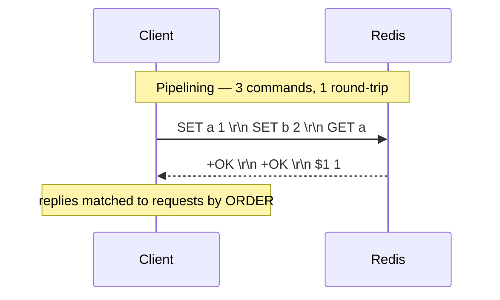

# Module 1.4 — The RESP protocol

> **Goal:** Understand exactly how bytes flow between a client and Redis. RESP (REdis
> Serialization Protocol) is deliberately simple — you can read it by eye and even speak it
> by hand over a raw socket. Knowing it demystifies clients, pipelining, and debugging.

---

## 1. Why a custom protocol at all?

Redis needed a wire format that is:
- **Simple to implement** — so client libraries exist for every language.
- **Fast to parse** — prefix each value with its length so no scanning/guessing.
- **Human-readable** — you can debug it with `telnet`/`nc`.
- **Binary-safe** — values can contain *any* bytes (including `\r\n` and nulls), because
  lengths are explicit.

The result is **RESP**. There are two versions in the wild:
- **RESP2** — the classic, universal protocol.
- **RESP3** — introduced in Redis 6; adds richer types (maps, sets, doubles, booleans,
  big numbers, push messages). Opt in per connection with the `HELLO 3` command.

---

## 2. The structure of a RESP message

Every RESP value starts with **one type byte**, followed by data, and (almost always) ends
with **`\r\n`** (carriage-return + line-feed, often written CRLF).

### RESP2 data types

| First byte | Type | Example (with `\r\n` shown) |
|---|---|---|
| `+` | **Simple String** | `+OK\r\n` |
| `-` | **Error** | `-ERR unknown command\r\n` |
| `:` | **Integer** | `:1000\r\n` |
| `$` | **Bulk String** (length-prefixed, binary-safe) | `$5\r\nhello\r\n` |
| `*` | **Array** (length-prefixed list of values) | `*2\r\n$3\r\nfoo\r\n$3\r\nbar\r\n` |

### RESP3 adds (selected)
| First byte | Type |
|---|---|
| `_` | Null (`_\r\n`) |
| `#` | Boolean (`#t\r\n` / `#f\r\n`) |
| `,` | Double (`,3.14\r\n`) |
| `(` | Big number |
| `%` | Map (e.g. `HGETALL` returns a real map, not a flat array) |
| `~` | Set |
| `>` | Push (out-of-band messages, e.g. Pub/Sub, client-side caching) |

---

## 3. Reading the special length values

Two sentinel forms you must recognize:

```
Null Bulk String (RESP2):   $-1\r\n      → "key does not exist" (GET on a missing key)
Null Array (RESP2):         *-1\r\n      → e.g. BLPOP timeout with nothing
Empty Bulk String:          $0\r\n\r\n   → an actual empty string ""
```
The length prefix is *why* RESP is binary-safe: a bulk string says "`$5`, here come exactly
5 bytes" — those 5 bytes can be anything, including `\r\n` or `\0`.

---

## 4. Requests: the client → server format

A command sent by a client is **always an Array of Bulk Strings** (one bulk string per
argument). This uniform encoding is sometimes called the *unified request protocol*.

`SET name Yatharth` becomes, on the wire:

```
*3\r\n              ← array of 3 elements (the 3 words)
$3\r\n              ← next bulk string is 3 bytes
SET\r\n
$4\r\n              ← next bulk string is 4 bytes
name\r\n
$8\r\n              ← next bulk string is 8 bytes
Yatharth\r\n
```

Annotated visually:

```
   *3        → "I'm sending a command with 3 parts"
   $3 SET    → part 1: 3-byte string "SET"
   $4 name   → part 2: 4-byte string "name"
   $8 Yatharth → part 3: 8-byte string "Yatharth"
```

And the server replies with a single RESP value:
```
+OK\r\n
```

---

## 5. Worked round-trips

```
CLIENT SENDS                          SERVER REPLIES         MEANING
─────────────────────────────────    ──────────────────     ─────────────────
*1 $4 PING                            +PONG\r\n              simple string
*3 $3 SET $1 k $1 v                   +OK\r\n                simple string
*2 $3 GET $1 k                        $1\r\nv\r\n            bulk string "v"
*2 $3 GET $7 missing                  $-1\r\n                null → key absent
*2 $4 INCR $3 cnt                     :1\r\n                 integer 1
*1 $7 INVALIDX                        -ERR unknown command... error
*2 $6 LRANGE ...  (returns [a,b])     *2\r\n$1\r\na\r\n$1\r\nb\r\n   array of 2 bulks
```

You can literally do this by hand:
```bash
# Talk raw RESP to Redis with netcat:
$ printf '*1\r\n$4\r\nPING\r\n' | nc localhost 6379
+PONG
```

---

## 6. Inline commands (the human shortcut)

For interactive convenience (e.g. via `telnet`), Redis also accepts **inline commands** —
just type the command and hit enter:
```
PING\r\n        → +PONG
```
This is a fallback for humans; real client libraries always use the array-of-bulk-strings
form because it's binary-safe and unambiguous.

---

## 7. How RESP enables pipelining

Because RESP is just a stream of length-prefixed messages with no required "turn-taking",
a client can **send many requests back-to-back without waiting** for each reply, then read
all the replies in order. That's **pipelining** (deep dive in Module 3.5).

```
   Without pipelining (RTT-bound):        With pipelining (1 RTT):
   ───────────────────────────────        ─────────────────────────
   send CMD1 ──►                           send CMD1 CMD2 CMD3 ──►
        ◄── reply1   (wait a round-trip)        ◄── reply1 reply2 reply3
   send CMD2 ──►
        ◄── reply2
   send CMD3 ──►
        ◄── reply3
   3 network round-trips                   1 network round-trip
```

RESP makes this trivial: the server reads commands as fast as they arrive and queues
replies; the client matches replies to requests **by order** (replies come back in the
exact order requests were sent).



---

## 8. RESP2 vs RESP3 in practice

```bash
127.0.0.1:6379> HELLO 3          # upgrade this connection to RESP3
# ... server returns its capabilities ...
127.0.0.1:6379> HGETALL myhash
# RESP2: flat array  [f1, v1, f2, v2]   (client must pair them up)
# RESP3: a real map  {f1: v1, f2: v2}   (typed map reply)
```
RESP3 benefits: typed replies (maps/sets/doubles/booleans), and **push messages** (`>`)
that enable features like **client-side caching** (server proactively tells the client
"this key changed"). Most modern clients negotiate RESP3 automatically; RESP2 remains the
safe default for compatibility.

---

## 9. Interview drills

**Q1 (junior). What does RESP stand for and what is it?**
REdis Serialization Protocol — the simple, length-prefixed, human-readable wire format
clients and Redis use to exchange commands and replies over TCP.

**Q2 (junior). What are the five RESP2 types and their prefix bytes?**
Simple String `+`, Error `-`, Integer `:`, Bulk String `$`, Array `*`.

**Q3 (mid). How is a command like `SET k v` encoded on the wire?**
As an array of bulk strings: `*3\r\n$3\r\nSET\r\n$1\r\nk\r\n$1\r\nv\r\n`.

**Q4 (mid). Why is RESP "binary-safe", and what does `$-1\r\n` mean?**
Bulk strings are length-prefixed (`$5` then exactly 5 bytes), so the payload can contain any
bytes including `\r\n` or nulls — no escaping needed. `$-1\r\n` is a null bulk string,
meaning "no value" (e.g. `GET` on a missing key).

**Q5 (senior). How does RESP make pipelining possible, and how are replies matched to
requests?**
RESP is a continuous stream of self-delimiting (length-prefixed) messages with no mandatory
request/response handshake, so a client can write many commands before reading any replies.
The server replies in the **same order** requests arrived, so the client matches by
position — no IDs needed.

**Q6 (staff). What does RESP3 add over RESP2 and why does it matter?**
Richer, typed replies (maps, sets, doubles, booleans, big numbers, nulls) so clients don't
have to infer structure from flat arrays, and out-of-band **push** messages (`>`). Push
enables server-initiated notifications such as client-side caching invalidations and cleaner
Pub/Sub. It's negotiated per-connection via `HELLO 3`, preserving RESP2 compatibility.

---

## 10. Key takeaways
1. RESP = simple, **length-prefixed**, **binary-safe**, human-readable wire protocol.
2. RESP2 types: `+` simple string, `-` error, `:` integer, `$` bulk string, `*` array.
3. **Requests are always arrays of bulk strings**; replies are a single RESP value.
4. Length prefixes make it binary-safe and **enable pipelining** (replies matched by order).
5. `$-1\r\n`/`*-1\r\n` = null; `RESP3` (via `HELLO 3`) adds typed maps/sets/doubles and push.

> **Next — 1.5 The event loop & I/O multiplexing:** how one thread juggles thousands of
> these RESP connections at once.
