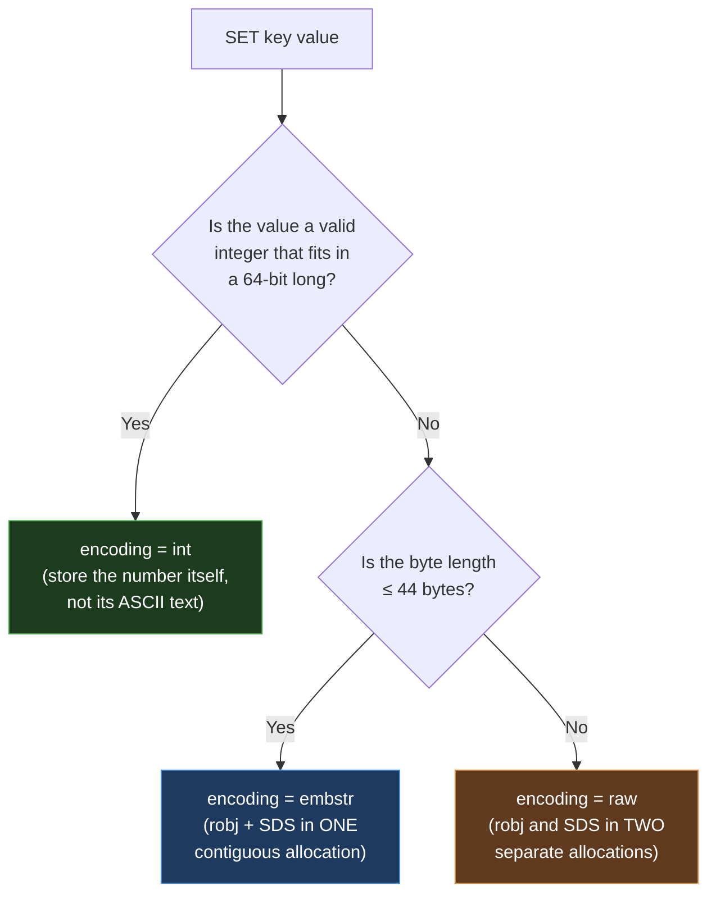

# Module 2.1 — Redis Strings (`int` / `embstr` / `raw` encodings)

---

## Section 1: The Big Picture

A Redis String is the most fundamental Redis type — it is the value that sits behind every key. Despite the name, it is not limited to text. A Redis String is a **binary-safe sequence of bytes**, up to **512 MB**, and it can hold anything: UTF-8 text, a JSON blob, a serialized protobuf, a JPEG, a UUID, an integer, or raw binary data.

Strings are universal. They are the value type behind:

- **Caching**: the most common Redis use case. Store a computed result with a TTL and skip recomputation on cache hit.
- **Session storage**: serialize a session object, store it under a session ID key with a rolling TTL.
- **Atomic counters**: page views, API rate limits, inventory levels, unique ID generation — all backed by integer-encoded Strings and `INCR`.
- **Feature flags and configuration**: store `"on"` or `"off"` under a feature key; read it in microseconds from any service.
- **Distributed lock primitive**: the `SET key value NX EX seconds` pattern is the canonical building block for acquiring a lock atomically.
- **Bitmaps**: a String viewed as a bit array enables compact boolean tracking (e.g., "did user N log in today?") using `SETBIT`/`GETBIT`/`BITCOUNT`.

Every other Redis type (Hash, List, Set, Sorted Set, Stream) stores its values as Strings internally. Mastering Strings means mastering the foundation of the entire type system.

---

## Section 2: Mental Model

Think of Redis as a **global dictionary** — a massive key-value store shared across your entire application. A String is just a variable in that dictionary: a name (the key) pointing to a blob of bytes (the value).

```
   key                 value (a String = up to 512 MB of arbitrary bytes)
   ─────────────       ───────────────────────────────────────────────
   "user:1:name"  ──►  "Yatharth"
   "counter"      ──►  "1027"              (looks like text, stored as an int)
   "session:abc"  ──►  "{\"uid\":1,\"role\":\"admin\"}"   (JSON blob)
   "avatar:7"     ──►  <raw JPEG bytes>    (binary-safe!)
```

The key insight is that a Redis String does not care what is inside it. It stores the **length** of its value explicitly, rather than relying on a null terminator like C strings do. This means any byte — including `\0` — can appear anywhere in the value. **Binary-safe** means there are no special characters, no escaping needed, and no surprises with embedded nulls.

> **One-line intuition:** *A Redis String is just a length + bytes. Everything else — counters, locks, caches — is a convention layered on top.*

The mental model for how the three internal representations work is also simple:

- If the value is a whole number, Redis stores the **actual number**, not its text representation.
- If the value is short text, Redis stores it **inline with the object header** in one contiguous memory block.
- If the value is long or has been modified, Redis stores it in a **separate memory buffer** pointed to by the object.

You never choose this — Redis selects the encoding automatically and it affects performance, not behavior.

---

## Section 3: Practical Usage

### Basic get/set

| Command | Meaning | Big-O |
|---|---|---|
| `SET key value [EX s] [PX ms] [NX\|XX] [GET] [KEEPTTL]` | Set a string (with options) | O(1) |
| `GET key` | Get the value | O(1) |
| `GETDEL key` | Get and delete atomically | O(1) |
| `GETEX key [EX s]` | Get and refresh a TTL | O(1) |
| `MSET k v [k v ...]` / `MGET k [k ...]` | Multi set / get | O(N) |
| `STRLEN key` | Byte length of the value | O(1) |
| `APPEND key value` | Append bytes; returns new length | O(1) amortized |

The modern `SET` is a Swiss-army knife — its options replace several old commands:

```bash
SET k v EX 60          # set with a 60-second TTL      (replaces SETEX)
SET k v PX 1500        # TTL in milliseconds           (replaces PSETEX)
SET k v NX             # set only if NOT exists         (replaces SETNX)
SET k v XX             # set only if it ALREADY exists
SET k v KEEPTTL        # overwrite value but keep the existing TTL
SET k v GET            # set new value, return the OLD value (replaces GETSET)
```

### Atomic counters

Strings that look like integers or floats can be incremented atomically:

| Command | Meaning |
|---|---|
| `INCR key` / `DECR key` | +1 / −1 |
| `INCRBY key n` / `DECRBY key n` | ± n (integer) |
| `INCRBYFLOAT key f` | ± f (float) |

```bash
127.0.0.1:6379> SET views 0
OK
127.0.0.1:6379> INCR views
(integer) 1
127.0.0.1:6379> INCRBY views 10
(integer) 11
127.0.0.1:6379> INCRBYFLOAT price 19.99
"19.99"
```

Because Redis executes commands on a single thread, `INCR` is an **atomic counter with no locks**. Concurrent increments from many clients cannot lose updates. `INCR` on a missing key treats it as `0` first — handy for self-initializing counters.

### Substring and range operations

| Command | Meaning |
|---|---|
| `GETRANGE key start end` | Substring (supports negative indices) |
| `SETRANGE key offset value` | Overwrite bytes starting at `offset` (zero-pads gaps) |

```bash
127.0.0.1:6379> SET msg "Hello World"
127.0.0.1:6379> GETRANGE msg 0 4
"Hello"
127.0.0.1:6379> GETRANGE msg -5 -1
"World"
```

### Bit operations (the string-as-bit-array view)

A String is also a bit array — `SETBIT`/`GETBIT`/`BITCOUNT`/`BITOP`/`BITPOS`/`BITFIELD`. This is the foundation of Bitmaps (Module 2.7). A single 512 MB string can track 4 billion bits — e.g. "did user N do X today?" in ~megabytes.

### Pattern: Caching a value with expiry (the #1 use case)

```bash
SET user:1:profile "{...json...}" EX 300        # cache for 5 minutes
GET user:1:profile
```

Always set a TTL on cached values. A String without a TTL lives forever and becomes a memory leak unless you explicitly delete it.

### Pattern: Atomic counter and rate limiter

```bash
INCR  api:calls:user:1
EXPIRE api:calls:user:1 60        # do both atomically via Lua / pipeline — Module 9.3
```

For a proper rate limiter, use a Lua script or pipeline to ensure `INCR` and `EXPIRE` are applied together. If the process crashes between the two commands, the key will never expire.

### Pattern: Distributed lock primitive

```bash
SET lock:resource <unique-token> NX EX 30     # acquire only if free, auto-expire in 30s
# release safely with a Lua compare-and-delete (Module 9.1)
```

`SET NX EX` is atomic: the key is created **only if it does not exist**, and the TTL is set **in the same command**. This is the canonical primitive. The token must be unique per caller so only the lock holder can release it.

### Pattern: Unique ID generation

```bash
INCR global:order:id        # monotonic, atomic, gap-free per instance
```

Simple, fast, and safe. Each call returns a unique integer. If you need distributed uniqueness across shards, UUID generation client-side or Snowflake IDs are better fits.

### Pattern: Feature flags and configuration

```bash
SET feature:new_checkout "on"
GET feature:new_checkout
```

Millisecond read latency, instantly updated across all application instances, no cache invalidation needed.

### Inspecting keys in production

```bash
OBJECT ENCODING key      # int / embstr / raw
STRLEN key               # byte length (O(1))
MEMORY USAGE key         # total bytes including overhead
TYPE key                 # "string"
TTL key / PTTL key       # remaining life
```

---

## Section 4: Common Mistakes

### Storing huge JSON blobs as a single String (the big key problem)

```bash
# WRONG: a 2 MB JSON object for a user profile
SET user:1:profile "{...2 MB of nested JSON...}"
GET user:1:profile     # Redis serializes 2 MB on every read, blocking all clients
```

```bash
# RIGHT: split into a Hash so you can read individual fields
HSET user:1 name "Yatharth" plan "pro" avatar_url "..."
HGET user:1 name       # fetch only what you need
```

Redis is single-threaded. A `GET` on a 200 MB value serializes all 200 MB through the event loop, blocking every other client for the duration. The threshold where this becomes noticeable is a few hundred KB. Values in the single-digit MB range will cause visible latency spikes. Values above 10 MB are a serious operational risk.

### Using INCR on a non-integer value

```bash
SET name "alice"
INCR name
# ERR value is not an integer or out of range
```

`INCR`/`INCRBY`/`DECR` only work on Strings that contain a valid decimal integer. `INCRBYFLOAT` works on integers and floats. Calling `INCR` on anything else returns an error. Validate your data before calling numeric operations.

### Not using NX for a distributed lock — race condition

```bash
# WRONG: two separate commands allow a race between them
GET lock:resource       # check: is it free?
SET lock:resource token # set: acquire it
# another client can slip in between GET and SET and both think they hold the lock
```

```bash
# RIGHT: atomic acquire in one command
SET lock:resource <unique-token> NX EX 30
# Returns OK only to the winner; no race possible
```

Always use `SET NX EX` as a single atomic command. Never check-then-set with two separate commands.

### APPEND in a tight loop growing unbounded

```bash
# WRONG: appending forever without any size check
while true:
    APPEND log:stream new_event    # the key grows forever
```

```bash
# RIGHT: use a capped List or rotate to a new key
LPUSH log:stream new_event
LTRIM log:stream 0 9999    # keep only the last 10,000 entries
```

`APPEND` grows the String without limit. In a high-throughput loop this can easily produce a multi-hundred-MB key. Monitor key sizes with `MEMORY USAGE` and cap growth explicitly.

### Forgetting that embstr is immutable — APPEND promotes to raw

```bash
SET s "hello"
OBJECT ENCODING s
# "embstr"

APPEND s "!"
OBJECT ENCODING s
# "raw"   ← promoted, even though it's only 6 bytes
```

Any modification to an `embstr`-encoded String promotes it to `raw`, even if the result is still short. This is by design: embstr is optimized for set-once short values. If you are building values incrementally with `APPEND`, expect `raw` encoding.

### Using SET without EX for cache values (memory leak)

```bash
# WRONG: cached value with no expiry
SET user:1:profile "{...}"

# RIGHT: always set a TTL for cache values
SET user:1:profile "{...}" EX 300
```

A String with no TTL lives until explicitly deleted. In a caching use case this means memory grows unboundedly as new users are cached but old ones are never evicted. Always set a TTL for cache keys. Use `GETEX` to refresh the TTL on a read without a separate `EXPIRE` call.

---

## Section 5: Production Considerations

### The big key problem

The most dangerous String anti-pattern in production is the **big key**: a single String whose value is hundreds of KB to hundreds of MB. Effects:

- Every `GET` blocks the event loop for the duration of serialization.
- Every `SET` can cause a large `realloc` on the `raw`-encoded SDS buffer.
- In Redis Cluster, big keys cause uneven shard memory distribution.
- Replication must ship the full value on every write.
- `DEBUG SLEEP`-free monitoring tools like `redis-cli --bigkeys` will flag them.

The practical threshold: treat any String value over **1 MB** as a candidate for redesign. Values over **10 MB** are a serious risk.

### Memory usage per key

Every String key has overhead beyond the value bytes. The total memory for a key is approximately:

- ~50–70 bytes for the Redis object header and dict entry
- The key string itself (in its own SDS buffer)
- The value SDS buffer (or just the embedded int)

Use `MEMORY USAGE key` to see the true total. For `embstr`-encoded values (≤ 44 bytes) the object and value share one 64-byte allocator chunk — highly efficient. For `raw` and large values, you pay for two allocations plus whatever the allocator wastes to alignment.

### Key expiry patterns

- For cache values: always use `EX` or `PX` on `SET`.
- For rolling sessions: use `GETEX` to refresh the TTL on each read without a round-trip.
- For rate limit counters: use `SET key 0 EX window_seconds` to initialize, then `INCR`. Or use a Lua script that sets the TTL only if the key is new.
- Use `TTL key` and `PTTL key` to inspect remaining lifetime in seconds and milliseconds respectively.

### Monitoring with MEMORY USAGE

```bash
MEMORY USAGE key              # bytes consumed by this key (key + value + overhead)
MEMORY USAGE key SAMPLES 0   # exact measurement, no sampling
```

Run `redis-cli --bigkeys` to scan for the largest keys by type — it uses `SCAN` internally so it does not block the server. Set up alerts for keys above your threshold (e.g., 1 MB per String).

### Performance cheat-sheet

| Operation | Complexity |
|---|---|
| `GET` / `SET` / `STRLEN` / `INCR` / `GETDEL` | **O(1)** |
| `APPEND` / `SETRANGE` | **O(1) amortized** (SDS over-allocates) |
| `GETRANGE` | O(N) of the returned slice |
| `MGET` / `MSET` | O(N) of keys |
| `SETBIT` / `GETBIT` | O(1); `BITCOUNT`/`BITOP` O(N) over bytes |

### Failure modes

- **Large value serialization**: a single large `GET`/`SET` can stall all clients. Monitor p99 latency per command, not just average.
- **OOM from TTL-less cache keys**: if cache keys never expire and your eviction policy is `noeviction`, you will get OOM errors. Use `allkeys-lru` or `volatile-lru` and always set TTLs.
- **INCR overflow**: `INCR` operates on a 64-bit signed integer. The maximum value is 9,223,372,036,854,775,807. Exceeding it returns an error. In practice, this is only a concern for counters that increment billions of times.

---

## Section 6: Internals Deep Dive

### Why Redis does not use C strings

Before understanding SDS, understand what problem it solves.

A C string is a `char[]` ending in a `\0` byte. This design has two fundamental flaws for a database:

1. **Not binary-safe**: you cannot store a `\0` byte in the middle of a C string — it would be interpreted as the end of the string. You cannot store arbitrary binary data (images, protobufs, encrypted bytes) in a C string.
2. **`strlen` is O(n)**: to find the length of a C string you scan every byte until you hit `\0`. For a Redis that answers millions of `STRLEN` requests per second, O(n) length lookup is unacceptable.

**SDS (Simple Dynamic String)** solves both problems by storing metadata in a **header** in front of the bytes.

### SDS structure

```
   An SDS value in memory:

   ┌──────────┬──────────┬────────────┬─────────────────────────────┬──────┐
   │   len    │  alloc   │   flags    │         buf[] (the bytes)    │  \0   │
   │ (used    │ (capacity│ (header    │  "Hello"                     │ (kept │
   │  bytes)  │  bytes)  │  type)     │                              │  for  │
   │          │          │            │                              │ C-lib │
   └──────────┴──────────┴────────────┴─────────────────────────────┴──────┘
        header (variable size)            ▲ the pointer Redis hands around
                                          │ points HERE (at buf), so SDS is
                                          │ a drop-in for char* in C funcs,
                                          │ yet len/alloc sit just behind it.
```

Why this matters:
- **`len` is stored** → `STRLEN` is **O(1)** (no scanning), and the data is **binary-safe** (embedded `\0` is fine — length tells the boundary, not a terminator).
- **`alloc` (capacity)** → SDS can **over-allocate** so `APPEND`/`SETRANGE` don't reallocate every time → O(1) amortized growth.
- **`flags`** → SDS has several header sizes (`sdshdr5/8/16/32/64`) so a tiny string uses a tiny header (1–2 bytes) while a huge string uses a bigger one — memory-efficient across scales.
- The trailing `\0` is kept as a courtesy so the buffer can be passed to C string functions for text values — but Redis never relies on it for length.

### The three encodings

`OBJECT ENCODING key` reveals which of three internal representations a String uses. Redis picks automatically based on the **content** and **length**.



**`int` encoding**

If the value is an integer that fits in a `long` (64-bit), Redis stores the **actual integer** in the object, not its text. `SET n 12345` stores the number `12345` (8 bytes) rather than the 5 ASCII characters. Bonus: Redis keeps a **shared pool of small integer objects** (0–9999 by default), so `SET a 100; SET b 100` can both point at the *same* shared object — near-zero memory for common small numbers. This is also what makes `INCR` cheap.

```bash
127.0.0.1:6379> SET n 12345
127.0.0.1:6379> OBJECT ENCODING n
"int"
```

**`embstr` encoding**

For short, non-integer strings (**≤ 44 bytes**), Redis allocates the object header (`robj`) and the SDS **together in a single contiguous block of memory**. One `malloc`, one `free`, and great cache locality (the metadata and bytes sit side by side).

```bash
127.0.0.1:6379> SET s "hello"
127.0.0.1:6379> OBJECT ENCODING s
"embstr"
```

> **Why 44?** It is tuned so the whole `robj` + SDS header + bytes + trailing `\0` fits neatly inside a 64-byte memory allocator chunk — minimizing wasted space and fragmentation.

**`raw` encoding**

For longer strings (**> 44 bytes**), Redis allocates the `robj` and the SDS **separately** (two allocations; the object holds a pointer to the SDS). Necessary for big or growing values.

```bash
127.0.0.1:6379> SET big "<a string longer than 44 bytes ........................>"
127.0.0.1:6379> OBJECT ENCODING big
"raw"
```

### Encoding transitions (one-way)

- `embstr` is treated as **immutable**: any modification (`APPEND`, `SETRANGE`) converts the value to `raw`, even if the result is still short. embstr is optimized for set-once short values.
- An `int`-encoded value becomes `raw`/`embstr` the moment you make it non-numeric (e.g. `APPEND`).
- Encodings **never downgrade** back — this is a consistent pattern across all Redis types.

```bash
127.0.0.1:6379> SET s "hi"
127.0.0.1:6379> OBJECT ENCODING s
"embstr"
127.0.0.1:6379> APPEND s "!"          # mutating → promotes to raw
(integer) 3
127.0.0.1:6379> OBJECT ENCODING s
"raw"
```

| Encoding | When | Memory layout |
|---|---|---|
| `int` | Value is a 64-bit integer | The integer stored in the object (small ones shared) |
| `embstr` | Non-int, **≤ 44 bytes**, set-once | `robj` + SDS in **one** allocation |
| `raw` | Non-int, **> 44 bytes**, or mutated | `robj` + SDS in **two** allocations |

---

## Section 7: Visual Diagrams

### SDS memory layout

```
   C string (NOT what Redis uses):
   ┌───┬───┬───┬───┬───┬────┐
   │ H │ e │ l │ l │ o │ \0 │
   └───┴───┴───┴───┴───┴────┘
   strlen = scan to find \0, O(n). Can't store \0 inside. Not binary-safe.

   SDS (what Redis uses):
   ┌────────┬────────┬───────┬───┬───┬───┬───┬───┬────┐
   │  len=5 │alloc=8 │ flags │ H │ e │ l │ l │ o │ \0 │
   └────────┴────────┴───────┴───┴───┴───┴───┴───┴────┘
   header ──────────────────►│◄── buf[] pointer lives here
   strlen = O(1) read from len field. Binary-safe. Amortized O(1) append.
```

### Encoding decision flowchart

```
   SET key "value"
         │
         ▼
   Is value a valid 64-bit integer?
         │
    YES ─┼─ NO
         │         │
         ▼         ▼
      encoding   len(value) ≤ 44 bytes?
       = int          │
    (or shared    YES ─┼─ NO
     pool for          │         │
     0–9999)           ▼         ▼
                  encoding   encoding
                  = embstr   = raw
                  (robj+SDS  (robj and
                   in ONE    SDS in TWO
                   malloc)   mallocs)

   Transitions (ONE-WAY — encodings never downgrade):
   int ──(APPEND/non-numeric)──► raw or embstr
   embstr ──(ANY modification)──► raw
   raw: stays raw
```

### embstr vs raw memory layout

```
   embstr (≤ 44 bytes): one contiguous 64-byte allocator chunk
   ┌──────────────────────────────────────────────────────────────┐
   │  robj header (16 bytes) │ SDS header │ bytes... │ \0 │ pad  │
   └──────────────────────────────────────────────────────────────┘
   └────────────────── 64 bytes total ──────────────────────────┘
   One malloc. One free. Excellent cache locality.

   raw (> 44 bytes or mutated): two separate allocations
   ┌──────────────────────┐       ┌──────────────────────────┐
   │  robj header (16 b)  │──ptr──►  SDS header │ bytes...   │
   └──────────────────────┘       └──────────────────────────┘
   Two mallocs. Two frees. SDS can grow independently.
```

---

## Section 8: Interview Questions

**Q1 (junior). What can a Redis String hold, and how big can it get?**

Any binary-safe sequence of bytes — text, JSON, numbers, images — up to 512 MB.

**Q2 (junior). How do you set a key that expires in 60 seconds, only if it doesn't already exist?**

`SET key value NX EX 60`. The `NX` flag makes the set conditional (only if not exists) and `EX 60` sets the TTL, all in one atomic command.

**Q3 (mid). Why are `INCR`/`STRLEN` O(1) and how is `INCR` safe under concurrency?**

Length is stored in the SDS header (no scan needed), so `STRLEN` reads a field. Integer-encoded strings store the actual number, so `INCR` is arithmetic on a stored `long`. Safety comes from single-threaded execution — `INCR` runs atomically, so concurrent increments from multiple clients cannot lose updates.

**Q4 (mid). What is SDS and why doesn't Redis use C strings?**

SDS (Simple Dynamic String) stores `len`, `alloc` (capacity), and `flags` in a header in front of the bytes. This makes strings binary-safe (embedded nulls are fine), `STRLEN` O(1), and appends O(1) amortized via over-allocation — none of which C's null-terminated strings provide.

**Q5 (senior). Explain the three String encodings and when Redis picks each.**

`int` for values that are valid 64-bit integers (stores the number itself; small ints 0–9999 are shared objects). `embstr` for short non-integer strings (≤ 44 bytes), where the object header and SDS are allocated as one contiguous block for locality and a single malloc/free. `raw` for strings > 44 bytes or any string that has been mutated, with the header and SDS in separate allocations. `embstr` is immutable — a write promotes it to `raw` — and encodings never downgrade.

**Q6 (senior). Why is the embstr/raw boundary 44 bytes?**

It is chosen so the `robj` + SDS header + the string bytes + trailing null fit within a 64-byte allocator chunk, keeping short strings to a single, fragmentation-friendly allocation. Beyond 44 bytes they no longer fit in that 64-byte chunk, so Redis switches to the two-allocation `raw` form.

**Q7 (staff). You see high memory and latency from a key holding a 200 MB JSON blob updated frequently. Diagnose and redesign.**

This is the big-key anti-pattern. Each `GET`/`SET` serializes 200 MB through the single-threaded engine and the network, stalling all other clients. `APPEND`/rewrite churns large `raw` allocations and drives up fragmentation. Redesign: store structured data in a **Hash** so individual fields can be read and written with `HGET`/`HSET`; split or paginate large collections; consider client-side compression before storing; and if the value is truly a large immutable document, question whether Redis is the right store for it — object storage or a document database may be a better fit.

---

## Section 9: Key Takeaways

### Must Know as a Redis User

- A String is a **binary-safe byte sequence up to 512 MB** — the universal value type. Use it for caching, counters, sessions, feature flags, and distributed lock primitives.
- Atomic numeric ops (`INCR`/`INCRBY`/`INCRBYFLOAT`) require no locks and are safe under any concurrency.
- **`SET key value NX EX seconds`** is the canonical distributed lock primitive — atomic, safe, with automatic TTL release.
- **Always set a TTL on cache values** (`EX` / `PX` on `SET`, or use `GETEX` to refresh on read). A String with no TTL lives forever.
- Beware **big keys** — any String value larger than a few hundred KB warrants scrutiny. Values over 1 MB can cause visible latency spikes for all clients.

### Should Know as a Senior Engineer

- Redis uses **SDS (Simple Dynamic String)** rather than C strings. SDS stores `len`/`alloc`/`flags` in a header, making `STRLEN` O(1), `APPEND` O(1) amortized, and the value binary-safe.
- Three encodings, auto-selected: **`int`** (numeric, shared pool for 0–9999), **`embstr`** (≤ 44 bytes, single 64-byte allocation, set-once), **`raw`** (> 44 bytes or mutated, two allocations). Transitions are one-way — encodings never downgrade.
- `embstr` is immutable. Any modification (`APPEND`, `SETRANGE`) promotes it to `raw` regardless of the resulting size. Build values incrementally and expect `raw` encoding.
- Monitor key memory with `MEMORY USAGE key` and scan for big keys with `redis-cli --bigkeys`.

### Nice To Know as a Redis Contributor

- The 44-byte `embstr` boundary is tuned so `robj` (16 bytes) + SDS header (3 bytes) + 44 bytes of data + 1 null terminator = 64 bytes exactly — fitting a common jemalloc size class to minimize wasted space.
- The shared integer pool (0–9999) means multiple keys holding the same small integer share one object in memory — effectively free memory for common counter values.
- SDS has five header types (`sdshdr5`, `sdshdr8`, `sdshdr16`, `sdshdr32`, `sdshdr64`) sized by the maximum string length they support. A tiny string uses a 1-byte header, a huge string uses a 4-byte header — memory-efficient across the full size range.
- The `flags` byte in every SDS header encodes both the header type and, for `sdshdr5`, doubles as storage for the length itself — a single byte storing both metadata and data for strings up to 31 bytes.

> **Next — 2.3 Hashes (`listpack` → `hashtable`):** when your "value" is itself a set of field→value pairs, and the same small-vs-large encoding story from Lists returns.
