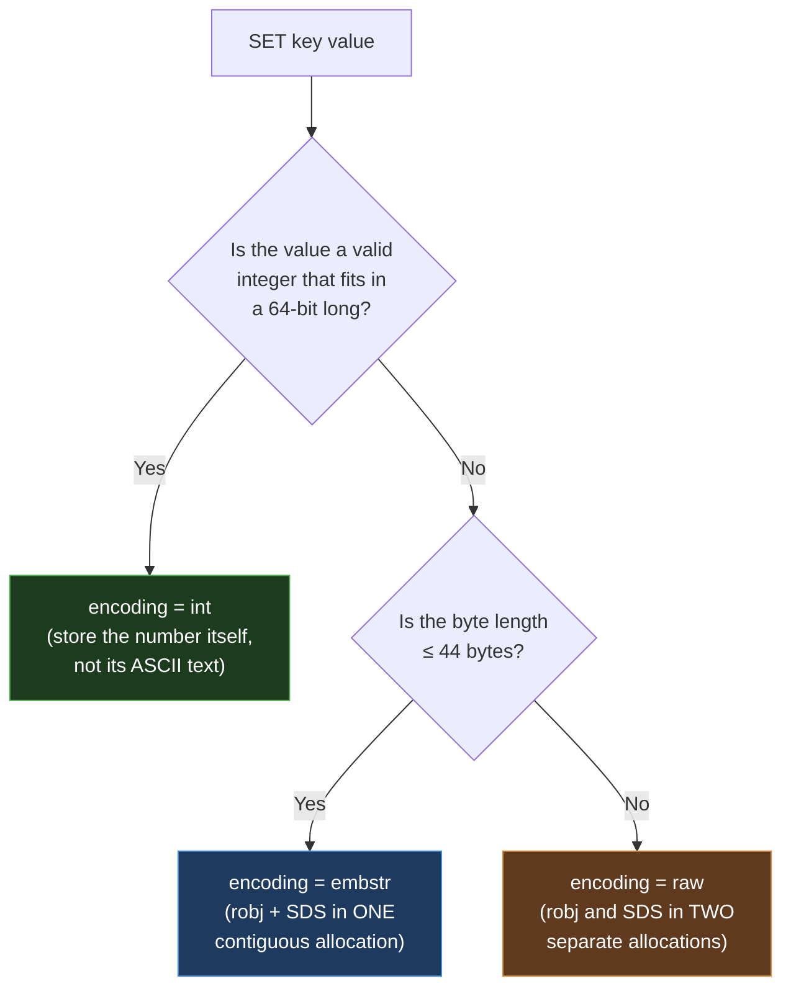

# Module 2.1 — Redis Strings (`int` / `embstr` / `raw` encodings)

> **Goal:** Master the most fundamental Redis type. Strings look trivial (`SET`/`GET`) but
> underpin everything — they're the value type behind counters, bitmaps, caches, and even
> the field-values inside other structures. We'll go from the command surface down to the
> **SDS** byte layout and the three encodings (`int`, `embstr`, `raw`) that Redis chooses
> between automatically.

---

## 1. The mental model

A Redis String is a **binary-safe sequence of bytes**, up to **512 MB**, stored under a key.

"Binary-safe" is the key phrase: a String can hold **anything** — UTF-8 text, a JSON blob,
a JPEG, a serialized protobuf, a number — because Redis stores the **length** explicitly and
never treats any byte as special (no null-terminator assumptions like C strings). It's the
universal "value" type.

```
   key                 value (a String = up to 512MB of arbitrary bytes)
   ─────────────       ───────────────────────────────────────────────
   "user:1:name"  ──►  "Yatharth"
   "counter"      ──►  "1027"              (looks like text, stored as an int — see §5)
   "session:abc"  ──►  "{\"uid\":1,\"role\":\"admin\"}"   (JSON blob)
   "avatar:7"     ──►  <raw JPEG bytes>    (binary-safe!)
```

> **One-line intuition:** *"A Redis String is just bytes + a length. Everything else is a
> convention layered on top."*

---

## 2. The command surface

### 2.1 Basic get/set
| Command | Meaning | Big-O |
|---|---|---|
| `SET key value [EX s] [PX ms] [NX|XX] [GET] [KEEPTTL]` | Set a string (with options) | O(1) |
| `GET key` | Get the value | O(1) |
| `GETDEL key` | Get and delete atomically | O(1) |
| `GETEX key [EX s]` | Get and set/refresh a TTL | O(1) |
| `MSET k v [k v ...]` / `MGET k [k ...]` | Multi set / get | O(N) |
| `STRLEN key` | Byte length of the value | O(1) |
| `APPEND key value` | Append; returns new length | O(1) amortized |

The modern `SET` is a Swiss-army knife — its options replace several old commands:
```bash
SET k v EX 60          # set with a 60-second TTL      (replaces SETEX)
SET k v PX 1500        # TTL in milliseconds           (replaces PSETEX)
SET k v NX             # set only if NOT exists         (replaces SETNX)
SET k v XX             # set only if it ALREADY exists
SET k v KEEPTTL        # overwrite value but keep the existing TTL
SET k v GET            # set new value, return the OLD value (replaces GETSET)
```
`SET key value NX EX 30` is the canonical building block of a **distributed lock**
(Module 9.1) — atomically "create this key only if absent, with a 30s safety expiry".

### 2.2 Numbers (atomic counters)
Strings that *look* like integers/floats can be incremented atomically:
| Command | Meaning |
|---|---|
| `INCR key` / `DECR key` | +1 / −1 |
| `INCRBY key n` / `DECRBY key n` | ± n (integer) |
| `INCRBYFLOAT key f` | ± f (float) |

```bash
127.0.0.1:6379> SET views 0
OK
127.0.0.1:6379> INCR views
(integer) 1
127.0.0.1:6379> INCRBY views 10
(integer) 11
127.0.0.1:6379> INCRBYFLOAT price 19.99
"19.99"
```
Because execution is single-threaded (Module 1.3), these are **atomic counters with no
locks** — the canonical use case for page views, rate-limit counters, ID generation, stock
levels, etc. `INCR` on a missing key treats it as `0` first.

> ⚠️ `INCR` errors with `ERR value is not an integer` if the string isn't a valid integer.

### 2.3 Substrings & ranges
| Command | Meaning |
|---|---|
| `GETRANGE key start end` | Substring (supports negative indices) |
| `SETRANGE key offset value` | Overwrite bytes starting at `offset` (zero-pads gaps) |

```bash
127.0.0.1:6379> SET msg "Hello World"
127.0.0.1:6379> GETRANGE msg 0 4
"Hello"
127.0.0.1:6379> GETRANGE msg -5 -1
"World"
```

### 2.4 Bit operations (the string-as-bit-array view)
A String is also a bit array — `SETBIT`/`GETBIT`/`BITCOUNT`/`BITOP`/`BITPOS`/`BITFIELD`.
This is the foundation of **Bitmaps** (covered in Module 2.7). A single 512 MB string can
track 4 billion bits — e.g. "did user N do X today?" in ~megabytes.

---

## 3. Internals — Strings are backed by **SDS**

Redis does **not** use C's null-terminated strings internally. It uses its own type, **SDS
(Simple Dynamic String)**. Understanding SDS explains why Strings are binary-safe and why
`STRLEN`/`APPEND` are fast.

A C string is `char[]` ending in `\0`. Problems: you can't store a `\0` in the middle
(not binary-safe), and `strlen` is O(n) (it scans for `\0`). SDS fixes both by storing
**metadata in a header** in front of the bytes:

```
   An SDS value in memory:

   ┌──────────┬──────────┬────────────┬─────────────────────────────┬──────┐
   │   len    │  alloc   │   flags    │         buf[] (the bytes)    │  \0   │
   │ (used    │ (capacity│ (header    │  "Hello"                     │ (kept │
   │  bytes)  │  bytes)  │  type)     │                              │  for  │
   │          │          │            │                              │ C-lib │
   └──────────┴──────────┴────────────┴─────────────────────────────┴──────┘
        header (variable size)            ▲ the pointer Redis hands around
                                          │ points HERE (at buf), so SDS is
                                          │ a drop-in for char* in C funcs,
                                          │ yet len/alloc sit just behind it.
```

Why this matters:
- **`len` is stored** → `STRLEN` is **O(1)** (no scanning), and the data is **binary-safe**
  (embedded `\0` is fine — length tells the boundary, not a terminator).
- **`alloc` (capacity)** → SDS can **over-allocate** so `APPEND`/`SETRANGE` don't reallocate
  every time → O(1) amortized growth.
- **`flags`** → SDS has several header sizes (`sdshdr5/8/16/32/64`) so a tiny string uses a
  tiny header (1–2 bytes) while a huge string uses a bigger one — memory-efficient across
  scales.
- The trailing `\0` is kept as a courtesy so the buffer can be passed to C string functions
  for *text* values — but Redis never relies on it for length.

---

## 4. The three encodings

`OBJECT ENCODING key` reveals which of three internal representations a String uses. Redis
picks automatically based on the **content** and **length**.



### 4.1 `int`
If the value is an integer that fits in a `long` (64-bit), Redis stores the **actual integer**
in the object, not its text. `SET n 12345` stores the number `12345` (8 bytes) rather than
the 5 ASCII characters. Bonus: Redis keeps a **shared pool of small integer objects**
(0–9999 by default), so `SET a 100; SET b 100` can both point at the *same* shared object —
near-zero memory for common small numbers. This is also what makes `INCR` cheap.

```bash
127.0.0.1:6379> SET n 12345
127.0.0.1:6379> OBJECT ENCODING n
"int"
```

### 4.2 `embstr` (embedded string)
For short, non-integer strings (**≤ 44 bytes**), Redis allocates the object header (`robj`)
and the SDS **together in a single contiguous block of memory**. One `malloc`, one `free`,
and great cache locality (the metadata and bytes sit side by side).

```bash
127.0.0.1:6379> SET s "hello"
127.0.0.1:6379> OBJECT ENCODING s
"embstr"
```

> **Why 44?** It's tuned so the whole `robj` + SDS header + bytes + trailing `\0` fits
> neatly inside a 64-byte memory allocator chunk — minimizing wasted space and fragmentation.

### 4.3 `raw`
For longer strings (**> 44 bytes**), Redis allocates the `robj` and the SDS **separately**
(two allocations, the object holds a pointer to the SDS). Necessary for big/growing values.

```bash
127.0.0.1:6379> SET big "<a string longer than 44 bytes ........................>"
127.0.0.1:6379> OBJECT ENCODING big
"raw"
```

### 4.4 Encoding transitions (one-way, like everywhere in Redis)
- `embstr` is treated as **immutable**: any modification (`APPEND`, `SETRANGE`) converts the
  value to `raw`, even if it's still short. (embstr is optimized for set-once short values.)
- An `int`-encoded value becomes `raw`/`embstr` the moment you make it non-numeric
  (e.g. `APPEND`).
- Encodings **don't downgrade** back (consistent with the Lists ratchet from 2.2).

```bash
127.0.0.1:6379> SET s "hi"
127.0.0.1:6379> OBJECT ENCODING s
"embstr"
127.0.0.1:6379> APPEND s "!"          # mutating → promotes to raw
(integer) 3
127.0.0.1:6379> OBJECT ENCODING s
"raw"
```

| Encoding | When | Memory layout |
|---|---|---|
| `int` | Value is a 64-bit integer | The integer stored in the object (small ones shared) |
| `embstr` | Non-int, **≤ 44 bytes**, set-once | `robj` + SDS in **one** allocation |
| `raw` | Non-int, **> 44 bytes**, or mutated | `robj` + SDS in **two** allocations |

---

## 5. Performance cheat-sheet

| Operation | Complexity |
|---|---|
| `GET` / `SET` / `STRLEN` / `INCR` / `GETDEL` | **O(1)** |
| `APPEND` / `SETRANGE` | **O(1) amortized** (SDS over-allocates) |
| `GETRANGE` | O(N) of the returned slice |
| `MGET` / `MSET` | O(N) of keys |
| `SETBIT` / `GETBIT` | O(1); `BITCOUNT`/`BITOP` O(N) over bytes |

**Footguns:**
- A single String can be **512 MB** — but a multi-hundred-MB value is a **big key**: every
  `GET` serializes the whole thing through the single thread and the network. Keep values
  small; don't stuff giant blobs in Redis (Module 10.4).
- `APPEND` in a tight loop can grow a value without bound — cap it.
- `INCR` on a non-integer string errors — validate inputs.

---

## 6. Patterns & real-world recipes

### 6.1 Caching a value with expiry (the #1 use)
```bash
SET user:1:profile "{...json...}" EX 300        # cache for 5 minutes
GET user:1:profile
```

### 6.2 Atomic counter / rate limiter primitive
```bash
INCR  api:calls:user:1
EXPIRE api:calls:user:1 60        # (do both atomically via Lua / pipeline — Module 9.3)
```

### 6.3 Distributed lock primitive
```bash
SET lock:resource <token> NX EX 30     # acquire only if free, auto-expire
# release safely with a Lua compare-and-delete (Module 9.1)
```

### 6.4 Unique ID generation
```bash
INCR global:order:id        # monotonic, atomic, gap-free per instance
```

### 6.5 Feature flag / config
```bash
SET feature:new_checkout "on"
GET feature:new_checkout
```

---

## 7. Inspecting in production
```bash
OBJECT ENCODING key      # int / embstr / raw
STRLEN key               # byte length (O(1))
MEMORY USAGE key         # total bytes incl. overhead
TYPE key                 # "string"
TTL key / PTTL key       # remaining life
```

---

## 8. Interview drills

**Q1 (junior). What can a Redis String hold, and how big can it get?**
Any binary-safe sequence of bytes — text, JSON, numbers, images — up to 512 MB.

**Q2 (junior). How do you set a key that expires in 60 seconds, only if it doesn't already
exist?**
`SET key value NX EX 60`.

**Q3 (mid). Why are `INCR`/`STRLEN` O(1) and how is `INCR` safe under concurrency?**
Length is stored in the SDS header (no scan), and integer-encoded strings store the number
directly, so increment is arithmetic on a stored long. Safety comes from single-threaded
execution — `INCR` runs atomically, so concurrent increments can't lose updates.

**Q4 (mid). What is SDS and why doesn't Redis use C strings?**
SDS (Simple Dynamic String) stores `len`, `alloc` (capacity), and `flags` in a header in
front of the bytes. This makes strings binary-safe (embedded nulls OK), `STRLEN` O(1), and
appends O(1) amortized via over-allocation — none of which C's null-terminated strings give
you.

**Q5 (senior). Explain the three String encodings and when Redis picks each.**
`int` for values that are valid 64-bit integers (stores the number itself; small ints are
shared objects). `embstr` for short non-integer strings (≤ 44 bytes), where the object
header and SDS are allocated as one contiguous block for locality and a single malloc/free.
`raw` for strings > 44 bytes or any string that's been mutated, with the header and SDS in
separate allocations. embstr is immutable — a write promotes it to raw — and encodings never
downgrade.

**Q6 (senior). Why is the embstr/raw boundary 44 bytes?**
It's chosen so the `robj` + SDS header + the string bytes + trailing null fit within a
64-byte allocator chunk, keeping short strings to a single, fragmentation-friendly
allocation. Beyond that they no longer fit, so Redis switches to the two-allocation `raw`
form.

**Q7 (staff). You see high memory and latency from a key holding a 200 MB JSON blob updated
frequently. Diagnose and redesign.**
It's a big-key anti-pattern: each `GET`/`SET` serializes 200 MB through the single-threaded
engine and the network, stalling all clients, and `APPEND`/rewrite churns large `raw`
allocations and fragmentation. Redesign: store structured data in a **Hash** so you can read/
write individual fields (`HGET`/`HSET`) instead of the whole blob; split or paginate large
collections; keep individual values small; consider compression client-side; and if it's
truly a large document store, question whether Redis is the right home for it at all.

---

## 9. Key takeaways
1. A String is a **binary-safe byte sequence up to 512 MB** — the universal value type.
2. Backed by **SDS** (header with `len`/`alloc`/`flags`) → binary-safe, O(1) length, O(1)
   amortized append.
3. Three encodings, auto-selected: **`int`** (numeric, shared small ints), **`embstr`**
   (≤ 44 bytes, single allocation), **`raw`** (> 44 bytes or mutated, two allocations).
   One-way transitions.
4. Atomic numeric ops (`INCR`/`INCRBY`/`INCRBYFLOAT`) make Strings perfect for counters,
   IDs, rate limits, and lock primitives (`SET NX EX`).
5. Beware **big-key** strings — they block the single thread on every access.

> **Next — 2.3 Hashes (`listpack` → `hashtable`):** when your "value" is itself a set of
> field→value pairs, and the same small-vs-large encoding story from Lists returns.
