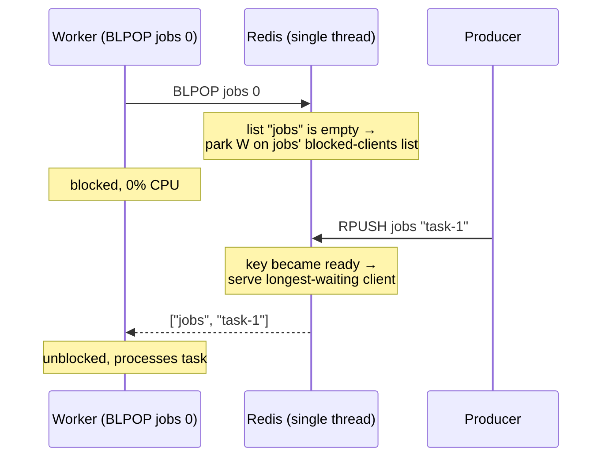
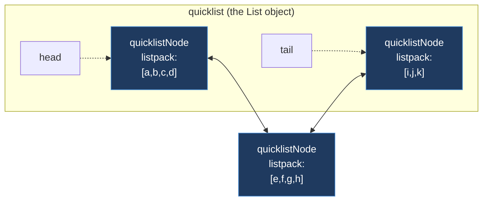
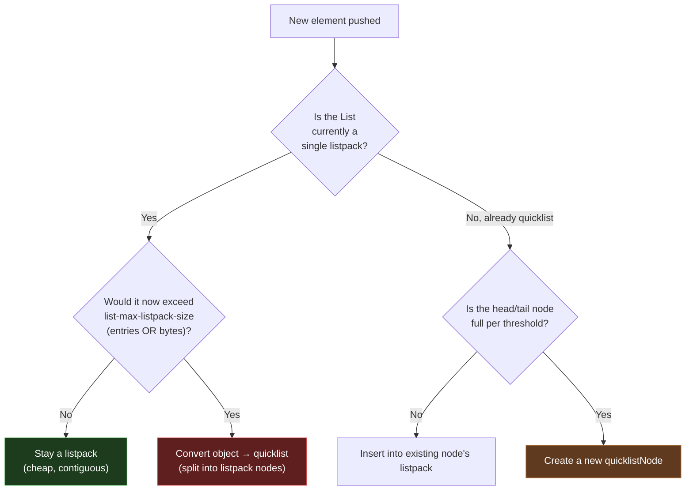

# Module 2.2 — Redis Lists (`listpack` → `quicklist`)

> **Goal of this lesson:** Understand Redis Lists from the *command surface* all the
> way down to the *byte layout* of the structures that back them. By the end you should
> be able to explain, at a senior level, why a `LPUSH` is O(1), why `LINDEX` in the
> middle is O(n), how Redis decides between a `listpack` and a `quicklist`, and how to
> use Lists as queues without blowing up your memory.

---

## 1. The mental model

A Redis List is an **ordered sequence of string values**, addressable from **both ends**.

Think of it as a **doubly-ended queue (deque)**:

```
  HEAD (left)                                   TAIL (right)
     │                                              │
     ▼                                              ▼
   ┌──────┬──────┬──────┬──────┬──────┬──────┬──────┐
   │ "a"  │ "b"  │ "c"  │ "d"  │ "e"  │ "f"  │ "g"  │
   └──────┴──────┴──────┴──────┴──────┴──────┴──────┘
   index:  0      1      2      3      4      5      6
          -7     -6     -5     -4     -3     -2     -1   (negative = from tail)

   LPUSH  ───► pushes here          here ◄─── RPUSH
   LPOP   ◄─── pops here            here ───► RPOP
```

Key properties:

- **Insertion order is preserved.** It is *not* sorted; it is *not* unique. Duplicates
  are perfectly fine.
- **Pushing/popping at either end is O(1).** This is the headline feature — it makes
  Lists the natural choice for **queues** (FIFO) and **stacks** (LIFO).
- **Random access by index is O(n)** in the worst case. A List is *not* an array; you
  cannot jump to element 5,000 for free.
- A List with **zero elements does not exist.** When you pop the last element, Redis
  deletes the key automatically. (This is true of all Redis collection types.)

> **One-line intuition:** *"A Redis List is a doubly-linked list of small contiguous
> chunks. Ends are cheap, middles are expensive."*

---

## 2. The command surface

### 2.1 Push / pop (the bread and butter)

| Command | Meaning | Big-O |
|---|---|---|
| `LPUSH key v [v ...]` | Prepend one or more values to the head | O(N) for N values |
| `RPUSH key v [v ...]` | Append one or more values to the tail | O(N) for N values |
| `LPOP key [count]` | Remove & return from the head | O(N) for N popped |
| `RPOP key [count]` | Remove & return from the tail | O(N) for N popped |
| `LPUSHX / RPUSHX` | Push **only if the key already exists** | O(1) per value |

```bash
127.0.0.1:6379> RPUSH tasks "email" "report" "deploy"
(integer) 3
127.0.0.1:6379> LPUSH tasks "urgent"
(integer) 4
127.0.0.1:6379> LRANGE tasks 0 -1
1) "urgent"
2) "email"
3) "report"
4) "deploy"
127.0.0.1:6379> LPOP tasks
"urgent"
127.0.0.1:6379> RPOP tasks 2          # pop 2 from the tail (Redis ≥ 6.2)
1) "deploy"
2) "report"
```

> ⚠️ **Return-value gotcha:** `LPUSH`/`RPUSH` return the **new length** of the list, not
> the pushed value. People misread this constantly.

### 2.2 Reading

| Command | Meaning | Big-O |
|---|---|---|
| `LLEN key` | Length of the list | O(1) |
| `LRANGE key start stop` | Slice `[start, stop]` (inclusive, supports negatives) | O(S+N), S=offset |
| `LINDEX key i` | Element at index `i` | O(N) |
| `LPOS key elem [RANK r] [COUNT c]` | Find index of a matching element | O(N) |

```bash
127.0.0.1:6379> RPUSH letters a b c d e
(integer) 5
127.0.0.1:6379> LRANGE letters 0 -1     # whole list
1) "a" ... 5) "e"
127.0.0.1:6379> LRANGE letters -3 -1    # last three
1) "c"
2) "d"
3) "e"
127.0.0.1:6379> LINDEX letters 2
"c"
127.0.0.1:6379> LPOS letters c
(integer) 2
```

### 2.3 Mutating in place

| Command | Meaning | Big-O |
|---|---|---|
| `LSET key i value` | Overwrite element at index `i` | O(N) |
| `LINSERT key BEFORE\|AFTER pivot value` | Insert relative to the first `pivot` | O(N) |
| `LREM key count value` | Remove `count` occurrences of `value` | O(N) |
| `LTRIM key start stop` | Keep only the `[start, stop]` slice, discard the rest | O(N) |

`LTRIM` is the secret weapon for **capped lists** (keep the latest N items):

```bash
# Keep only the 100 most-recent log lines on every write:
LPUSH mylog "new entry"
LTRIM mylog 0 99
```

### 2.4 Moving between lists

| Command | Meaning | Notes |
|---|---|---|
| `LMOVE src dst LEFT\|RIGHT LEFT\|RIGHT` | Atomically pop from `src`, push to `dst` | Replaces deprecated `RPOPLPUSH` |
| `BLMOVE ...` | Blocking version of `LMOVE` | |
| `LMPOP numkeys k [k...] LEFT\|RIGHT [COUNT c]` | Pop from the first non-empty list among several | Redis ≥ 7.0 |

`LMOVE src src RIGHT LEFT` (rotate a list onto itself) implements a **reliable round-robin
worker queue** — the item is never lost mid-flight because the pop+push is atomic.

### 2.5 Blocking commands (the queue superpower)

| Command | Meaning |
|---|---|
| `BLPOP key [key ...] timeout` | Block until an element is available at the head of any key |
| `BRPOP key [key ...] timeout` | Same, from the tail |
| `BLMOVE src dst ... timeout` | Blocking `LMOVE` |
| `BLMPOP timeout numkeys k... LEFT\|RIGHT` | Blocking `LMPOP` |

```bash
# Worker process — sleeps with zero CPU until work arrives:
127.0.0.1:6379> BLPOP jobs 0          # 0 = block forever
   ... (hangs here, no polling) ...
# Meanwhile, a producer in another connection:
127.0.0.1:6379> RPUSH jobs "process-image-42"
# The worker instantly wakes:
1) "jobs"            # which key it came from
2) "process-image-42"
```

**How blocking actually works (important mental model):** Redis is single-threaded.
A blocked client does **not** spin or poll. The client is parked on a per-key wait list.
When a `PUSH` makes a key non-empty, Redis checks that wait list and serves the longest-
waiting client (FIFO fairness). The blocking is in the *client's* control flow, never in
the server's event loop — the server stays free to serve everyone else.



> **Pitfall:** Inside a `MULTI/EXEC` transaction, blocking commands **do not block** —
> they behave like their non-blocking versions and return nil if empty. Blocking + a
> queued transaction can't coexist (the server can't pause mid-transaction).

---

## 3. Internals — what backs a List

This is the heart of the lesson. Redis Lists have had **three eras** of internal encoding.
Knowing the history is the fastest way to truly understand the current design.

```
   ERA 1 (Redis < 3.2)        ERA 2 (Redis 3.2 – 6.2)     ERA 3 (Redis 7.0+)
   ───────────────────        ───────────────────────     ──────────────────
   small list → ziplist       ALWAYS quicklist            small list → listpack
   big   list → linkedlist    (a linked list of ziplists) big   list → quicklist
                                                                       (a linked list
   two separate encodings      one unified encoding         of listpacks)
```

The `OBJECT ENCODING` command tells you which one a key is using right now:

```bash
127.0.0.1:6379> RPUSH small a b c
(integer) 3
127.0.0.1:6379> OBJECT ENCODING small
"listpack"                 # tiny list → single listpack
127.0.0.1:6379> RPUSH big <... 200 elements ...>
127.0.0.1:6379> OBJECT ENCODING big
"quicklist"                # grew past threshold → quicklist
```

Let's build up the structures from the bottom.

---

### 3.1 The `listpack` — a compact, serialized array

A **listpack** is a single, contiguous, heap-allocated blob of bytes that stores a
sequence of entries. No per-element pointers, no fragmentation — just one tight buffer.
It is the successor to the older **ziplist** (listpack fixed some edge-case bugs and
simplified the layout, removing ziplist's notorious "cascading update" problem).

**Why bother?** For small collections, pointer overhead dominates. A traditional linked
list node needs a `prev` pointer (8 bytes), a `next` pointer (8 bytes), and a pointer to
the value (8 bytes) — 24 bytes of overhead to store maybe a 3-byte string. A listpack
packs everything inline, so a 3-byte string costs ~3 bytes plus a couple of length bytes.
**Cache locality** is the other win: the whole structure is one contiguous region, so
iterating it is friendly to the CPU cache.

**Layout of a listpack:**

```
┌─────────────┬──────────┬─────────┬─────────┬─────┬─────────┬──────────┐
│ Total Bytes │ Num Elems│ Entry 0 │ Entry 1 │ ... │ Entry N │ End Byte  │
│  (4 bytes)  │ (2 bytes)│         │         │     │         │  (0xFF)   │
└─────────────┴──────────┴─────────┴─────────┴─────┴─────────┴──────────┘
     header (6 bytes)        ◄──────── entries ────────►       terminator
```

**Layout of a single entry** — and this is the clever bit:

```
┌──────────────┬─────────────────────┬─────────────────────┐
│  Encoding +  │       Data          │   Backlen            │
│  Length      │   (the value)       │  (length of this     │
│              │                     │   entry, encoded     │
│              │                     │   backwards)         │
└──────────────┴─────────────────────┴─────────────────────┘
```

The trailing **backlen** field stores the size of the entry. This is what lets you walk
the listpack **right-to-left**: from the end byte you read backlen, jump back that many
bytes to the start of the last entry, and repeat. That's how Redis does O(1)-per-step
**reverse iteration** (needed for `RPOP`, tail access) on a contiguous buffer.

Small integers are stored **as integers**, not as ASCII text. If you push `"127"`,
the listpack notices it's a small int and stores it in a 1-byte integer encoding instead
of a 3-character string — another memory win.

**The catch:** because it is one contiguous buffer:
- Inserting/deleting in the **middle** means `memmove`-ing the tail of the buffer →
  O(n) and possibly a `realloc`.
- It only stays efficient while it's **small**. A huge listpack means huge memmoves and
  huge reallocations.

That size limit is exactly why we need the next structure.

---

### 3.2 The `quicklist` — a linked list of listpacks

A **quicklist** is a **doubly-linked list whose nodes are each a listpack** (in older
versions, a ziplist). It is the hybrid that gets you the best of both worlds:

- **Linked-list level:** O(1) push/pop at the ends, no giant reallocations.
- **Listpack level:** compact, cache-friendly storage inside each node.



ASCII view of the same thing:

```
   quicklist
   ┌───────────────────────────────────────────────────────────────┐
   │ head ─┐                                              ┌─ tail    │
   └───────┼──────────────────────────────────────────────┼─────────┘
           ▼                                                ▼
     ┌───────────┐      ┌───────────┐      ┌───────────┐
     │ Node A    │◄────►│ Node B    │◄────►│ Node C    │
     │ ┌───────┐ │ prev │ ┌───────┐ │ next │ ┌───────┐ │
     │ │listpack│ │      │ │listpack│ │      │ │listpack│ │
     │ │a b c d │ │      │ │e f g h │ │      │ │i j k   │ │
     │ └───────┘ │      │ └───────┘ │      │ └───────┘ │
     └───────────┘      └───────────┘      └───────────┘
       (a "node" holds many elements, not just one)
```

The crucial insight: **one linked-list node holds MANY list elements** (a whole
listpack's worth), not a single element. This dramatically reduces the number of pointers
and `next`/`prev` hops compared to a classic one-element-per-node linked list.

Each `quicklistNode` carries metadata: a pointer to its listpack, the byte size, the
element count, and a flag for whether it's **LZF-compressed** (see §4.2).

**How operations map onto this structure:**

- `LPUSH` → go to the head node, insert into its listpack. If that node is "full"
  (per the size threshold), allocate a new node at the head instead. → **O(1) amortized.**
- `RPOP` → go to the tail node, remove the last listpack entry. If the node becomes
  empty, unlink and free it. → **O(1) amortized.**
- `LINDEX 5000` → walk nodes from the nearest end, subtracting each node's element count
  until you find the node containing index 5000, then scan inside its listpack. →
  **O(n)**, but the node-count metadata lets Redis skip whole nodes quickly, and it
  starts from whichever end is closer.

---

### 3.3 The encoding-selection rule (the part interviewers love)

> **A List starts as a single `listpack`. It is upgraded to a `quicklist` the moment it
> exceeds the configured size limits — and it never downgrades back.**

The threshold is controlled by **`list-max-listpack-size`** (alias:
`list-max-ziplist-size`). It has a dual meaning depending on the sign of its value:

| Value | Meaning |
|---|---|
| **Positive** `N` | Max **number of entries** per listpack node before splitting (e.g. `128`). |
| **Negative** `-N` | Max **size in bytes** per listpack node, using a preset scale: |

The negative presets:

| Setting | Max size per node |
|---|---|
| `-1` | 4 KB |
| `-2` | 8 KB  ← **default** |
| `-3` | 16 KB |
| `-4` | 32 KB |
| `-5` | 64 KB |

There is **also an unconditional safety cap**: a single listpack node will never hold
more than **128 entries** *and* never a value larger than **64 bytes** can keep the whole
list as a plain `listpack`. Concretely, the top-level List object stays a bare `listpack`
only while it is small; once it exceeds `list-max-listpack-size` (entries **or** bytes,
whichever the config picks), Redis converts the object to a `quicklist`.



Demonstrate it live:

```bash
127.0.0.1:6379> CONFIG GET list-max-listpack-size
1) "list-max-listpack-size"
2) "128"
127.0.0.1:6379> RPUSH demo a b c
(integer) 3
127.0.0.1:6379> OBJECT ENCODING demo
"listpack"
127.0.0.1:6379> RPUSH demo <... push until > 128 entries ...>
127.0.0.1:6379> OBJECT ENCODING demo
"quicklist"
127.0.0.1:6379> RPOP demo <... shrink back to 3 entries ...>
127.0.0.1:6379> OBJECT ENCODING demo
"quicklist"          # ← NOTE: it did NOT go back to listpack
```

> **Why no downgrade?** Conversion is CPU work, and a list that *was* big is likely to be
> big again. Redis optimizes for the steady state and avoids "flapping" between encodings.
> This one-way ratchet is a recurring theme across **all** Redis types — remember it.

---

## 4. Config knobs you should know

### 4.1 `list-max-listpack-size` (= `list-max-ziplist-size`)
Covered above. **Trade-off:**
- **Bigger nodes** → fewer nodes, fewer pointers, better memory density and locality, but
  **larger memmoves** on middle inserts and bigger atomic allocations.
- **Smaller nodes** → more pointer overhead, but cheaper individual operations.
- The default `-2` (8 KB) is a well-tuned balance; most people never touch it.

### 4.2 `list-compress-depth` — compressing the cold middle
Real-world lists are used as queues: you touch the **ends** constantly and the **middle**
rarely. So Redis can **LZF-compress the interior nodes** while leaving the ends
uncompressed for fast access.

```
list-compress-depth = 1
   ┌────────┐   ┌══════════┐   ┌══════════┐   ┌══════════┐   ┌────────┐
   │ Node 0 │◄─►│ Node 1   │◄─►│ Node 2   │◄─►│ Node 3   │◄─►│ Node 4 │
   │ PLAIN  │   │COMPRESSED│   │COMPRESSED│   │COMPRESSED│   │ PLAIN  │
   └────────┘   └══════════┘   └══════════┘   └══════════┘   └────────┘
     head end                                                  tail end
   (kept fast)        ◄──── LZF-compressed cold middle ────►  (kept fast)
```

| Value | Meaning |
|---|---|
| `0` | **Disabled** (default). No compression — everything is plain. |
| `1` | Leave **1 node** on each end uncompressed; compress the rest. |
| `N` | Leave **N nodes** on each end uncompressed. |

Use this when you have **long lists used as queues** and you want to claw back memory from
the rarely-touched middle. The cost is CPU to decompress if you ever do a deep `LINDEX`
or full `LRANGE`.

---

## 5. Performance cheat-sheet & gotchas

| Operation | Complexity | Note |
|---|---|---|
| `LPUSH` / `RPUSH` / `LPOP` / `RPOP` | **O(1)** (per element) | The reason Lists exist |
| `LLEN` | **O(1)** | Count is cached |
| `LINDEX` near an end | ~O(1) | Starts from nearest end |
| `LINDEX` in the middle | **O(n)** | Walks nodes |
| `LRANGE 0 50` | O(50) | Cheap small slice |
| `LRANGE 0 -1` on a huge list | **O(n)** ⚠️ | Can dump millions of items & block the server |
| `LINSERT` / `LREM` / `LSET` | **O(n)** | Avoid in hot paths |

**The biggest real-world footguns:**

1. **`LRANGE key 0 -1` on a million-element list.** Redis is single-threaded; this one
   command serializes a million strings and blocks *every other client* for the duration.
   It can also spike the output buffer. **Always paginate** (`LRANGE 0 99`, `LRANGE 100
   199`, …) or use `LPOP count`.

2. **Treating a List like a random-access array.** `LINDEX`/`LSET` in a loop over indices
   is O(n²). If you need random access, you want a different structure (Hash or Sorted Set).

3. **Unbounded queues.** A producer outrunning a consumer grows the List forever until
   you OOM. Cap it (`LTRIM` for "latest N", or backpressure on the producer) and monitor
   `LLEN`.

4. **"Big keys."** A single List holding millions of elements is a classic *big key*: slow
   to migrate in Cluster, slow to dump/delete (use `UNLINK` for async free), and a memory
   landmine. We cover big-key mitigation in **Module 10.4**.

---

## 6. Patterns & real-world recipes

### 6.1 Simple work queue (at-most-once)
```bash
# Producer
RPUSH jobs "{...payload...}"
# Consumer
BLPOP jobs 0        # FIFO: oldest job first
```
Risk: if the worker crashes *after* `BLPOP` but *before* finishing, the job is lost.

### 6.2 Reliable queue (at-least-once) with `LMOVE`
```bash
# Atomically move a job from the main queue to a per-worker "processing" list:
BLMOVE jobs processing:worker1 LEFT RIGHT 0
# ... do the work ...
LREM processing:worker1 1 "<that job>"     # ack: remove it on success
```
If the worker dies, the job survives in `processing:worker1` and a reaper can requeue it.
(For production-grade reliability you'd usually reach for **Streams + consumer groups** —
Module 8.2 — but `LMOVE` is the classic List-based pattern.)

### 6.3 Capped activity feed / latest-N log
```bash
LPUSH user:42:feed "<event>"
LTRIM user:42:feed 0 999       # keep only the newest 1000 events
```

### 6.4 Stack (LIFO)
```bash
LPUSH undo "<action>"     # push
LPOP  undo                # pop most recent
```

### 6.5 Round-robin scheduler
```bash
# Rotate the head element to the tail, atomically, and read it:
LMOVE round_robin round_robin LEFT RIGHT
```

---

## 7. Inspecting and debugging in production

```bash
OBJECT ENCODING mylist        # listpack vs quicklist
LLEN mylist                   # length (O(1))
MEMORY USAGE mylist           # bytes consumed by the key
DEBUG OBJECT mylist           # internals: ql_nodes, ql_avg_node, compression, etc.
```

Example `DEBUG OBJECT` output for a quicklist (fields you care about):
```
Value at:0x... encoding:quicklist ql_nodes:42 ql_avg_node:120.50
ql_listpack_max:128 ql_compressed:0 ...
```
- `ql_nodes` — number of linked-list nodes (listpacks).
- `ql_avg_node` — average elements per node (low average = wasteful, many tiny nodes).
- `ql_compressed` — whether `list-compress-depth` kicked in.

---

## 8. Interview drills (junior → staff)

**Q1 (junior). What's the difference between `LPUSH` and `RPUSH`?**
`LPUSH` prepends to the head (left), `RPUSH` appends to the tail (right). Both are O(1)
per element and both return the new length of the list.

**Q2 (junior). How do you implement a FIFO queue and a LIFO stack with one List?**
FIFO: `RPUSH` to enqueue, `LPOP` to dequeue (or `LPUSH`+`RPOP`). LIFO stack: push and pop
from the *same* end (`LPUSH`+`LPOP`).

**Q3 (mid). Why is `LPOP` O(1) but `LINDEX` in the middle O(n)?**
A List is backed by a quicklist — a linked list of listpack nodes. The head/tail nodes are
directly reachable, so end operations are O(1). Reaching a middle index requires walking
nodes from the nearest end, summing element counts until the right node is found, hence
O(n).

**Q4 (mid). What's the difference between a `listpack` and a `quicklist`, and when does
Redis switch?**
A listpack is a single contiguous serialized buffer — great for small lists (low overhead,
cache-friendly) but O(n) for middle edits and bad when large. A quicklist is a doubly-
linked list of listpack nodes — O(1) ends, no giant reallocations. A List starts as a
listpack and converts to a quicklist once it exceeds `list-max-listpack-size` (by entry
count or bytes). The conversion is one-way; it never downgrades.

**Q5 (senior). Why doesn't a quicklist downgrade back to a listpack after shrinking?**
Conversion costs CPU and a list that grew large is likely to grow again; Redis avoids
encoding "flapping" by optimizing for the steady state. This one-way ratchet is consistent
across all Redis types.

**Q6 (senior). How does `list-compress-depth` work and when would you enable it?**
It LZF-compresses interior quicklist nodes while leaving `N` nodes on each end
uncompressed. Ideal for long queue-style lists where only the ends are hot; it trades CPU
(decompress on access) for memory. Default is `0` (off).

**Q7 (senior). A teammate runs `LRANGE key 0 -1` on a 5-million-element list in prod and
latency for all clients spikes. Explain.**
Redis is single-threaded. That command is O(n): it must serialize 5M strings into one
reply, monopolizing the event loop and the client output buffer, so *every* other client
stalls until it finishes. Fix: paginate with bounded `LRANGE`/`LPOP count`, and treat the
key as a "big key" candidate.

**Q8 (staff). Design a reliable job queue on Redis Lists and discuss its failure modes.**
Use `BLMOVE main processing:<worker> LEFT RIGHT` to atomically claim a job into a per-
worker processing list (so a crash doesn't lose it), do the work, then `LREM` to ack. A
background reaper scans stale processing lists and requeues abandoned jobs. Failure modes:
(a) no visibility timeout natively — you must build the reaper; (b) duplicate processing
if a job is requeued while still running (need idempotency); (c) no consumer-group
semantics, ordering guarantees, or per-message acks beyond what you build. At scale, prefer
**Redis Streams with consumer groups** (XADD / XREADGROUP / XACK / XCLAIM), which provide
PEL tracking, acks, and claim/replay built in.

**Q9 (staff). How do blocking commands like `BLPOP` work without polling, given Redis is
single-threaded?**
The blocked client is parked on the key's blocked-clients list and consumes no CPU; the
server's event loop is never paused. When a `PUSH` makes the key ready, Redis serves the
longest-waiting blocked client (FIFO fairness) as part of handling that write. Inside
`MULTI/EXEC`, blocking commands degrade to non-blocking (the server can't pause mid-
transaction).

---

## 9. Key takeaways

1. **Lists are deques.** Ends are O(1); middles are O(n). Use them for queues/stacks/feeds.
2. **Two encodings:** small → `listpack` (one compact buffer), large → `quicklist` (linked
   list of listpacks). Conversion is governed by `list-max-listpack-size` and is **one-way**.
3. **`listpack`** wins on memory + cache locality for small data; **`quicklist`** wins on
   O(1) ends + bounded allocations for large data.
4. **`list-compress-depth`** can LZF-compress the cold middle of long queue-lists.
5. **Never `LRANGE 0 -1` a huge list** — it blocks the whole server. Paginate.
6. **Cap your queues** and watch `LLEN`; for serious messaging, graduate to **Streams**.

---

### 📎 Quick reference card

```
ENDS (O(1)):     LPUSH RPUSH LPOP RPOP LLEN LPUSHX RPUSHX
RANGE/READ:      LRANGE LINDEX LPOS
MUTATE (O(n)):   LSET LINSERT LREM LTRIM
MOVE:            LMOVE BLMOVE LMPOP BLMPOP   (RPOPLPUSH = deprecated)
BLOCKING:        BLPOP BRPOP BLMOVE BLMPOP
INSPECT:         OBJECT ENCODING / MEMORY USAGE / DEBUG OBJECT
CONFIG:          list-max-listpack-size (=ziplist-size), list-compress-depth
ENCODINGS:       listpack  ─(grows past threshold)─►  quicklist  (one-way)
```

> **Next up — 2.3 Hashes (`listpack` → `hashtable`):** you'll see the *same* small-vs-large
> encoding pattern, but with field→value pairs and a different upgrade trigger
> (`hash-max-listpack-entries` / `hash-max-listpack-value`). The listpack knowledge you
> just built transfers directly.
