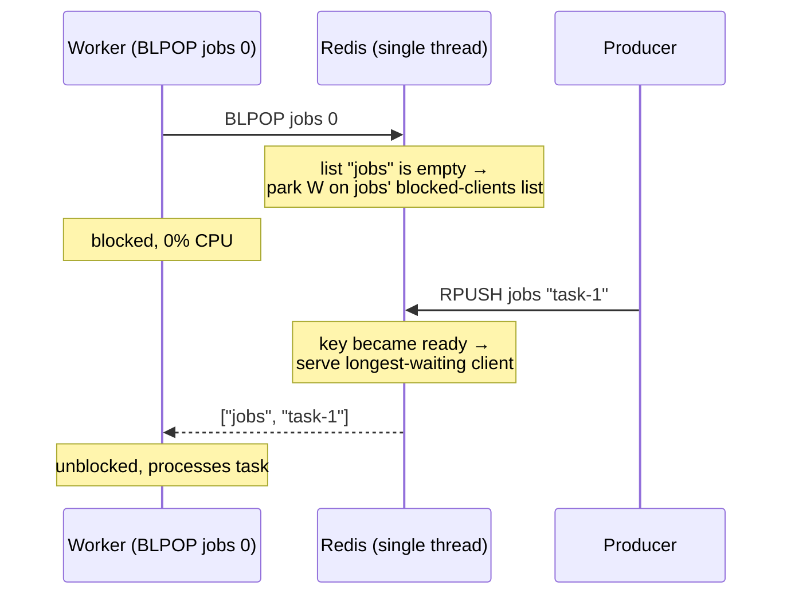
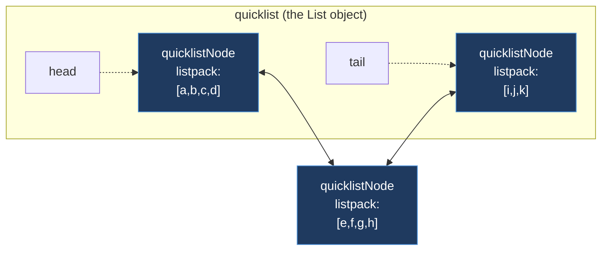
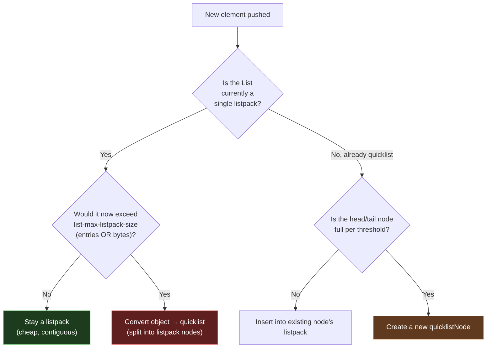

# Module 2.2 — Redis Lists (`listpack` → `quicklist`)

---

## Section 1: The Big Picture

A Redis List is an **ordered sequence of string values** with O(1) push and pop from both ends. That headline performance characteristic — constant-time insertion and removal at the head and tail — is what makes Lists the natural choice for a specific class of problems.

In production systems, Redis Lists appear in:

- **Work queues**: producers push tasks to the tail with `RPUSH`; workers pop them from the head with `BLPOP`. Zero CPU polling — workers sleep until work arrives.
- **Reliable queues**: use `LMOVE` to atomically move a job from the main queue to a per-worker processing list. If the worker crashes, the job is still in the processing list for a reaper to recover.
- **Activity feeds and timelines**: push new events to the head, trim to the last N events with `LTRIM`. Read the feed with `LRANGE`.
- **Capped logs**: the `LPUSH` + `LTRIM` idiom keeps a rolling window of the most recent N log lines — constant memory, O(1) write path.
- **Stacks**: push and pop from the same end (`LPUSH` + `LPOP`).
- **Round-robin schedulers**: `LMOVE` a list onto itself rotates the current head to the tail atomically.

The fundamental constraint to internalize: **O(1) at the ends, O(n) in the middle.** A List is not a random-access array. It is optimized for sequential access and for the ends. If you need to frequently access elements by index or search by value, a different data structure is a better fit.

---

## Section 2: Mental Model

Think of a Redis List as a **deque** — a doubly-ended queue, like a line of people that can join and leave from either the front or the back.

```
  HEAD (left)                                   TAIL (right)
     │                                              │
     ▼                                              ▼
   ┌──────┬──────┬──────┬──────┬──────┬──────┬──────┐
   │ "a"  │ "b"  │ "c"  │ "d"  │ "e"  │ "f"  │ "g"  │
   └──────┴──────┴──────┴──────┴──────┴──────┴──────┘
   index:  0      1      2      3      4      5      6
          -7     -6     -5     -4     -3     -2     -1   (negative = from tail)

   LPUSH  ───► pushes here          here ◄─── RPUSH
   LPOP   ◄─── pops here            here ───► RPOP
```

Key properties:

- **Insertion order is preserved.** A List is not sorted and not unique. Duplicates are perfectly fine.
- **Pushing and popping at either end is O(1).** This is the headline feature.
- **Random access by index is O(n)** in the worst case. You cannot jump to element 5,000 for free.
- **A List with zero elements does not exist.** When you pop the last element, Redis deletes the key automatically. This is true of all Redis collection types.

> **One-line intuition:** *A Redis List is a doubly-linked list of small contiguous chunks. Ends are cheap, middles are expensive.*

Two analogies that make the behavior stick:

- **Queue (FIFO)**: a line at a bank teller. Customers join at the back (`RPUSH`), get served from the front (`LPOP`). First in, first out.
- **Stack (LIFO)**: a stack of papers on your desk. You put new papers on top (`LPUSH`) and take from the top (`LPOP`). Last in, first out.

---

## Section 3: Practical Usage

### Push and pop (the bread and butter)

| Command | Meaning | Big-O |
|---|---|---|
| `LPUSH key v [v ...]` | Prepend one or more values to the head | O(N) for N values |
| `RPUSH key v [v ...]` | Append one or more values to the tail | O(N) for N values |
| `LPOP key [count]` | Remove and return from the head | O(N) for N popped |
| `RPOP key [count]` | Remove and return from the tail | O(N) for N popped |
| `LPUSHX / RPUSHX` | Push only if the key already exists | O(1) per value |

```bash
127.0.0.1:6379> RPUSH tasks "email" "report" "deploy"
(integer) 3
127.0.0.1:6379> LPUSH tasks "urgent"
(integer) 4
127.0.0.1:6379> LRANGE tasks 0 -1
1) "urgent"
2) "email"
3) "report"
4) "deploy"
127.0.0.1:6379> LPOP tasks
"urgent"
127.0.0.1:6379> RPOP tasks 2          # pop 2 from the tail (Redis >= 6.2)
1) "deploy"
2) "report"
```

> `LPUSH`/`RPUSH` return the **new length** of the list, not the pushed value. This is a common source of confusion.

### Reading

| Command | Meaning | Big-O |
|---|---|---|
| `LLEN key` | Length of the list | O(1) |
| `LRANGE key start stop` | Slice `[start, stop]` (inclusive, supports negatives) | O(S+N), S=offset |
| `LINDEX key i` | Element at index `i` | O(N) |
| `LPOS key elem [RANK r] [COUNT c]` | Find index of a matching element | O(N) |

```bash
127.0.0.1:6379> RPUSH letters a b c d e
(integer) 5
127.0.0.1:6379> LRANGE letters 0 -1     # whole list
1) "a" ... 5) "e"
127.0.0.1:6379> LRANGE letters -3 -1    # last three
1) "c"
2) "d"
3) "e"
127.0.0.1:6379> LINDEX letters 2
"c"
127.0.0.1:6379> LPOS letters c
(integer) 2
```

### Mutating in place

| Command | Meaning | Big-O |
|---|---|---|
| `LSET key i value` | Overwrite element at index `i` | O(N) |
| `LINSERT key BEFORE\|AFTER pivot value` | Insert relative to the first `pivot` | O(N) |
| `LREM key count value` | Remove `count` occurrences of `value` | O(N) |
| `LTRIM key start stop` | Keep only the `[start, stop]` slice, discard the rest | O(N) |

`LTRIM` is the secret weapon for **capped lists** — keep the latest N items:

```bash
# Keep only the 100 most-recent log lines on every write:
LPUSH mylog "new entry"
LTRIM mylog 0 99
```

### Moving between lists

| Command | Meaning | Notes |
|---|---|---|
| `LMOVE src dst LEFT\|RIGHT LEFT\|RIGHT` | Atomically pop from `src`, push to `dst` | Replaces deprecated `RPOPLPUSH` |
| `BLMOVE ...` | Blocking version of `LMOVE` | |
| `LMPOP numkeys k [k...] LEFT\|RIGHT [COUNT c]` | Pop from the first non-empty list among several | Redis >= 7.0 |

`LMOVE src src RIGHT LEFT` (rotating a list onto itself) implements a **reliable round-robin worker queue** — the item is never lost mid-flight because the pop+push is atomic.

### Blocking commands (the queue superpower)

| Command | Meaning |
|---|---|
| `BLPOP key [key ...] timeout` | Block until an element is available at the head of any key |
| `BRPOP key [key ...] timeout` | Same, from the tail |
| `BLMOVE src dst ... timeout` | Blocking `LMOVE` |
| `BLMPOP timeout numkeys k... LEFT\|RIGHT` | Blocking `LMPOP` |

```bash
# Worker process — sleeps with zero CPU until work arrives:
127.0.0.1:6379> BLPOP jobs 0          # 0 = block forever
   ... (hangs here, no polling) ...
# Meanwhile, a producer in another connection:
127.0.0.1:6379> RPUSH jobs "process-image-42"
# The worker instantly wakes:
1) "jobs"            # which key it came from
2) "process-image-42"
```

**How blocking actually works:** Redis is single-threaded. A blocked client does **not** spin or poll. The client is parked on a per-key wait list. When a `PUSH` makes a key non-empty, Redis checks that wait list and serves the longest-waiting client (FIFO fairness). The blocking is in the *client's* control flow, never in the server's event loop — the server stays free to serve everyone else.



### Pattern: Simple work queue (at-most-once)

```bash
# Producer
RPUSH jobs "{...payload...}"
# Consumer
BLPOP jobs 0        # FIFO: oldest job first
```

Risk: if the worker crashes *after* `BLPOP` but *before* finishing, the job is lost.

### Pattern: Reliable queue (at-least-once) with `LMOVE`

```bash
# Atomically move a job from the main queue to a per-worker "processing" list:
BLMOVE jobs processing:worker1 LEFT RIGHT 0
# ... do the work ...
LREM processing:worker1 1 "<that job>"     # ack: remove it on success
```

If the worker dies, the job survives in `processing:worker1` and a reaper can requeue it. For production-grade reliability, prefer **Streams + consumer groups** (Module 8.2), but `LMOVE` is the classic List-based pattern.

### Pattern: Capped activity feed / latest-N log

```bash
LPUSH user:42:feed "<event>"
LTRIM user:42:feed 0 999       # keep only the newest 1000 events
```

### Pattern: Stack (LIFO)

```bash
LPUSH undo "<action>"     # push
LPOP  undo                # pop most recent
```

### Pattern: Round-robin scheduler

```bash
# Rotate the head element to the tail, atomically, and read it:
LMOVE round_robin round_robin LEFT RIGHT
```

### Inspecting in production

```bash
OBJECT ENCODING mylist        # listpack vs quicklist
LLEN mylist                   # length (O(1))
MEMORY USAGE mylist           # bytes consumed by the key
DEBUG OBJECT mylist           # internals: ql_nodes, ql_avg_node, compression, etc.
```

Example `DEBUG OBJECT` output for a quicklist:
```
Value at:0x... encoding:quicklist ql_nodes:42 ql_avg_node:120.50
ql_listpack_max:128 ql_compressed:0 ...
```
- `ql_nodes` — number of linked-list nodes (listpacks).
- `ql_avg_node` — average elements per node (low average = wasteful, many tiny nodes).
- `ql_compressed` — whether `list-compress-depth` kicked in.

---

## Section 4: Common Mistakes

### LRANGE 0 -1 on a huge list (blocks the server)

```bash
# WRONG: on a list with 5 million elements this is a disaster
LRANGE mylist 0 -1
```

```bash
# RIGHT: paginate in bounded slices
LRANGE mylist 0 99
LRANGE mylist 100 199
# ...or pop in batches
LPOP mylist 100
```

Redis is single-threaded. `LRANGE 0 -1` is O(n): it serializes every element into one reply, monopolizing the event loop and the client output buffer. Every other client stalls until it finishes. On a list with millions of elements this can take seconds. Always paginate.

### Using a List as a random-access array (LINDEX in a loop = O(n²))

```bash
# WRONG: O(n) per call, O(n²) total
for i in range(1000):
    LINDEX mylist i      # walks from the head every time

# RIGHT: if you need random access, use a different structure
HGETALL myhash           # Hash: O(1) field access
ZRANGE myzset 0 -1       # Sorted Set: indexed access
```

`LINDEX` walks the list from the nearest end to reach index `i`. Calling it in a loop over all indices is O(n²). If you find yourself iterating over indices, you have picked the wrong data structure.

### Unbounded queues (producer faster than consumer → OOM)

```bash
# DANGEROUS: if consumer can't keep up, the list grows forever
RPUSH jobs payload        # producer at 10k/s
BLPOP jobs 0              # consumer at 1k/s → list grows 9k items/s
```

```bash
# SAFER: cap the queue or apply backpressure
# Option 1: check before pushing
LLEN jobs                 # if > threshold, reject or wait
RPUSH jobs payload

# Option 2: trim (loses old items, use only if acceptable)
RPUSH jobs payload
LTRIM jobs -10000 -1      # keep only the last 10k items
```

Monitor `LLEN` in production. Set up alerts when a queue grows past a comfortable threshold. An unbounded queue is a silent OOM waiting to happen. At scale, use **Redis Streams** which provide consumer groups and backpressure semantics built in.

### Using blocking commands inside MULTI/EXEC (they don't actually block)

```bash
# WRONG: expecting blocking behavior inside a transaction
MULTI
BLPOP jobs 0      # does NOT block — returns nil immediately if queue is empty
EXEC
```

Inside a `MULTI/EXEC` transaction, blocking commands degrade to their non-blocking behavior and return nil if the key is empty. The server cannot pause mid-transaction. Never rely on `BLPOP`/`BRPOP` inside a transaction.

### Not understanding that BLPOP returns which key, not just the value

```bash
# BLPOP can watch multiple keys at once
BLPOP queue1 queue2 queue3 0

# Returns: ["queue2", "the-value"]
# The FIRST element is the KEY name, second is the VALUE
# Many engineers destructure this incorrectly and ignore the key name
```

When `BLPOP` watches multiple keys, it returns a two-element array: the name of the key that had the element, and the element value. If you are watching multiple queues and routing logic depends on which queue produced the item, you must read the key name.

### Using RPOPLPUSH (deprecated, use LMOVE instead)

```bash
# WRONG: deprecated since Redis 6.2
RPOPLPUSH source destination

# RIGHT: LMOVE is more general and the official replacement
LMOVE source destination RIGHT LEFT   # equivalent to RPOPLPUSH
LMOVE source destination LEFT RIGHT   # new direction combinations
```

`RPOPLPUSH` is deprecated as of Redis 6.2 and may be removed in a future version. Use `LMOVE` which supports all four direction combinations (`LEFT/RIGHT` from source to `LEFT/RIGHT` of destination).

---

## Section 5: Production Considerations

### The big key problem with Lists

A List with millions of elements is a classic **big key**:

- **Slow to read**: `LRANGE 0 -1` or even large paginated reads can block the event loop.
- **Slow to delete**: `DEL` on a large key blocks while freeing memory. Always use `UNLINK` instead — it frees memory asynchronously in a background thread.
- **Slow to migrate in Cluster**: Redis Cluster must transfer the entire key during slot migration.
- **Slow to dump**: `BGSAVE` / RDB persistence must serialize the full list.

```bash
UNLINK big_list        # async delete — returns immediately, frees in background
# vs
DEL big_list           # synchronous delete — blocks during free
```

### Monitoring list length

```bash
LLEN myqueue           # O(1) — always safe to call
MEMORY USAGE myqueue   # full memory cost including overhead
```

Set up monitoring alerts for `LLEN` on critical queues. Common thresholds:

- **Warning**: queue length > 10,000 (consumer may be falling behind)
- **Critical**: queue length > 100,000 (risk of OOM or latency degradation)

The right threshold depends on your item size and growth rate.

### Consumer group semantics vs Streams

Redis Lists are appropriate for simple queues where:

- You have one consumer or multiple consumers sharing one work pool
- At-most-once delivery is acceptable (simple `BLPOP`)
- At-least-once delivery with manual reaper is acceptable (`LMOVE` pattern)

Move to **Redis Streams** (Module 8.2) when you need:

- Multiple independent consumer groups reading the same stream
- Built-in pending entry list (PEL) with visibility timeout
- Message acknowledgment and replay built in
- Message ID ordering and consumer tracking

Streams are strictly more capable for messaging use cases. Lists are simpler and sufficient for basic work queues.

### Memory per node and compression

Each element in a `quicklist` node (a listpack) stores the element inline — no per-element pointer overhead. The cost is dominated by the listpack headers and the quicklist node metadata.

For long queue-style lists where only the ends are hot, enable compression:

```bash
# In redis.conf:
list-compress-depth 1    # compress all nodes except 1 on each end
```

This LZF-compresses the cold middle, trading CPU (decompress on deep access) for memory. Typical compression ratios for text data are 30–60%.

### Config knobs

**`list-max-listpack-size`** (alias: `list-max-ziplist-size`) controls how large each listpack node can grow before a new node is created:

| Value | Meaning |
|---|---|
| Positive `N` | Max **number of entries** per node (e.g. `128`) |
| `-1` | 4 KB max per node |
| `-2` | 8 KB max per node **(default)** |
| `-3` | 16 KB max per node |
| `-4` | 32 KB max per node |
| `-5` | 64 KB max per node |

The default `-2` (8 KB) is a well-tuned balance. Larger nodes mean better memory density but larger `memmove` on middle operations. Most teams never touch this.

**`list-compress-depth`**:

| Value | Meaning |
|---|---|
| `0` | Disabled (default). No compression. |
| `1` | Leave 1 node on each end uncompressed; compress the rest. |
| `N` | Leave N nodes on each end uncompressed. |

```
list-compress-depth = 1
   ┌────────┐   ┌══════════┐   ┌══════════┐   ┌══════════┐   ┌────────┐
   │ Node 0 │◄─►│ Node 1   │◄─►│ Node 2   │◄─►│ Node 3   │◄─►│ Node 4 │
   │ PLAIN  │   │COMPRESSED│   │COMPRESSED│   │COMPRESSED│   │ PLAIN  │
   └────────┘   └══════════┘   └══════════┘   └══════════┘   └────────┘
     head end                                                  tail end
   (kept fast)        ◄──── LZF-compressed cold middle ────►  (kept fast)
```

### Performance cheat-sheet

| Operation | Complexity | Note |
|---|---|---|
| `LPUSH` / `RPUSH` / `LPOP` / `RPOP` | **O(1)** (per element) | The reason Lists exist |
| `LLEN` | **O(1)** | Count is cached |
| `LINDEX` near an end | ~O(1) | Starts from nearest end |
| `LINDEX` in the middle | **O(n)** | Walks nodes |
| `LRANGE 0 50` | O(50) | Cheap small slice |
| `LRANGE 0 -1` on a huge list | **O(n)** | Can dump millions of items and block the server |
| `LINSERT` / `LREM` / `LSET` | **O(n)** | Avoid in hot paths |

---

## Section 6: Internals Deep Dive

### The three eras of Redis List encoding

To understand what backs a List today, it helps to understand the history. Redis Lists have had three internal eras, and each change was motivated by a concrete problem with the previous design.

```
   ERA 1 (Redis < 3.2)        ERA 2 (Redis 3.2 – 6.2)     ERA 3 (Redis 7.0+)
   ───────────────────        ───────────────────────     ──────────────────
   small list → ziplist       ALWAYS quicklist            small list → listpack
   big   list → linkedlist    (a linked list of ziplists) big   list → quicklist
                                                                       (a linked list
   two separate encodings      one unified encoding         of listpacks)
```

The `OBJECT ENCODING` command tells you which one a key is using right now:

```bash
127.0.0.1:6379> RPUSH small a b c
(integer) 3
127.0.0.1:6379> OBJECT ENCODING small
"listpack"                 # tiny list → single listpack
127.0.0.1:6379> RPUSH big <... 200 elements ...>
127.0.0.1:6379> OBJECT ENCODING big
"quicklist"                # grew past threshold → quicklist
```

### Why listpack exists: the pointer overhead problem

Before listpack (and its predecessor ziplist), the naive encoding for a small list was a traditional doubly-linked list: each node has a `prev` pointer, a `next` pointer, and a pointer to the value's SDS buffer.

That is 24 bytes of pointer overhead to store, say, a 3-byte string like `"yes"`. For a list of 128 short strings, you are paying ~3 KB in pointer overhead for a few hundred bytes of actual data. This also destroys cache locality — every node is a separate heap allocation, scattered across memory.

**The listpack idea:** throw away all the pointers. Store everything in one contiguous buffer, with the length of each entry encoded inline, so you can scan forward and backward without any pointers. For a 3-byte string, pay a few bytes of metadata, not 24 bytes of pointers.

The trade-off: insertions and deletions in the middle require `memmove`-ing the tail of the buffer — O(n) and possibly a `realloc`. This is acceptable when the listpack is small. When it grows large, you need a different structure.

**Note:** listpack is the successor to the older **ziplist**. Ziplist had a subtle bug — a "cascading update" problem where modifying one entry could require re-encoding all subsequent entries due to the way it stored the previous entry's length. Listpack redesigned the entry format to eliminate this.

### Listpack layout

A **listpack** is a single, contiguous, heap-allocated blob of bytes:

```
┌─────────────┬──────────┬─────────┬─────────┬─────┬─────────┬──────────┐
│ Total Bytes │ Num Elems│ Entry 0 │ Entry 1 │ ... │ Entry N │ End Byte  │
│  (4 bytes)  │ (2 bytes)│         │         │     │         │  (0xFF)   │
└─────────────┴──────────┴─────────┴─────────┴─────┴─────────┴──────────┘
     header (6 bytes)        ◄──────── entries ────────►       terminator
```

Each entry has a clever three-part layout:

```
┌──────────────┬─────────────────────┬─────────────────────┐
│  Encoding +  │       Data          │   Backlen            │
│  Length      │   (the value)       │  (length of this     │
│              │                     │   entry, encoded     │
│              │                     │   backwards)         │
└──────────────┴─────────────────────┴─────────────────────┘
```

The trailing **backlen** field stores the size of the entry. This is what enables walking the listpack **right-to-left**: from the end byte you read backlen, jump back that many bytes to the start of the last entry, and repeat. That is how Redis does O(1)-per-step reverse iteration (needed for `RPOP`, tail access) on a contiguous buffer.

Small integers are stored **as integers**, not ASCII text. If you push `"127"`, the listpack notices it is a small int and stores it in 1 byte instead of 3 characters — another memory win.

**The catch:** because it is one contiguous buffer, inserting or deleting in the **middle** means `memmove`-ing the tail → O(n) and possibly a `realloc`. A huge listpack means huge memmoves and huge reallocations. That size limit is exactly why the next structure exists.

### Quicklist: a linked list of listpacks

A **quicklist** is a **doubly-linked list whose nodes are each a listpack**. It is the hybrid that gets you the best of both worlds:

- **Linked-list level:** O(1) push/pop at the ends, no giant reallocations.
- **Listpack level:** compact, cache-friendly storage inside each node.



ASCII view:

```
   quicklist
   ┌───────────────────────────────────────────────────────────────┐
   │ head ─┐                                              ┌─ tail    │
   └───────┼──────────────────────────────────────────────┼─────────┘
           ▼                                                ▼
     ┌───────────┐      ┌───────────┐      ┌───────────┐
     │ Node A    │◄────►│ Node B    │◄────►│ Node C    │
     │ ┌───────┐ │ prev │ ┌───────┐ │ next │ ┌───────┐ │
     │ │listpack│ │      │ │listpack│ │      │ │listpack│ │
     │ │a b c d │ │      │ │e f g h │ │      │ │i j k   │ │
     │ └───────┘ │      │ └───────┘ │      │ └───────┘ │
     └───────────┘      └───────────┘      └───────────┘
       (a "node" holds many elements, not just one)
```

The crucial insight: **one linked-list node holds MANY list elements** (a whole listpack's worth), not a single element. This dramatically reduces the number of pointers and `next`/`prev` hops compared to a classic one-element-per-node linked list.

Each `quicklistNode` carries metadata: a pointer to its listpack, the byte size, the element count, and a flag for whether it is **LZF-compressed**.

How operations map onto this structure:

- `LPUSH` → go to the head node, insert into its listpack. If that node is "full" (per the size threshold), allocate a new node at the head instead. → **O(1) amortized.**
- `RPOP` → go to the tail node, remove the last listpack entry. If the node becomes empty, unlink and free it. → **O(1) amortized.**
- `LINDEX 5000` → walk nodes from the nearest end, subtracting each node's element count until you find the node containing index 5000, then scan inside its listpack. → **O(n)**, but the node-count metadata lets Redis skip whole nodes quickly, and it starts from whichever end is closer.

### The encoding-selection rule

> A List starts as a single `listpack`. It is upgraded to a `quicklist` the moment it exceeds the configured size limits — and it never downgrades back.



Demonstrate it live:

```bash
127.0.0.1:6379> CONFIG GET list-max-listpack-size
1) "list-max-listpack-size"
2) "128"
127.0.0.1:6379> RPUSH demo a b c
(integer) 3
127.0.0.1:6379> OBJECT ENCODING demo
"listpack"
127.0.0.1:6379> RPUSH demo <... push until > 128 entries ...>
127.0.0.1:6379> OBJECT ENCODING demo
"quicklist"
127.0.0.1:6379> RPOP demo <... shrink back to 3 entries ...>
127.0.0.1:6379> OBJECT ENCODING demo
"quicklist"          # NOTE: it did NOT go back to listpack
```

> **Why no downgrade?** Conversion costs CPU and a list that was big is likely to be big again. Redis optimizes for the steady state and avoids "flapping" between encodings. This one-way ratchet is a recurring pattern across all Redis types.

---

## Section 7: Visual Diagrams

### The deque — push/pop directions

```
  LPUSH / LPOP                                    RPUSH / RPOP
  (head/left)                                     (tail/right)
       │                                                │
       ▼                                                ▼
  ┌────────────────────────────────────────────────────────┐
  │   "a"   │   "b"   │   "c"   │   "d"   │   "e"         │
  └────────────────────────────────────────────────────────┘
   index 0    index 1    index 2    index 3    index 4
   index -5   index -4   index -3   index -2   index -1

  Queue (FIFO): RPUSH to enqueue → LPOP to dequeue
  Stack (LIFO): LPUSH to push → LPOP to pop
```

### Listpack buffer layout

```
  ┌─────────────┬──────────┬──────────────────────────────────────────┬──────┐
  │ total_bytes │ num_elems│         entries (variable length)         │ 0xFF │
  │  (4 bytes)  │ (2 bytes)│                                           │      │
  └─────────────┴──────────┴──────────────────────────────────────────┴──────┘

  Each entry:
  ┌────────────────────┬─────────────────┬─────────────────────┐
  │ encoding+length    │   data bytes    │   backlen           │
  │ (1-5 bytes)        │ (variable)      │ (1-5 bytes)         │
  └────────────────────┴─────────────────┴─────────────────────┘
                                              │
                                              └── enables RIGHT-TO-LEFT traversal:
                                                  read backlen → jump backward
                                                  to start of this entry → repeat
  Memory advantage vs linked list:
  ┌──────────────────────────────────────────────────────────────┐
  │  Linked list node: prev(8) + next(8) + *value(8) = 24 bytes  │
  │  overhead for a 3-byte string                                 │
  │                                                               │
  │  Listpack entry:   encoding(1) + data(3) + backlen(1) = 5    │
  │  bytes for a 3-byte string — 5x less overhead                 │
  └──────────────────────────────────────────────────────────────┘
```

### Quicklist structure

```
  quicklist object
  ┌─────────────────────────────────────────────────────────────────┐
  │ head ptr ──────────────────────────────────────► tail ptr       │
  │ length: 11       count: 3 nodes                                  │
  └─────────────────────────────────────────────────────────────────┘
         │                                                  │
         ▼                                                  ▼
  ┌────────────┐    ┌────────────┐    ┌────────────┐
  │ Node 1     │◄──►│ Node 2     │◄──►│ Node 3     │
  │ ┌────────┐ │    │ ┌────────┐ │    │ ┌────────┐ │
  │ │listpack│ │    │ │listpack│ │    │ │listpack│ │
  │ │ a b c d│ │    │ │ e f g h│ │    │ │ i j k  │ │
  │ └────────┘ │    │ └────────┘ │    │ └────────┘ │
  │ count: 4   │    │ count: 4   │    │ count: 3   │
  │ NOT compr. │    │ COMPRESSED │    │ NOT compr. │
  └────────────┘    └────────────┘    └────────────┘
  (list-compress-depth 1: middle nodes compressed, ends kept plain)

  LPUSH → insert at head node's listpack; create new head node if full
  RPOP  → remove from tail node's listpack; free tail node if empty
  LINDEX → walk nodes, skip by count, scan inside the correct listpack
```

---

## Section 8: Interview Questions

**Q1 (junior). What is the difference between `LPUSH` and `RPUSH`?**

`LPUSH` prepends to the head (left), `RPUSH` appends to the tail (right). Both are O(1) per element and both return the new length of the list.

**Q2 (junior). How do you implement a FIFO queue and a LIFO stack with one List?**

FIFO: `RPUSH` to enqueue, `LPOP` to dequeue (or `LPUSH`+`RPOP`). LIFO stack: push and pop from the *same* end (`LPUSH`+`LPOP`).

**Q3 (mid). Why is `LPOP` O(1) but `LINDEX` in the middle O(n)?**

A List is backed by a quicklist — a linked list of listpack nodes. The head and tail nodes are directly reachable, so end operations are O(1). Reaching a middle index requires walking nodes from the nearest end, summing element counts until the right node is found, hence O(n).

**Q4 (mid). What is the difference between a `listpack` and a `quicklist`, and when does Redis switch?**

A listpack is a single contiguous serialized buffer — great for small lists (low overhead, cache-friendly) but O(n) for middle edits and bad when large. A quicklist is a doubly-linked list of listpack nodes — O(1) ends, no giant reallocations. A List starts as a listpack and converts to a quicklist once it exceeds `list-max-listpack-size` (by entry count or bytes). The conversion is one-way; it never downgrades.

**Q5 (senior). Why does a quicklist not downgrade back to a listpack after shrinking?**

Conversion costs CPU and a list that grew large is likely to grow again; Redis avoids encoding "flapping" by optimizing for the steady state. This one-way ratchet is consistent across all Redis types.

**Q6 (senior). How does `list-compress-depth` work and when would you enable it?**

It LZF-compresses interior quicklist nodes while leaving `N` nodes on each end uncompressed. Ideal for long queue-style lists where only the ends are hot; it trades CPU (decompress on deep access) for memory. Default is `0` (off). Enable it when you have long-lived queues with many elements that are rarely accessed in the middle.

**Q7 (senior). A teammate runs `LRANGE key 0 -1` on a 5-million-element list in production and latency for all clients spikes. Explain.**

Redis is single-threaded. That command is O(n): it must serialize 5M strings into one reply, monopolizing the event loop and the client output buffer, so every other client stalls until it finishes. Fix: paginate with bounded `LRANGE`/`LPOP count`, and treat the key as a "big key" candidate. Also use `UNLINK` instead of `DEL` to avoid blocking on deletion.

**Q8 (staff). Design a reliable job queue on Redis Lists and discuss its failure modes.**

Use `BLMOVE main processing:<worker> LEFT RIGHT` to atomically claim a job into a per-worker processing list (so a crash doesn't lose it), do the work, then `LREM` to ack. A background reaper scans stale processing lists and requeues abandoned jobs. Failure modes: (a) no visibility timeout natively — you must build the reaper; (b) duplicate processing if a job is requeued while still running (need idempotency); (c) no consumer-group semantics, ordering guarantees, or per-message acks beyond what you build. At scale, prefer **Redis Streams with consumer groups** (XADD / XREADGROUP / XACK / XCLAIM), which provide PEL tracking, acks, and claim/replay built in.

**Q9 (staff). How do blocking commands like `BLPOP` work without polling, given Redis is single-threaded?**

The blocked client is parked on the key's blocked-clients list and consumes no CPU; the server's event loop is never paused. When a `PUSH` makes the key ready, Redis serves the longest-waiting blocked client (FIFO fairness) as part of handling that write. Inside `MULTI/EXEC`, blocking commands degrade to non-blocking (the server cannot pause mid-transaction).

---

## Section 9: Key Takeaways

### Must Know as a Redis User

- Lists are **deques**: ends are O(1), middles are O(n). Use them for queues, stacks, activity feeds, and capped logs — not for random-access arrays.
- **`BLPOP`/`BRPOP`** give you a zero-CPU-polling work queue. Workers sleep until work arrives. This is the canonical Redis queue primitive.
- **`LMOVE`** is the reliable queue primitive: atomically move a job from the work queue to a processing list so it survives worker crashes.
- **Never `LRANGE 0 -1` on a large list** — paginate instead. Never use `LINDEX` in a loop.
- **Cap your queues** with `LTRIM` or backpressure. Monitor `LLEN`. An unbounded queue is a silent OOM.
- Use `UNLINK` instead of `DEL` for large lists to avoid blocking on deletion.

### Should Know as a Senior Engineer

- Two encodings: small lists use a single **`listpack`** (one compact contiguous buffer), large lists use a **`quicklist`** (doubly-linked list of listpack nodes). Conversion is governed by `list-max-listpack-size` and is **one-way** — encodings never downgrade.
- A **listpack** stores entries inline with no per-element pointers. The **backlen** field at the end of each entry enables O(1)-per-step reverse traversal. Small integers are stored as integers, not ASCII, saving memory.
- A **quicklist** node holds many elements (a whole listpack), not one. This cuts pointer overhead dramatically vs a classic linked list.
- `list-compress-depth` LZF-compresses interior quicklist nodes. Enable it for long queue-style lists where only the ends are hot.
- For production messaging with consumer groups, acknowledgment, and replay, **Redis Streams** are strictly superior to Lists.

### Nice To Know as a Redis Contributor

- **Listpack replaced ziplist** in Redis 7.0. Ziplist had a "cascading update" bug: because each entry stored the byte length of the *previous* entry, a size change to one entry could force re-encoding of all subsequent entries. Listpack's backlen field is self-contained per entry, eliminating cascades entirely.
- A `quicklistNode` stores a `recompress` flag. When Redis decompresses a node for access (e.g., a deep `LINDEX`), it sets this flag and recompresses the node after the operation completes, so LZF-compressed nodes don't stay decompressed after a single touch.
- The `list-max-listpack-size` negative preset `-2` (8 KB) maps to the `OBJ_LIST_MAX_LISTPACK_VALUE` constant in the source. The positive preset (number of entries) is checked separately, and whichever limit is hit first triggers a node split.
- `LMPOP` (Redis 7.0+) pops from the first non-empty list among a set of keys in a single round-trip — useful for priority queues where you want to drain higher-priority queues before lower-priority ones.

---

### Quick reference card

```
ENDS (O(1)):     LPUSH RPUSH LPOP RPOP LLEN LPUSHX RPUSHX
RANGE/READ:      LRANGE LINDEX LPOS
MUTATE (O(n)):   LSET LINSERT LREM LTRIM
MOVE:            LMOVE BLMOVE LMPOP BLMPOP   (RPOPLPUSH = deprecated)
BLOCKING:        BLPOP BRPOP BLMOVE BLMPOP
INSPECT:         OBJECT ENCODING / MEMORY USAGE / DEBUG OBJECT
CONFIG:          list-max-listpack-size (=ziplist-size), list-compress-depth
ENCODINGS:       listpack  ─(grows past threshold)─►  quicklist  (one-way)
```

> **Next up — 2.3 Hashes (`listpack` → `hashtable`):** you will see the same small-vs-large encoding pattern, but with field→value pairs and a different upgrade trigger (`hash-max-listpack-entries` / `hash-max-listpack-value`). The listpack knowledge you just built transfers directly.
