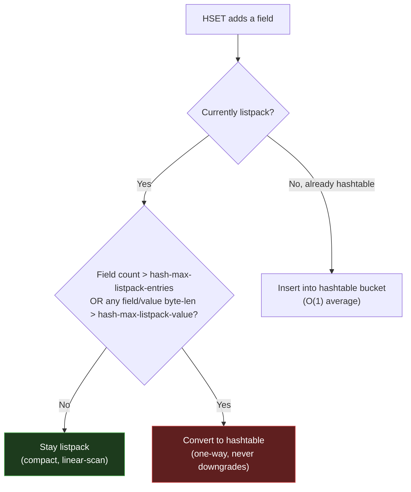

# Module 2.3 — Redis Hashes (`listpack` → `hashtable`)

> **Goal of this lesson:** Understand Redis Hashes from the command surface down to the
> two internal encodings (`listpack` and `hashtable`). By the end you should be able to
> explain *why* Hashes are a better model than one-key-per-field Strings, when Redis
> upgrades the encoding, what that costs, and how to use Hashes to avoid the "big key"
> problem. The encoding pattern is the same as Lists (2.2) — you'll see it click into
> place instantly.

---

## 1. The mental model

A Redis Hash is a **dictionary of field→value pairs** stored under a single key.

```
   Redis key: "user:1001"
   ┌─────────────┬─────────────────────────┐
   │    field    │          value           │
   ├─────────────┼─────────────────────────┤
   │  "name"     │  "Yatharth"             │
   │  "email"    │  "yatharth@topo.io"     │
   │  "age"      │  "28"                   │
   │  "country"  │  "India"                │
   └─────────────┴─────────────────────────┘
```

Think of it as a **mini key-value store inside a key**. Field names and values are both
**strings** (binary-safe, up to 512 MB each).

Key properties:
- Fields are **unique within a Hash** (setting the same field twice overwrites the first).
- **No ordering guarantee** on fields (unlike Lists). The iteration order is arbitrary.
- A Hash with **zero fields ceases to exist** — Redis deletes the key automatically when
  you delete the last field. (Same rule as all Redis collections.)
- Field count is effectively unlimited, but the *encoding* used internally has a threshold
  (§4) after which performance characteristics change.

> **One-line intuition:** *"A Hash is like a JSON object in Redis — one key, many
> named fields, partial reads and writes without touching the rest."*

---

## 2. Why Hashes instead of one String per field?

The most important design question first, because this comes up in every interview.

### Option A — one String key per field
```
SET user:1001:name    "Yatharth"
SET user:1001:email   "yatharth@topo.io"
SET user:1001:age     "28"
SET user:1001:country "India"
```

### Option B — one Hash key
```
HSET user:1001 name "Yatharth" email "yatharth@topo.io" age "28" country "India"
```

**Why Option B wins:**

| Dimension | One String per field | One Hash |
|---|---|---|
| **Memory** | Each key has a full Redis object header (~64–100 bytes overhead) | All fields share one key header; small Hashes use the compact `listpack` encoding |
| **Atomicity** | Reading 4 keys requires a pipeline or Lua; they can diverge | `HMGET user:1001 name email` is one atomic command |
| **Keyspace pollution** | 4 keys per user × 1M users = 4M keys | 1M keys; keyspace stays clean, `SCAN` is cheaper |
| **TTL** | Must set/refresh TTL on every sub-key separately | One TTL on the Hash key covers all fields |
| **Partial updates** | Must `GET`+`SET` the whole blob if using JSON string | `HSET user:1001 age 29` — touch only what changed |

The memory win is especially dramatic for small Hashes: the `listpack` encoding packs
everything into a single contiguous buffer with no per-field pointer overhead (explained in
§4.1). Storing 1 million users with 4 fields each in individual Strings vs. Hashes can be
**5–10× more memory** with Strings.

---

## 3. The command surface

### 3.1 Writing fields

| Command | Meaning | Big-O |
|---|---|---|
| `HSET key f v [f v ...]` | Set one or more fields (overwrites if exists) | O(N) fields |
| `HSETNX key f v` | Set field **only if it does not exist** | O(1) |
| `HDEL key f [f ...]` | Delete one or more fields; returns count deleted | O(N) fields |

```bash
127.0.0.1:6379> HSET user:1001 name "Yatharth" email "yatharth@topo.io" age 28
(integer) 3           # ← number of NEW fields created (not updated ones)
127.0.0.1:6379> HSET user:1001 age 29
(integer) 0           # ← 0 new fields; age already existed, just updated
127.0.0.1:6379> HDEL user:1001 country
(integer) 0           # ← field didn't exist
```

> **Gotcha:** `HSET` returns the count of **new** fields, not the total. Updated fields
> count as 0. People expect it to return the field value (it doesn't).

### 3.2 Reading fields

| Command | Meaning | Big-O |
|---|---|---|
| `HGET key f` | Get one field | O(1) |
| `HMGET key f [f ...]` | Get multiple fields | O(N) fields |
| `HGETALL key` | Get all fields and values (interleaved) | O(N) total fields |
| `HKEYS key` | Get all field names | O(N) |
| `HVALS key` | Get all values | O(N) |
| `HLEN key` | Count of fields | O(1) |
| `HEXISTS key f` | Does field exist? | O(1) |
| `HRANDFIELD key [count [WITHVALUES]]` | Random field(s) | O(N count) |

```bash
127.0.0.1:6379> HGET user:1001 name
"Yatharth"

127.0.0.1:6379> HMGET user:1001 name email age
1) "Yatharth"
2) "yatharth@topo.io"
3) "29"

127.0.0.1:6379> HGETALL user:1001
1) "name"
2) "Yatharth"
3) "email"
4) "yatharth@topo.io"
5) "age"
6) "29"
```

> **`HGETALL` on a large Hash = footgun.** Like `LRANGE 0 -1` on a huge List, calling
> `HGETALL` on a Hash with thousands of fields serializes everything in one shot and blocks
> the server. Use `HSCAN` instead (§3.4).

### 3.3 Numeric fields (counters inside a Hash)

| Command | Meaning | Big-O |
|---|---|---|
| `HINCRBY key f n` | Increment integer field by `n` (creates if absent) | O(1) |
| `HINCRBYFLOAT key f f` | Increment float field | O(1) |

```bash
127.0.0.1:6379> HSET stats:page:42 views 0 likes 0
127.0.0.1:6379> HINCRBY stats:page:42 views 1
(integer) 1
127.0.0.1:6379> HINCRBYFLOAT stats:page:42 rating 4.5
"4.5"
```

This is one of the most powerful Hash patterns: a **per-entity counter object** with one
round-trip per counter increment, rather than one round-trip per scalar key.

### 3.4 Cursor-based iteration (`HSCAN`)

For large Hashes where `HGETALL` is unsafe:

```bash
HSCAN user:sessions 0 COUNT 100
# returns: [next_cursor, [f1, v1, f2, v2, ...]]

# Iterate until cursor returns to "0":
HSCAN user:sessions 0 COUNT 100
HSCAN user:sessions <cursor1> COUNT 100
...
HSCAN user:sessions <cursorN> COUNT 100    # cursor is "0" → done
```

`HSCAN` is **not fully atomic** across calls (the Hash can change between calls), but it is
safe for full-scan scenarios and will not block the server. The `COUNT` is a *hint*, not a
hard limit — the actual count per call varies. We cover the cursor algorithm in depth in
Module 11.1 when looking at `SCAN`.

---

## 4. Internals — what backs a Hash

Exactly the same two-encoding story as Lists, but tuned for key-value pairs.

```
   Small Hash (few fields, short values)     Large Hash (many fields OR long values)
   ──────────────────────────────────────    ─────────────────────────────────────────
        encoding = listpack                       encoding = hashtable
   (one compact contiguous buffer)           (classic separate-chaining hash table)
```

Check it live:
```bash
127.0.0.1:6379> HSET small a 1 b 2
127.0.0.1:6379> OBJECT ENCODING small
"listpack"

127.0.0.1:6379> HSET big f1 v1 f2 v2 ... <129 fields>
127.0.0.1:6379> OBJECT ENCODING big
"hashtable"
```

---

### 4.1 `listpack` — the small-Hash encoding

For Hashes that fit within the configured thresholds, Redis uses the exact same **listpack**
structure you learned in 2.2, but with field-value pairs stored as consecutive entries:

```
listpack buffer layout for HSET user:1 name "Alice" age "30":

┌──────────────┬───────────┬─────────────────────────────────────────────────────────┬────────┐
│  Total Bytes │ Num Entries│                    entries                              │  0xFF  │
│   (4 bytes)  │ (2 bytes)  │                                                        │(end)   │
└──────────────┴───────────┴─────────────────────────────────────────────────────────┴────────┘

entries (read left-to-right in field/value pairs):

┌───────────────┬──────────┬───────────────┬──────────┬──────────────┬──────────┐
│ Enc+Len "name"│  "name"  │ Enc+Len "Alice"│ "Alice"  │ Enc+Len "age"│  "age"   │ ...
│  + backlen    │(4 bytes) │  + backlen    │(5 bytes) │  + backlen   │(3 bytes) │
└───────────────┴──────────┴───────────────┴──────────┴──────────────┴──────────┘
   ▲ field entry              ▲ value entry             ▲ field entry  ▲ value entry
```

Fields and values alternate as consecutive listpack entries. A key insight: **there are no
pointers**. The structure is one flat buffer. Finding a field requires a **linear scan**
through the buffer comparing each odd entry (field) until a match is found.

**Why is this fine?** Because the listpack is only used while the Hash is small (≤ 128
fields and all values ≤ 64 bytes by default). At that scale, a linear scan of a tiny
contiguous buffer is **faster in practice** than a hash table lookup because of CPU cache
effects — the whole buffer fits in L1/L2 cache, so "scan" is very cheap.

**Memory savings (the reason this encoding exists):**
A hashtable has per-entry overhead for the hash table array, linked-list bucket pointers,
and the dict entry struct. For a 10-field Hash, that overhead vastly exceeds the actual
data. The listpack stores the same 10 fields with virtually zero overhead beyond the data
itself.

---

### 4.2 `hashtable` — the large-Hash encoding

Once either threshold is crossed (§4.3), Redis converts the Hash to a proper **hash table**.

```
   Hash table (dict) internals:

   ┌─────────────────────────────────────────────────────────────────────────────┐
   │  dict                                                                       │
   │  ┌───────────────┐                                                          │
   │  │ ht[0]         │  ← primary table                                         │
   │  │  size: 8      │  (always a power of 2)                                  │
   │  │  used: 5      │  (entries currently stored)                              │
   │  │  table: ──────┼──────────────────────────────────────────────────────┐   │
   │  └───────────────┘                                                       │   │
   │  ┌───────────────┐                                                       │   │
   │  │ ht[1]         │  ← rehash table (only non-null during incremental     │   │
   │  │  (NULL)       │    rehash — see §4.4)                                 │   │
   │  └───────────────┘                                                       │   │
   └──────────────────────────────────────────────────────────────────────────┼───┘
                                                                              ▼
   table array (size=8 slots):
   ┌───┬───┬───┬───┬───┬───┬───┬───┐
   │ 0 │ 1 │ 2 │ 3 │ 4 │ 5 │ 6 │ 7 │
   └─┬─┴───┴───┴─┬─┴───┴───┴───┴───┘
     │             │
     ▼             ▼
   ┌──────────┐  ┌──────────┐
   │ dictEntry│  │ dictEntry│
   │ key:"name"│  │ key:"age"│
   │ val:"Alice"│  │ val:"30" │
   │ next: NULL│  │ next: ───┼──► ┌──────────┐
   └──────────┘  └──────────┘     │ dictEntry│
                                   │ key:"city"│
                                   │ val:"Delhi"│
                                   │ next: NULL│
                                   └──────────┘
   (separate chaining via linked list for collisions)
```

Each `dictEntry` holds a pointer to the SDS key, a union value (can hold a pointer, int, or
double), and a `next` pointer for collision chaining.

**Why two tables (`ht[0]` and `ht[1]`)?** Incremental rehashing — read §4.4 below.

`HGET` on a hashtable encoding: compute `hash(field) % size`, find the bucket, walk the
chain comparing field names → typically **O(1)** average, **O(n)** worst case (all
collisions, which is extremely rare with a good hash function).

---

### 4.3 The encoding-selection rule

> **A Hash starts as a `listpack`. It is upgraded to a `hashtable` the moment it exceeds
> EITHER threshold — and it never downgrades back.**

Two config knobs control the threshold:

| Config key | Default | Meaning |
|---|---|---|
| `hash-max-listpack-entries` | `128` | Max **number of fields** before upgrading |
| `hash-max-listpack-value` | `64` | Max **byte length of any single field OR value** before upgrading |

The `value` threshold is a per-entry check: if you add *any single* field or value whose
byte length exceeds `hash-max-listpack-value`, the entire Hash immediately converts to
hashtable, regardless of field count.



Demonstrate it:
```bash
127.0.0.1:6379> CONFIG GET hash-max-listpack-entries
1) "hash-max-listpack-entries"
2) "128"

127.0.0.1:6379> CONFIG GET hash-max-listpack-value
1) "hash-max-listpack-value"
2) "64"

# A long value triggers upgrade regardless of field count:
127.0.0.1:6379> HSET test f1 v1 f2 v2
127.0.0.1:6379> OBJECT ENCODING test
"listpack"

127.0.0.1:6379> HSET test f3 "this value is longer than 64 bytes so it triggers the hashtable upgrade now"
(integer) 1
127.0.0.1:6379> OBJECT ENCODING test
"hashtable"      # ← converted even though only 3 fields!
```

---

### 4.4 Incremental rehashing — the clever detail

When a hashtable grows, it must **double in size** and redistribute all entries into the new
slot positions. Doing this all at once on a large Hash would **block the event loop** for
many milliseconds — unacceptable for a single-threaded server.

Redis solves this with **incremental (lazy) rehashing**:

```
   Normal state (no rehash):           During rehash:
   ┌──────────┐                        ┌──────────┐    ┌──────────┐
   │ ht[0]    │                        │ ht[0]    │    │ ht[1]    │
   │ size:8   │                        │ size:8   │    │ size:16  │  ← new table
   │ used:6   │                        │ used:6   │    │ used:0   │    (2× old size)
   │ table:─┐ │                        │ table:─┐ │    │ table:─┐ │
   └─────────┘                        └────────┘ │   └─────────┘ │
                                                  ▼               ▼
                                       (old entries, shrinking)  (new entries, growing)
```

During a rehash:
1. Redis allocates `ht[1]` at 2× the size of `ht[0]`.
2. A `rehashidx` cursor starts at 0 (pointing to slot 0 of `ht[0]`).
3. **On every Hash operation** (`HSET`, `HGET`, `HDEL`, etc.) Redis migrates **one bucket**
   from `ht[0]` to `ht[1]` (moving all entries in that chain), then increments `rehashidx`.
4. Reads check **both tables** until the rehash completes.
5. When `ht[0]` is empty, swap `ht[0]` = `ht[1]`, free the old table, `ht[1]` = NULL.

The work is amortized over thousands of operations — no single command pays a big rehash
cost. This same dict mechanism is used for **Redis's main key-value store** (the global
dict mapping all keys to their values), so this is one of the most important internals in
all of Redis.

```
   Timeline of incremental rehash:

   Op 1: HGET   → migrate bucket 0 from ht[0] to ht[1]
   Op 2: HSET   → migrate bucket 1
   Op 3: HDEL   → migrate bucket 2
   ...
   Op N: HGET   → bucket 7 (last) migrated → rehash complete, ht[1] becomes ht[0]

   Each op pays O(1) extra work for migration.
   No single op blocks for O(n) rehash cost.
```

> **Interview gold:** "How does Redis avoid O(n) blocking during hash table resize?" →
> Incremental rehashing: every operation migrates one bucket from the old table to the new
> one. The load is spread across many operations, so no single command experiences a big
> pause.

---

## 5. Memory layout comparison

To make the encoding trade-off concrete, let's estimate memory for a Hash with 10 fields,
each field name ~8 bytes, each value ~12 bytes.

### listpack encoding
```
listpack buffer (approx):
- Header: 6 bytes
- 10 fields × (field entry + value entry):
  Each entry ≈ 1 byte encoding + data + 1 byte backlen
  Field: 1 + 8 + 1 = 10 bytes
  Value: 1 + 12 + 1 = 14 bytes
  Per pair: 24 bytes
- 10 pairs: 240 bytes
- Terminator: 1 byte
Total: ~247 bytes for the data, plus one robj header (~32 bytes)
Grand total: ~279 bytes
```

### hashtable encoding
```
Per dictEntry (one field-value pair):
- key SDS: header (8 bytes) + field data (8 bytes) + null = ~17 bytes → padded to 24
- val SDS: header (8 bytes) + value data (12 bytes) + null = ~21 bytes → padded to 24
- dictEntry struct: key ptr (8) + val union (8) + next ptr (8) = 24 bytes
- Per pair total: ~72 bytes

10 pairs: 720 bytes
Hash table array (power-of-2 ≥ 10 → size 16):
  16 slots × 8 bytes (pointer) = 128 bytes
dict struct overhead: ~40 bytes
Total: ~888 bytes
```

**listpack is ~3× more memory-efficient** for a 10-field Hash. For millions of small Hashes
(e.g., one per user), this is the difference between a 3 GB footprint and a 9 GB footprint.

---

## 6. Config tuning

### `hash-max-listpack-entries` (default: 128)
- **Increase** if your Hashes always stay below a certain field count and you want to keep
  the compact listpack encoding for longer → less memory, faster for small ops.
- **Decrease** if you want hashtable semantics sooner for write-heavy Hashes with many
  random-access field reads (to avoid linear listpack scans).

### `hash-max-listpack-value` (default: 64)
- The byte-length limit per individual field or value.
- If your application stores long UUIDs (36 bytes), JSON snippets, or base64 values as
  Hash field values, check whether they exceed this limit — if so, the Hash immediately
  upgrades to hashtable even with few fields.
- Example: storing a 128-character session token as a value → exceeds 64 → hashtable even
  for a 2-field Hash. You might lower `hash-max-listpack-value` to 36 to match your UUID
  length, or accept hashtable encoding.

```bash
# To keep Hashes compact for a user-profile use case
# where you know fields ≤ 50, values ≤ 32 bytes:
CONFIG SET hash-max-listpack-entries 64
CONFIG SET hash-max-listpack-value 32
```

---

## 7. Performance cheat-sheet & gotchas

| Operation | Encoding=listpack | Encoding=hashtable |
|---|---|---|
| `HSET` one field | O(n) scan to find/insert | O(1) avg |
| `HGET` one field | O(n) scan | O(1) avg |
| `HDEL` one field | O(n) scan + memmove | O(1) avg |
| `HGETALL` | O(n) total entries | O(n) total entries |
| `HLEN` | O(1) | O(1) |
| `HSCAN` | O(n) | O(n) per full scan |

For **small Hashes** (listpack), "O(n) scan" sounds scary but is misleading — n is small
(≤128) and the scan is over a contiguous buffer with excellent cache locality. In practice
it's faster than a hashtable lookup for small n.

**The biggest footguns:**

1. **`HGETALL` on a large Hash.** Serializes all fields in one shot — same problem as
   `LRANGE 0 -1`. Use `HSCAN` for large Hashes in production code.

2. **Storing a huge value in one field.** A 10 MB JSON blob as a Hash value is a **big key**
   sub-problem: `HGET` is O(1) but the serialization of that 10 MB value blocks the thread
   for the duration of the network write. Keep individual field values small.

3. **Using `HMSET` (deprecated).** As of Redis 4.0 `HSET` accepts multiple fields, so
   `HMSET` is redundant and deprecated. Use `HSET key f1 v1 f2 v2 ...`.

4. **Not using Hashes for object storage at all.** Storing one JSON string per user key
   (`SET user:1 "{...}"`) prevents partial updates, wastes memory, and forces you to parse
   the whole JSON for every operation. Hashes let you touch individual fields atomically.

---

## 8. Patterns & real-world recipes

### 8.1 User profile / entity store
```bash
HSET user:1001 name "Yatharth" email "y@topo.io" plan "pro" credits 500

# Read only what you need (no JSON parse):
HGET user:1001 plan
HMGET user:1001 name credits

# Update one field without touching others:
HSET user:1001 plan "enterprise"

# Atomic counter inside the Hash:
HINCRBY user:1001 credits -10
```

### 8.2 Per-entity counters object
```bash
# Instead of 4 separate keys per article:
HINCRBY article:42:stats views 1
HINCRBY article:42:stats likes 1
HINCRBYFLOAT article:42:stats rating 0.1
HMGET article:42:stats views likes rating
```
One round-trip for all stats at once, and one key instead of 4.

### 8.3 Shopping cart (field = product ID, value = quantity)
```bash
HSET cart:user:55 prod:101 2 prod:205 1
HINCRBY cart:user:55 prod:101 1        # add one more of prod 101
HDEL cart:user:55 prod:205             # remove item
HGETALL cart:user:55                   # full cart contents
HLEN cart:user:55                      # item type count
```

### 8.4 Rate limiting with per-route buckets
```bash
# Instead of one key per (user, route, minute):
HINCRBY ratelimit:user:55:2024060301 GET:/api/search 1
EXPIRE ratelimit:user:55:2024060301 120

# Check all routes for this user in one call:
HGETALL ratelimit:user:55:2024060301
```

### 8.5 Caching a sparse, frequently-changing object
Store only the fields that change often in a Hash; put the static fields in a separate Hash
with a longer TTL. This avoids blowing the cache on a field that changes every second.

---

## 9. Inspecting and debugging in production

```bash
OBJECT ENCODING user:1001      # listpack vs hashtable
HLEN user:1001                 # field count (O(1))
MEMORY USAGE user:1001         # total bytes including overhead
DEBUG OBJECT user:1001         # encoding details

# Safe large-Hash iteration:
HSCAN user:sessions 0 COUNT 200 MATCH "sess:*"
```

When you see `OBJECT ENCODING` return `hashtable` on a Hash you expected to be `listpack`,
check whether any field name or value exceeds `hash-max-listpack-value` bytes:
```bash
# Find the longest value in a Hash (example in redis-cli loop):
HGETALL mykey | awk 'NR%2==0{print length, $0}' | sort -rn | head -5
```

---

## 10. Interview drills (junior → staff)

**Q1 (junior). What is a Redis Hash and how is it different from a String?**
A String maps one key to one binary-safe value. A Hash maps one key to a sub-dictionary of
field→value pairs, supporting independent reads, writes, and increments on individual
fields without touching the rest.

**Q2 (junior). Why would you store a user object as a Hash instead of a JSON string in a
String key?**
A Hash lets you read or update individual fields atomically with O(1) commands (`HGET`,
`HSET`). With a JSON String you must `GET` the entire blob, deserialize it, modify it,
serialize it, and `SET` the whole thing back — not atomic, and wasteful for large objects.
Hashes also use less memory for small objects via the `listpack` encoding.

**Q3 (mid). When does a Hash switch from `listpack` to `hashtable` encoding?**
When either the field count exceeds `hash-max-listpack-entries` (default 128) OR any
single field name or value's byte length exceeds `hash-max-listpack-value` (default 64).
The conversion is one-way — it never downgrades back to listpack.

**Q4 (mid). Why is `HGET` O(n) for a listpack-encoded Hash but O(1) for a hashtable?**
In listpack encoding there is no index — fields are stored as sequential entries in a flat
buffer. Finding a field requires scanning from the start, comparing each field entry until
a match is found (O(n) comparisons). In hashtable encoding, the field name is hashed to a
bucket directly, giving O(1) average lookup.

**Q5 (senior). Explain Redis's incremental rehashing and why it's necessary.**
Redis's hash table doubles in size when it becomes too full (load factor > 1). Resizing all
at once would block the single-threaded event loop for O(n) time. Incremental rehashing
keeps two tables (`ht[0]` and `ht[1]`): on each Hash operation, one bucket is migrated
from the old table to the new one. Reads check both tables. After all buckets are migrated,
`ht[1]` becomes the primary and the old table is freed. The migration cost is amortized
across many commands with no single pause.

**Q6 (senior). You have 5 million small user Hashes, each with ~15 fields and all values
< 30 bytes. Your ops team says memory is twice what they expected. What do you investigate?**
The Hashes may have accidentally upgraded to `hashtable` encoding. Check `OBJECT ENCODING`
on a sample key. If it shows `hashtable`, diagnose what triggered the upgrade: run
`CONFIG GET hash-max-listpack-entries` / `hash-max-listpack-value` and verify the data
stays within those limits. If a value exceeds the byte limit (e.g., a 70-byte session
token), either lower the value length client-side or accept that the encoding won't be
`listpack`. If the encoding is `listpack` but memory is still high, use `MEMORY USAGE` to
check per-key overhead and compare against the theoretical listpack size. Also check if
some Hashes have many more fields than expected.

**Q7 (staff). Design a leaderboard system where you must efficiently rank users AND read
per-user stats. What Redis types do you use?**
A **Sorted Set** (Module 2.5) for the ranked leaderboard — it gives you O(log n) updates
and O(log n + range) range queries by score. A **Hash per user** for per-user metadata
(name, avatar URL, win/loss record) — `HGET user:<id> wins` is O(1). The two structures
are complementary: the Sorted Set answers "who is at rank 5?" and "what are the top 10?"
while the Hashes answer "what is player 7's full profile?". You'd never try to do
arbitrary ranking with a Hash (no order) and you'd never store rich metadata in a Sorted
Set member string.

**Q8 (staff). A Hash field holds a value that is occasionally updated by multiple services.
How do you safely do compare-and-swap (CAS) on a Hash field?**
Redis has no native CAS for individual Hash fields. You must use Lua (`EVAL`) or
WATCH+MULTI/EXEC (Module 3.3). With Lua: load the current value, compare, and conditionally
set — all in one atomic server-side script. With WATCH: watch the key, read the field,
open MULTI, set the field in EXEC; if another client modified the key between WATCH and
EXEC, the transaction is aborted and you retry. Lua is simpler and more efficient for this
case (one round trip, not two), but WATCH is fine for low-contention fields.

---

## 11. Key takeaways

1. **A Hash is a sub-dictionary**: one Redis key, many independent field→value pairs. Use it
   to model objects, avoid keyspace explosion, and enable partial atomic updates.
2. **Two encodings**: small → `listpack` (flat contiguous buffer, linear scan, memory-
   efficient), large → `hashtable` (O(1) avg, incremental rehash). Upgrade is one-way.
3. The upgrade trigger is **dual**: field count (`hash-max-listpack-entries`) **or** any
   single field/value byte length (`hash-max-listpack-value`). Either condition alone
   forces the conversion.
4. **Incremental rehashing** amortizes the O(n) table resize across many operations by
   migrating one bucket per command. The same mechanism powers Redis's global key dict.
5. **`HGETALL` on large Hashes = footgun.** Use `HSCAN` for large Hashes in production.
6. **Default thresholds (128 fields, 64 bytes/value)** are well-tuned for user-profile
   objects. Tune them to your data shape and measure with `MEMORY USAGE`.

---

### Quick reference card

```
WRITE:      HSET key f v [f v...]    HSETNX key f v    HDEL key f [f...]
READ ONE:   HGET key f               HEXISTS key f     HLEN key
READ MANY:  HMGET key f [f...]       HRANDFIELD key [count [WITHVALUES]]
READ ALL:   HGETALL key              HKEYS key         HVALS key
ITERATE:    HSCAN key cursor [COUNT n] [MATCH pattern]
COUNTERS:   HINCRBY key f n          HINCRBYFLOAT key f f

ENCODINGS:  listpack  ─(field count > 128  OR  any field/value > 64 bytes)─►  hashtable
            (one-way; never downgrades)

CONFIG:     hash-max-listpack-entries (default 128)
            hash-max-listpack-value   (default 64)

INSPECT:    OBJECT ENCODING key    MEMORY USAGE key    HSCAN key 0 COUNT 100
```

> **Next up — 2.4 Sets (`intset` → `listpack` → `hashtable`):** the same compact-then-
> promote pattern, but now with **no values** (only unique members) and a third encoding
> (`intset`) that packs integer-only Sets into a sorted integer array for superb memory
> efficiency. You'll also see set-algebra commands (`SINTER`, `SUNION`, `SDIFF`) that have
> no equivalent in Lists or Hashes.
