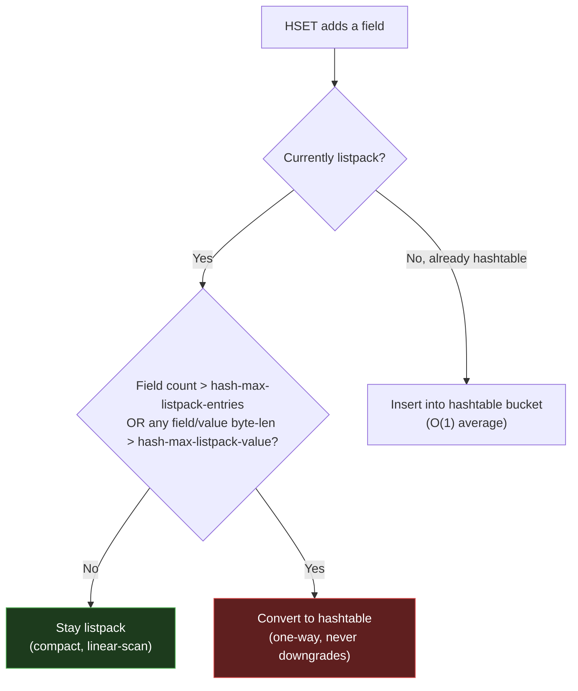

# Module 2.3 — Redis Hashes (`listpack` → `hashtable`)

> **Goal of this lesson:** Understand Redis Hashes from the command surface down to the
> two internal encodings (`listpack` and `hashtable`). By the end you should be able to
> explain *why* Hashes are a better model than one-key-per-field Strings, when Redis
> upgrades the encoding, what that costs, and how to use Hashes for the most common
> entity-storage patterns in production.

---

## Section 1: The Big Picture

A Redis Hash is a **dictionary of field→value pairs** stored under a single key. Think of
it as a mini key-value store nested inside a Redis key.

**Why it exists:** When you need to model a structured object — a user profile, a shopping
cart, a page's view/like counters, a config record — storing one String key per field is
wasteful and awkward. A Hash lets you group all the fields for one entity under one Redis
key, with atomic reads and writes on individual fields.

**Where it appears in production:**

- **User profiles**: `HSET user:1001 name "Alice" email "alice@co.com" plan "pro"` — read
  individual fields without deserializing a JSON blob.
- **Shopping carts**: field = product ID, value = quantity. Atomic `HINCRBY` to adjust
  quantities without fetching the whole cart.
- **Per-entity counters**: `HINCRBY article:42:stats views 1` — one key per entity, many
  counters per key, one round-trip for all stats.
- **Session storage**: one Hash per session ID — partial reads for the field you need.
- **Rate limiting buckets**: one Hash per (user, time window), fields = routes or actions.
- **Config/feature flags**: one Hash per service with named flags as fields.

---

## Section 2: Mental Model

A Hash is a **mini-dictionary inside a key**.

```
   Redis key: "user:1001"
   ┌─────────────┬─────────────────────────┐
   │    field    │          value           │
   ├─────────────┼─────────────────────────┤
   │  "name"     │  "Yatharth"             │
   │  "email"    │  "yatharth@topo.io"     │
   │  "age"      │  "28"                   │
   │  "country"  │  "India"                │
   └─────────────┴─────────────────────────┘
```

The analogy: **a row in a database table, but stored in Redis**. One key maps to a record;
each column is a field. You can read or write any column without touching the others.

The key insight — what Hashes unlock that Strings can't:
- **Partial reads**: `HGET user:1001 plan` fetches one field, not the whole object.
- **Partial writes**: `HSET user:1001 age 29` updates one field atomically. With a JSON
  String you'd GET the whole blob, deserialize it, modify it, re-serialize it, SET it back
  — four steps, not atomic, wasteful.
- **Atomic counters per field**: `HINCRBY article:42 views 1` increments a field in a
  single round-trip without loading the object.

Key properties:
- Fields are **unique within a Hash** (setting the same field twice overwrites the first).
- **No ordering guarantee** on fields. Iteration order is arbitrary.
- A Hash with **zero fields ceases to exist** — Redis deletes the key automatically.
- Both field names and values are **binary-safe strings** (up to 512 MB each).

---

## Section 3: Practical Usage

### Why Hash instead of one String per field

This is the most important design question — it comes up in every Redis interview.

**Option A — one String key per field:**
```
SET user:1001:name    "Yatharth"
SET user:1001:email   "yatharth@topo.io"
SET user:1001:age     "28"
SET user:1001:country "India"
```

**Option B — one Hash key:**
```
HSET user:1001 name "Yatharth" email "yatharth@topo.io" age "28" country "India"
```

**Why Option B wins:**

| Dimension | One String per field | One Hash |
|---|---|---|
| **Memory** | Each key has a full Redis object header (~64–100 bytes overhead) | All fields share one key header; small Hashes use the compact `listpack` encoding |
| **Atomicity** | Reading 4 keys requires a pipeline or Lua; they can diverge | `HMGET user:1001 name email` is one atomic command |
| **Keyspace pollution** | 4 keys per user × 1M users = 4M keys | 1M keys; keyspace stays clean, `SCAN` is cheaper |
| **TTL** | Must set/refresh TTL on every sub-key separately | One TTL on the Hash key covers all fields |
| **Partial updates** | Must `GET`+`SET` the whole blob if using JSON string | `HSET user:1001 age 29` — touch only what changed |

The memory win is especially dramatic for small Hashes: the `listpack` encoding packs
everything into a single contiguous buffer with no per-field pointer overhead. Storing
1 million users with 4 fields each in individual Strings vs. Hashes can be **5–10× more
memory** with Strings.

---

### Writing fields

| Command | Meaning | Big-O |
|---|---|---|
| `HSET key f v [f v ...]` | Set one or more fields (overwrites if exists) | O(N) fields |
| `HSETNX key f v` | Set field **only if it does not exist** | O(1) |
| `HDEL key f [f ...]` | Delete one or more fields; returns count deleted | O(N) fields |

```bash
127.0.0.1:6379> HSET user:1001 name "Yatharth" email "yatharth@topo.io" age 28
(integer) 3           # ← number of NEW fields created (not updated ones)
127.0.0.1:6379> HSET user:1001 age 29
(integer) 0           # ← 0 new fields; age already existed, just updated
127.0.0.1:6379> HDEL user:1001 country
(integer) 0           # ← field didn't exist
```

### Reading fields

| Command | Meaning | Big-O |
|---|---|---|
| `HGET key f` | Get one field | O(1) |
| `HMGET key f [f ...]` | Get multiple fields | O(N) fields |
| `HGETALL key` | Get all fields and values (interleaved) | O(N) total fields |
| `HKEYS key` | Get all field names | O(N) |
| `HVALS key` | Get all values | O(N) |
| `HLEN key` | Count of fields | O(1) |
| `HEXISTS key f` | Does field exist? | O(1) |
| `HRANDFIELD key [count [WITHVALUES]]` | Random field(s) | O(N count) |

```bash
127.0.0.1:6379> HGET user:1001 name
"Yatharth"

127.0.0.1:6379> HMGET user:1001 name email age
1) "Yatharth"
2) "yatharth@topo.io"
3) "29"

127.0.0.1:6379> HGETALL user:1001
1) "name"
2) "Yatharth"
3) "email"
4) "yatharth@topo.io"
5) "age"
6) "29"
```

### Numeric fields (counters inside a Hash)

| Command | Meaning | Big-O |
|---|---|---|
| `HINCRBY key f n` | Increment integer field by `n` (creates if absent) | O(1) |
| `HINCRBYFLOAT key f f` | Increment float field | O(1) |

```bash
127.0.0.1:6379> HSET stats:page:42 views 0 likes 0
127.0.0.1:6379> HINCRBY stats:page:42 views 1
(integer) 1
127.0.0.1:6379> HINCRBYFLOAT stats:page:42 rating 4.5
"4.5"
```

This is one of the most powerful Hash patterns: a **per-entity counter object** with one
round-trip per counter increment, rather than one round-trip per scalar key.

### Cursor-based iteration (HSCAN)

For large Hashes where `HGETALL` is unsafe:

```bash
HSCAN user:sessions 0 COUNT 100
# returns: [next_cursor, [f1, v1, f2, v2, ...]]

# Iterate until cursor returns to "0":
HSCAN user:sessions 0 COUNT 100
HSCAN user:sessions <cursor1> COUNT 100
...
HSCAN user:sessions <cursorN> COUNT 100    # cursor is "0" → done
```

`HSCAN` is **not fully atomic** across calls (the Hash can change between calls), but it is
safe for full-scan scenarios and will not block the server. The `COUNT` is a *hint*, not a
hard limit.

---

### Patterns

**Pattern 1 — User profile / entity store:**
```bash
HSET user:1001 name "Yatharth" email "y@topo.io" plan "pro" credits 500

# Read only what you need (no JSON parse):
HGET user:1001 plan
HMGET user:1001 name credits

# Update one field without touching others:
HSET user:1001 plan "enterprise"

# Atomic counter inside the Hash:
HINCRBY user:1001 credits -10
```

**Pattern 2 — Per-entity counters object:**
```bash
# Instead of 4 separate keys per article:
HINCRBY article:42:stats views 1
HINCRBY article:42:stats likes 1
HINCRBYFLOAT article:42:stats rating 0.1
HMGET article:42:stats views likes rating
```
One round-trip for all stats at once, and one key instead of 4.

**Pattern 3 — Shopping cart (field = product ID, value = quantity):**
```bash
HSET cart:user:55 prod:101 2 prod:205 1
HINCRBY cart:user:55 prod:101 1        # add one more of prod 101
HDEL cart:user:55 prod:205             # remove item
HGETALL cart:user:55                   # full cart contents
HLEN cart:user:55                      # item type count
```

**Pattern 4 — Rate limiting with per-route buckets:**
```bash
# Instead of one key per (user, route, minute):
HINCRBY ratelimit:user:55:2024060301 GET:/api/search 1
EXPIRE ratelimit:user:55:2024060301 120

# Check all routes for this user in one call:
HGETALL ratelimit:user:55:2024060301
```

**Pattern 5 — Caching a sparse, frequently-changing object:**
Store only the fields that change often in a Hash; put the static fields in a separate Hash
with a longer TTL. This avoids blowing the cache on a field that changes every second.

---

## Section 4: Common Mistakes

**Mistake 1 — `HGETALL` on a large Hash (blocks the server)**

`HGETALL` serializes all fields in one shot. On a Hash with thousands of fields, this
blocks Redis's single-threaded event loop for the entire serialization duration — same
danger as `LRANGE 0 -1` on a huge List.

```bash
# Wrong: HGETALL on a session store with 10,000 sessions per user
HGETALL user:sessions   # blocks the server

# Right: Use HSCAN for large Hashes in production
HSCAN user:sessions 0 COUNT 100
```

**Mistake 2 — Storing one huge JSON blob as a Hash field value**

A 10 MB JSON blob stored as a Hash value is a **big key sub-problem**. `HGET` is O(1) to
find the field, but the server still has to serialize and write 10 MB over the network in
one shot — blocking the event loop during that write. Keep individual field values small.

```bash
# Wrong: one giant blob value
HSET user:1001 profile_data "{...10MB JSON...}"

# Right: break it into individual fields, or store the blob in a separate key
HSET user:1001 name "Alice" email "alice@co.com" plan "pro"
```

**Mistake 3 — Using `HMSET` (deprecated since Redis 4.0)**

`HMSET` was deprecated when `HSET` gained multi-field support. Using `HMSET` in new code
signals outdated knowledge and may fail in future Redis versions.

```bash
# Wrong (deprecated):
HMSET user:1001 name "Alice" age 28

# Right:
HSET user:1001 name "Alice" age 28
```

**Mistake 4 — One long value triggers hashtable encoding for the whole Hash**

The `hash-max-listpack-value` limit (default 64 bytes) applies to every individual field
name AND value. Adding a single field whose name or value exceeds 64 bytes converts the
entire Hash to `hashtable` encoding — even if the Hash has only 2 fields.

```bash
127.0.0.1:6379> HSET test f1 v1 f2 v2
127.0.0.1:6379> OBJECT ENCODING test
"listpack"

# One long value flips the whole Hash:
127.0.0.1:6379> HSET test f3 "this value is longer than 64 bytes so it triggers the hashtable upgrade right now"
127.0.0.1:6379> OBJECT ENCODING test
"hashtable"   # ← converted even though only 3 fields!
```

Common culprits: UUIDs (36 bytes — safe), JWT tokens (150+ bytes — triggers upgrade), base64
blobs, session tokens.

**Mistake 5 — Misreading `HSET`'s return value**

`HSET` returns the count of **newly created** fields, not the updated value and not the
total field count. An `HSET` on an existing field returns `0`, which looks like failure.

```bash
127.0.0.1:6379> HSET user:1001 age 28
(integer) 1    # ← 1 new field created

127.0.0.1:6379> HSET user:1001 age 29
(integer) 0    # ← 0 new fields; age was updated, not created
               #   this is NOT an error
```

**Mistake 6 — Not using `HSCAN` for large Hashes**

If your Hash can grow beyond a few hundred fields in production, always use `HSCAN` rather
than `HGETALL`, `HKEYS`, or `HVALS`. The scan cursor ensures no single call dumps the
entire Hash.

---

## Section 5: Production Considerations

### Memory efficiency: listpack vs hashtable

The encoding makes a dramatic memory difference. For a 10-field Hash with ~8-byte field
names and ~12-byte values:

```
listpack encoding (~279 bytes total):
  Header: 6 bytes
  10 pairs × (field: 1+8+1 + value: 1+12+1) = 10 × 24 = 240 bytes
  Terminator: 1 byte
  robj header: ~32 bytes

hashtable encoding (~888 bytes total):
  Per dictEntry: key SDS(24) + val SDS(24) + entry struct(24) = 72 bytes
  10 entries × 72 = 720 bytes
  Hash table array (16 slots × 8 bytes) = 128 bytes
  dict struct: ~40 bytes
```

**listpack is ~3× more memory-efficient** for a 10-field Hash. At 1 million users with 4
fields each, that's the difference between a 3 GB and 9 GB footprint.

### Encoding thresholds and when to tune them

| Config key | Default | Effect |
|---|---|---|
| `hash-max-listpack-entries` | `128` | Max field count before upgrading to hashtable |
| `hash-max-listpack-value` | `64` | Max byte length of any single field OR value |

```bash
CONFIG GET hash-max-listpack-entries
CONFIG GET hash-max-listpack-value
```

**Raise `hash-max-listpack-entries`** if your Hashes always stay below a known field count
and you want to keep the compact listpack encoding. For user-profile workloads with ≤50
fields, raising to 64 or 256 is reasonable and saves memory.

**Lower `hash-max-listpack-value`** if your application stores values you know will always
be short (e.g., you use 36-byte UUIDs as values but the default 64 lets some other value
slip through). Explicit thresholds prevent surprise encoding upgrades.

**Accept hashtable encoding** when values are inherently long — JWT tokens, base64 blobs,
long descriptions. Tuning the threshold to force listpack with oversized values causes
problems when data outliers appear.

### Monitoring encoding in production

```bash
OBJECT ENCODING user:1001      # listpack vs hashtable
HLEN user:1001                 # field count (O(1))
MEMORY USAGE user:1001         # total bytes including overhead
DEBUG OBJECT user:1001         # encoding details

# Safe large-Hash iteration:
HSCAN user:sessions 0 COUNT 200 MATCH "sess:*"
```

When `OBJECT ENCODING` shows `hashtable` on a Hash you expected to be `listpack`, diagnose
what triggered the upgrade:

```bash
# Find the longest value in a Hash (redis-cli + awk):
HGETALL mykey | awk 'NR%2==0{print length, $0}' | sort -rn | head -5
```

### Performance cheat-sheet

| Operation | Encoding=listpack | Encoding=hashtable |
|---|---|---|
| `HSET` one field | O(n) scan to find/insert | O(1) avg |
| `HGET` one field | O(n) scan | O(1) avg |
| `HDEL` one field | O(n) scan + memmove | O(1) avg |
| `HGETALL` | O(n) total entries | O(n) total entries |
| `HLEN` | O(1) | O(1) |
| `HSCAN` | O(n) | O(n) per full scan |

For **small Hashes** (listpack), "O(n) scan" is misleading — n is small (≤128) and the scan
is over a contiguous buffer with excellent cache locality. In practice it's faster than a
hashtable lookup for small n due to CPU cache effects.

### Failure modes and operational concerns

- **Encoding upgrade is permanent**: once a Hash converts to hashtable, it never downgrades.
  A temporary large value (e.g., a 200-byte debug token) can permanently inflate memory.
- **Big Hash + `HGETALL` in a hot path**: monitor your slowlog (`SLOWLOG GET 10`) for
  commands taking > 1ms; HGETALL on large Hashes is a common culprit.
- **Rehashing pause**: during incremental rehash (when the hashtable grows), each command
  pays a tiny extra migration cost. This is usually invisible, but extremely write-heavy
  Hashes that keep crossing the load-factor threshold can accumulate this overhead.

---

## Section 6: Internals Deep Dive

### Why small Hashes don't need a hash table

Consider a Hash with 5 fields. A hash table has overhead for: the `dict` struct, two table
arrays (`ht[0]` and `ht[1]`), per-`dictEntry` structs with key pointer + value union + next
pointer, and SDS headers for each field name and value. For 5 fields, the overhead dwarfs
the actual data.

This is the pointer-overhead problem: a hash table is designed for large collections where
O(1) average lookup justifies the overhead. For small collections, you pay the same pointer
tax but get no benefit — 5 fields is always going to be a short scan anyway.

**The `listpack` solution:** store the whole Hash in a single flat byte buffer. No pointers,
no linked lists, no structs — just the data and a few bytes of bookkeeping per entry.

### `listpack` — the small-Hash encoding

For Hashes within the configured thresholds, Redis uses a **listpack**: a compact contiguous
buffer where field-value pairs are stored as consecutive entries.

Finding a field requires a **linear scan** through the buffer comparing each odd entry
(field) until a match is found. This is fine because the listpack is only used while the
Hash is small (≤128 fields and all values ≤64 bytes by default). At that scale, a linear
scan of a tiny contiguous buffer is **faster in practice** than a hash table lookup due to
CPU cache effects — the whole buffer fits in L1/L2 cache.

### `hashtable` — the large-Hash encoding

Once either threshold is crossed, Redis converts to a proper hash table.

> **A Hash starts as a `listpack`. It is upgraded to a `hashtable` the moment it exceeds
> EITHER threshold — and it never downgrades back.**

```
   Encoding selection rule:

   ┌─────────────────────────────────────────────────────────────────────┐
   │                                                                     │
   │   listpack   ──(field count > 128  OR  any field/value > 64B)──►  hashtable
   │               (one-way; never downgrades)                          │
   │                                                                     │
   └─────────────────────────────────────────────────────────────────────┘
```



`HGET` on a hashtable encoding: compute `hash(field) % size`, find the bucket, walk the
chain comparing field names → typically **O(1)** average, **O(n)** worst case (all
collisions, extremely rare with a good hash function).

### Why incremental rehashing exists

When a hashtable's load factor exceeds 1 (more entries than slots), Redis must resize:
double the table and redistribute all entries. Doing this all at once would **block the
event loop** for many milliseconds on a large Hash — unacceptable for a single-threaded
server.

Redis solves this with **incremental (lazy) rehashing**: the resize is spread across
subsequent operations, one bucket migrated per command.

The mechanism keeps **two hash tables** simultaneously: `ht[0]` (old) and `ht[1]` (new,
2× size). A `rehashidx` cursor tracks which bucket of `ht[0]` has been migrated next.
On every Hash operation, Redis migrates one bucket, then increments `rehashidx`. Reads
check both tables. When `ht[0]` is empty, `ht[1]` becomes `ht[0]` and the old table is
freed.

> **This same `dict` mechanism powers Redis's global key-value store** — every key lookup
> and write on the entire Redis instance goes through this same incremental rehash logic.
> Understanding it for Hashes means you understand how Redis's top-level keyspace works.

---

## Section 7: Visual Diagrams

### listpack buffer layout

```
listpack buffer layout for HSET user:1 name "Alice" age "30":

┌──────────────┬────────────┬─────────────────────────────────────────────────────────┬────────┐
│  Total Bytes │ Num Entries│                    entries                              │  0xFF  │
│   (4 bytes)  │ (2 bytes)  │                                                        │(end)   │
└──────────────┴────────────┴─────────────────────────────────────────────────────────┴────────┘

entries (read left-to-right in field/value pairs):

┌───────────────┬──────────┬───────────────┬──────────┬──────────────┬──────────┐
│ Enc+Len "name"│  "name"  │ Enc+Len "Alice"│ "Alice"  │ Enc+Len "age"│  "age"   │ ...
│  + backlen    │(4 bytes) │  + backlen    │(5 bytes) │  + backlen   │(3 bytes) │
└───────────────┴──────────┴───────────────┴──────────┴──────────────┴──────────┘
   ▲ field entry              ▲ value entry             ▲ field entry  ▲ value entry

No pointers. One flat buffer. Field lookup = linear scan of odd entries.
```

### hashtable (dict) structure

```
Hash table (dict) internals:

┌─────────────────────────────────────────────────────────────────────────────┐
│  dict                                                                       │
│  ┌───────────────┐                                                          │
│  │ ht[0]         │  ← primary table                                         │
│  │  size: 8      │  (always a power of 2)                                  │
│  │  used: 5      │  (entries currently stored)                              │
│  │  table: ──────┼──────────────────────────────────────────────────────┐   │
│  └───────────────┘                                                       │   │
│  ┌───────────────┐                                                       │   │
│  │ ht[1]         │  ← rehash table (only non-null during incremental     │   │
│  │  (NULL)       │    rehash)                                            │   │
│  └───────────────┘                                                       │   │
└──────────────────────────────────────────────────────────────────────────┼───┘
                                                                          ▼
table array (size=8 slots):
┌───┬───┬───┬───┬───┬───┬───┬───┐
│ 0 │ 1 │ 2 │ 3 │ 4 │ 5 │ 6 │ 7 │
└─┬─┴───┴───┴─┬─┴───┴───┴───┴───┘
  │             │
  ▼             ▼
┌──────────┐  ┌──────────┐
│ dictEntry│  │ dictEntry│
│ key:"name"│  │ key:"age"│
│ val:"Alice"│  │ val:"30" │
│ next: NULL│  │ next: ───┼──► ┌──────────┐
└──────────┘  └──────────┘     │ dictEntry│
                                │ key:"city"│
                                │ val:"Delhi"│
                                │ next: NULL│
                                └──────────┘
(separate chaining via linked list for collisions)
```

### Incremental rehash timeline

```
Normal state (no rehash):           During rehash:
┌──────────┐                        ┌──────────┐    ┌──────────┐
│ ht[0]    │                        │ ht[0]    │    │ ht[1]    │
│ size:8   │                        │ size:8   │    │ size:16  │  ← new table
│ used:6   │                        │ used:6   │    │ used:0   │    (2× old size)
│ table:─┐ │                        │ table:─┐ │    │ table:─┐ │
└─────────┘                        └────────┘ │   └─────────┘ │
                                              ▼               ▼
                                   (old entries, shrinking)  (new entries, growing)

Timeline:

  Op 1: HGET   → migrate bucket 0 from ht[0] to ht[1]
  Op 2: HSET   → migrate bucket 1
  Op 3: HDEL   → migrate bucket 2
  ...
  Op N: HGET   → bucket 7 (last) migrated → rehash complete, ht[1] becomes ht[0]

  Each op pays O(1) extra work for migration.
  No single op blocks for O(n) rehash cost.
```

---

## Section 8: Interview Questions

**Q1 (Junior). What is a Redis Hash and how is it different from a String?**

A String maps one key to one binary-safe value. A Hash maps one key to a sub-dictionary of
field→value pairs, supporting independent reads, writes, and increments on individual
fields without touching the rest.

**Q2 (Junior). Why would you store a user object as a Hash instead of a JSON string in a
String key?**

A Hash lets you read or update individual fields atomically with O(1) commands (`HGET`,
`HSET`). With a JSON String you must `GET` the entire blob, deserialize it, modify it,
serialize it, and `SET` the whole thing back — not atomic, and wasteful for large objects.
Hashes also use less memory for small objects via the `listpack` encoding.

**Q3 (Mid). When does a Hash switch from `listpack` to `hashtable` encoding?**

When either the field count exceeds `hash-max-listpack-entries` (default 128) OR any
single field name or value's byte length exceeds `hash-max-listpack-value` (default 64).
The conversion is one-way — it never downgrades back to listpack.

**Q4 (Mid). Why is `HGET` O(n) for a listpack-encoded Hash but O(1) for a hashtable?**

In listpack encoding there is no index — fields are stored as sequential entries in a flat
buffer. Finding a field requires scanning from the start, comparing each field entry until
a match is found (O(n) comparisons). In hashtable encoding, the field name is hashed to a
bucket directly, giving O(1) average lookup.

**Q5 (Senior). Explain Redis's incremental rehashing and why it's necessary.**

Redis's hash table doubles in size when it becomes too full (load factor > 1). Resizing all
at once would block the single-threaded event loop for O(n) time. Incremental rehashing
keeps two tables (`ht[0]` and `ht[1]`): on each Hash operation, one bucket is migrated
from the old table to the new one. Reads check both tables. After all buckets are migrated,
`ht[1]` becomes the primary and the old table is freed. The migration cost is amortized
across many commands with no single pause.

**Q6 (Senior). You have 5 million small user Hashes, each with ~15 fields and all values
< 30 bytes. Your ops team says memory is twice what they expected. What do you investigate?**

The Hashes may have accidentally upgraded to `hashtable` encoding. Check `OBJECT ENCODING`
on a sample key. If it shows `hashtable`, diagnose what triggered the upgrade: run
`CONFIG GET hash-max-listpack-entries` / `hash-max-listpack-value` and verify the data
stays within those limits. If a value exceeds the byte limit (e.g., a 70-byte session
token), either lower the value length client-side or accept that the encoding won't be
`listpack`. If the encoding is `listpack` but memory is still high, use `MEMORY USAGE` to
check per-key overhead and compare against the theoretical listpack size. Also check if
some Hashes have many more fields than expected.

**Q7 (Staff). Design a leaderboard system where you must efficiently rank users AND read
per-user stats. What Redis types do you use?**

A **Sorted Set** (Module 2.5) for the ranked leaderboard — it gives you O(log n) updates
and O(log n + range) range queries by score. A **Hash per user** for per-user metadata
(name, avatar URL, win/loss record) — `HGET user:<id> wins` is O(1). The two structures
are complementary: the Sorted Set answers "who is at rank 5?" and "what are the top 10?"
while the Hashes answer "what is player 7's full profile?". You'd never try to do
arbitrary ranking with a Hash (no order) and you'd never store rich metadata in a Sorted
Set member string.

**Q8 (Staff). A Hash field holds a value that is occasionally updated by multiple services.
How do you safely do compare-and-swap (CAS) on a Hash field?**

Redis has no native CAS for individual Hash fields. You must use Lua (`EVAL`) or
WATCH+MULTI/EXEC (Module 3.3). With Lua: load the current value, compare, and conditionally
set — all in one atomic server-side script. With WATCH: watch the key, read the field,
open MULTI, set the field in EXEC; if another client modified the key between WATCH and
EXEC, the transaction is aborted and you retry. Lua is simpler and more efficient for this
case (one round trip, not two), but WATCH is fine for low-contention fields.

---

## Section 9: Key Takeaways

### Must Know as a Redis User

- A Hash is a **sub-dictionary**: one Redis key, many independent field→value pairs. Use it
  to model objects, avoid keyspace explosion, and enable partial atomic updates.
- **Partial reads and writes are the core value**: `HGET` fetches one field; `HSET` updates
  one field — without touching or loading the rest of the object.
- **`HGETALL` on large Hashes = footgun.** Use `HSCAN` for iterating over large Hashes.
- **`HMSET` is deprecated** since Redis 4.0. Use `HSET key f1 v1 f2 v2 ...`.
- **`HSET` returns the count of NEW fields**, not the updated value and not a success flag.

### Should Know as a Senior Engineer

- **Two encodings**: small → `listpack` (flat contiguous buffer, linear scan, memory-
  efficient), large → `hashtable` (O(1) avg, incremental rehash). Upgrade is one-way.
- The upgrade trigger is **dual**: field count (`hash-max-listpack-entries`) **or** any
  single field/value byte length (`hash-max-listpack-value`). Either condition alone forces
  conversion — even a single field with a 65-byte value converts a 2-field Hash.
- **`listpack` is ~3× more memory-efficient** than `hashtable` for small Hashes. For
  millions of small user objects, this is the difference between 3 GB and 9 GB.
- Default thresholds (128 fields, 64 bytes/value) are well-tuned for user-profile objects.
  Audit your data shapes and tune with `MEMORY USAGE`.

### Nice To Know as a Redis Contributor

- **Incremental rehashing** amortizes the O(n) table resize across many operations by
  migrating one bucket per command. The same mechanism powers Redis's global key dict.
- The `listpack` linear-scan is **faster than hashtable lookup for small n** due to CPU
  cache effects — the whole buffer fits in L1/L2 cache, while a hashtable requires pointer
  chasing across multiple cache lines.
- `ht[0]` and `ht[1]` in the `dict` struct are the two tables held simultaneously during
  incremental rehash. Reads during rehash must check both tables.
- The `rehashidx` cursor in the `dict` struct tracks which bucket of `ht[0]` to migrate
  next. When it reaches `ht[0].size`, rehash is complete and `ht[1]` becomes `ht[0]`.

---

### Quick reference card

```
WRITE:      HSET key f v [f v...]    HSETNX key f v    HDEL key f [f...]
READ ONE:   HGET key f               HEXISTS key f     HLEN key
READ MANY:  HMGET key f [f...]       HRANDFIELD key [count [WITHVALUES]]
READ ALL:   HGETALL key              HKEYS key         HVALS key
ITERATE:    HSCAN key cursor [COUNT n] [MATCH pattern]
COUNTERS:   HINCRBY key f n          HINCRBYFLOAT key f f

ENCODINGS:  listpack  ─(field count > 128  OR  any field/value > 64 bytes)─►  hashtable
            (one-way; never downgrades)

CONFIG:     hash-max-listpack-entries (default 128)
            hash-max-listpack-value   (default 64)

INSPECT:    OBJECT ENCODING key    MEMORY USAGE key    HSCAN key 0 COUNT 100
```

> **Next up — 2.4 Sets (`intset` → `listpack` → `hashtable`):** the same compact-then-
> promote pattern, but now with **no values** (only unique members) and a third encoding
> (`intset`) that packs integer-only Sets into a sorted integer array for superb memory
> efficiency. You'll also see set-algebra commands (`SINTER`, `SUNION`, `SDIFF`) that have
> no equivalent in Lists or Hashes.
