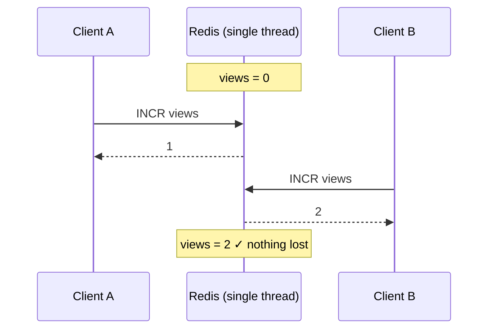
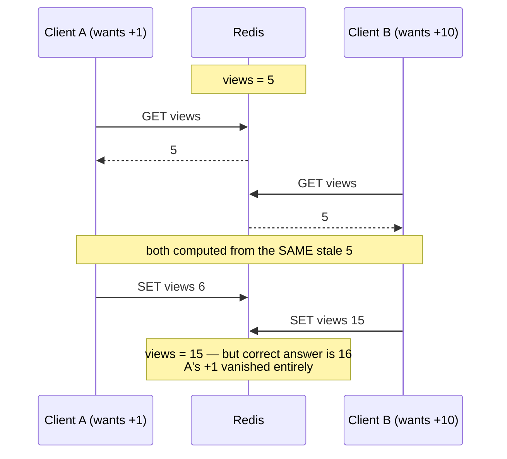

# Module 3.1 — Redis Execution Model & Per-Command Atomicity

> **Module 3 — Atomicity & Coordination** · [← Index](../../README.md) · Next → [3.2 Atomic commands](./3.2-atomic-commands.md)

---

## In one sentence

Redis runs every command to completion on a single thread before starting the next, so **each individual command is atomic for free** — but that guarantee stops at the command boundary.

## Problem it solves

Concurrent clients hitting the same key would normally need locks, isolation levels, and careful reasoning about interleaving. Redis removes that entire problem class *within a single command* — no mutexes, no torn reads, no half-applied updates.

## Mental model

One cashier, one customer at a time, served completely before the next is called. Nothing is ever half-done when someone else looks.

The catch: the guarantee covers **one transaction at the till**, not "I'll go get my wallet and come back" — that gap is where races live.

## How it works

Redis pulls a command off the event loop, executes it fully (read + mutate + build reply), and only then moves on (see [1.3 Single-threaded model](../module-01-foundations/1.3-single-threaded-model.md) and [1.5 Event loop & I/O multiplexing](../module-01-foundations/1.5-event-loop-io-multiplexing.md)). Because no two commands ever run *concurrently*, there is no shared-state race to protect against — the internal `dict` needs no locking at all.

So when two clients both send `INCR views` at the same instant, Redis serializes them:



Final value is exactly 2. No increment is lost, and you wrote no locking code.

## What "atomic" does and doesn't guarantee

**It DOES guarantee**, for a single command:

- All-or-nothing: the command's effects are never half-visible to another client.
- No interleaving: nothing runs in the middle of it.
- This holds even for multi-key commands (`MSET`, `SUNIONSTORE`) and commands touching many elements (`LPUSH k a b c`).

**It does NOT guarantee:**

- Atomicity **across two commands** you send — this is the big one (below).
- Durability. Atomic ≠ persisted; a crash can still lose recent writes (Module 4).
- Isolation from expiry/eviction — a key can vanish between your commands.

## The failure mode: read-modify-write

The moment your logic is "read a value, compute, write it back," you have used **two** commands, and another client can slip between them.

### Why `SET` is not an increment

This is the part that confuses everyone, so let's be precise. The increment does **not** happen in Redis. It happens in your application's memory, invisible to the server:

```
value = GET views      # value = 5
value = value + 1      # ← THE INCREMENT. in your app, in RAM
SET views value        # Redis just sees "write 6"
```

Redis has no idea anyone was incrementing anything. It received a command that says *"make this key 6."* The intent — "add one to whatever is there" — never reached the server.

### The lost update

Give the two clients **different** amounts and the bug becomes impossible to miss:



```
start: views = 5

client A wants +1        client B wants +10
─────────────────        ──────────────────
GET views → 5
                         GET views → 5     ← both read the same stale 5
SET views 6
                         SET views 15      ← overwrites A completely

final: 15        correct answer: 16
```

B's write did not "combine" with A's — it **replaced** it. Flip the order and you end at 6, losing B's +10 instead. This is **last-write-wins**, and it is exactly what you do not want for a counter.

Note that both clients computed *correctly*. A read 5, added 1, got 6. B read 5, added 10, got 15. Neither did the arithmetic wrong — both were working from a photograph of the past.

### Absolute vs relative writes

This is the cleanest way to hold the whole idea:

| | What it means | Safe under concurrency? |
|---|---|---|
| `SET views 6` | **Absolute** — "make it 6, regardless of what's there now." A decision based on a stale snapshot. | ❌ loses data |
| `INCR views` | **Relative** — "add 1 to whatever is there *right now*", evaluated live at execution time. | ✅ cannot lose data |

Absolute writes computed from stale reads lose updates. Relative writes structurally cannot, because the reading and the adding happen inside the same indivisible command.

An analogy: two people open the same Google Doc showing 5 items. Both add one item and save. The doc ends with 6 items, not 7 — the second save overwrote the first person's version wholesale.

## Basic example

```bash
# ✅ safe — one atomic command does read+write together
INCR views

# ❌ unsafe — two commands, race window in between
GET views
SET views <value+1>
```

## The four ways to get multi-command atomicity

This is the roadmap for the rest of Module 3:

| Tool | What it gives you |
|---|---|
| **A single atomic command** ([3.2](./3.2-atomic-commands.md)) | Best option — if one command already does what you need |
| **`MULTI`/`EXEC`** ([3.3](./3.3-multi-exec.md)) | Queue commands, run them with no interleaving |
| **`WATCH`** ([3.4](./3.4-watch-optimistic-cas.md)) | Optimistic CAS — abort if a key changed under you |
| **Lua / Functions** | Arbitrary logic, executed atomically server-side |

**Rule of preference:** reach for a single atomic command first; only escalate when it cannot express your logic.

## Important details and edge cases

- **Atomicity is per-command, not per-connection.** Sending two commands back-to-back on one connection gives you *ordering*, not atomicity.
- **Pipelining is not atomic** — it batches network round trips; other clients' commands can still interleave.
- A slow command holds the thread and delays everyone — atomicity's cost (see [1.3](../module-01-foundations/1.3-single-threaded-model.md)).
- Expiration and eviction can delete a key *between* your commands, even with no other client writing.

## When to use / not use

Rely on per-command atomicity for counters, flags, and any operation a single command expresses. Do **not** rely on it the moment your update depends on a value you read in a previous command.

## Comparison with related concepts

- **vs SQL transactions** — SQL gives ACID across many statements with rollback; Redis gives atomicity per command, and even `MULTI` has **no rollback** (see [3.3](./3.3-multi-exec.md)).
- **vs application-level locks** — unnecessary within one command; genuinely needed across commands (or use `WATCH`/Lua instead of a distributed lock where possible).

## Common misunderstandings

- ❌ "Redis is atomic, so my read-then-write is safe." → Only each command is atomic; the sequence races.
- ❌ "Atomic means durable." → It means indivisible, not persisted.
- ❌ "I need a lock for concurrent `INCR`." → No; that's one atomic command.
- ❌ "Pipelining makes my batch atomic." → It doesn't; that's `MULTI` or Lua.
- ❌ "Both clients wrote 6, so 6 is correct." → Two clients each intended +1. The answer should be 7. Both writing 6 is *proof* that the second never saw the first's work.

## Production example

A view counter under heavy concurrency: `INCR views:post:123` from 50 app servers gives an exact count with zero coordination. Rewrite the same feature as `GET` + compute + `SET` and you will silently undercount under load — the bug appears only at high traffic, which is why it usually ships to production before anyone notices.

## Quick revision

- One thread → each command runs start-to-finish → **atomic per command**.
- The guarantee **ends at the command boundary**.
- Read-modify-write across two commands = lost updates (last-write-wins).
- `SET` is **absolute** (based on a stale read); `INCR` is **relative** (evaluated live). Prefer relative.
- Fixes, in order of preference: single atomic command → `MULTI` → `WATCH` → Lua.
- Atomic ≠ durable; atomic ≠ isolated from expiry/eviction.

## Self-test questions

1. Two clients send `INCR c` simultaneously — final value and why no lock is needed?
2. Show a two-command sequence that loses an update, and explain exactly where the race window is.
3. Is `MSET a 1 b 2` atomic? Is sending `SET a 1` then `SET b 2` atomic? Why the difference?
4. Does atomic mean the write survives a crash? Why or why not?
5. Why is `SET views 6` not an "increment" from Redis's point of view?
6. Name the four ways to get atomicity across multiple operations, and when you'd pick each.

## References

- [Redis transactions](https://redis.io/docs/latest/develop/using-commands/transactions/)
- [You don't need transaction rollbacks in Redis](https://redis.io/blog/you-dont-need-transaction-rollbacks-in-redis/)
