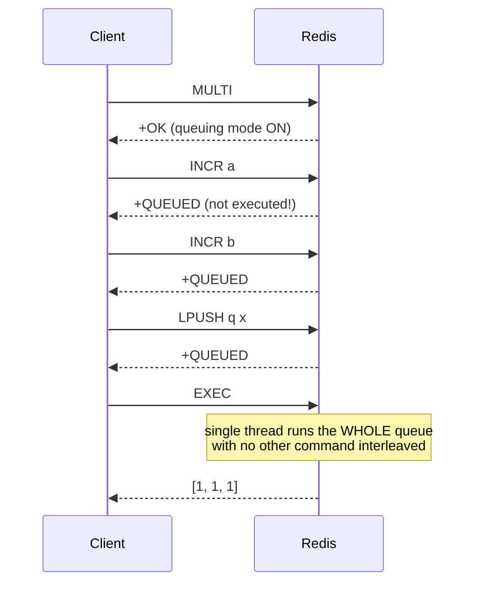
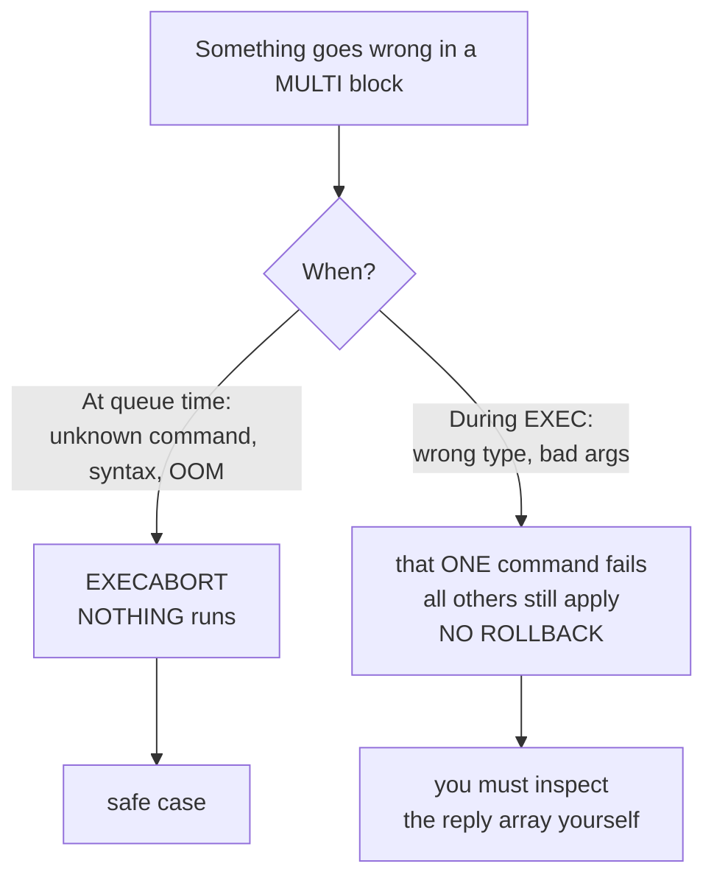

# Module 3.3 — `MULTI` / `EXEC` (Transactions, `DISCARD`, and Why There Is No Rollback)

> **Module 3 — Atomicity & Coordination** · [← Index](../../README.md) · Prev → [3.2 Atomic commands](./3.2-atomic-commands.md) · Next → [3.4 WATCH & optimistic CAS](./3.4-watch-optimistic-cas.md)

---

## In one sentence

`MULTI` starts a **command queue** on your connection; `EXEC` runs the whole queue in one uninterrupted batch so no other client's command can interleave.

## Problem it solves

Sometimes you need several commands to take effect as a unit — debit one key and credit another, write a record and add it to an index — and no single command ([3.2](./3.2-atomic-commands.md)) expresses it. `MULTI`/`EXEC` gives you "these run together, with nothing in between."

## Mental model

**A shopping list, not a database transaction.** Between `MULTI` and `EXEC` nothing executes — Redis just writes each command down and replies `QUEUED`. `EXEC` hands the entire list to the single thread, which runs it start to finish without serving anyone else.

The crucial difference from SQL: it is a *batch*, not a rollback-protected unit. There is **no rollback**, and you **cannot branch** on intermediate results (you never see them until `EXEC` returns).

## How it works



```
MULTI              → +OK        (connection enters queuing mode)
INCR a             → +QUEUED    (not executed yet!)
INCR b             → +QUEUED
LPUSH q x          → +QUEUED
EXEC               → 1) 1  2) 1  3) 1     (array of all replies, in order)
```

`DISCARD` throws the queue away and exits queuing mode without running anything.

Because the whole queue executes inside one slice of the single thread (see [1.3](../module-01-foundations/1.3-single-threaded-model.md)), isolation is total — no other client observes a partial state.

## Basic example

```bash
MULTI
DECRBY account:alice 100
INCRBY account:bob   100
EXEC
```

Either both run, or (if the transaction is aborted before `EXEC`) neither does.

## The two error types — the part everyone gets wrong



### 1. Error BEFORE `EXEC` (queue-time): whole transaction aborts

A syntax error, unknown command, or OOM at queue time marks the connection dirty. `EXEC` then refuses to run anything:

```
MULTI
INVALIDCOMMAND foo     → -ERR unknown command
INCR a                 → +QUEUED
EXEC                   → -EXECABORT Transaction discarded because of previous errors.
```

Nothing executed. This is the *safe* case.

### 2. Error DURING `EXEC` (runtime): only that command fails

```
SET  mystr "hello"
MULTI
INCR counter           → +QUEUED
INCR mystr             → +QUEUED   (queues fine — type error isn't visible yet)
LPUSH mylist a         → +QUEUED
EXEC
# → 1) (integer) 1
#    2) (error) WRONGTYPE Operation against a key holding the wrong kind of value
#    3) (integer) 1
```

`counter` was incremented. `mylist` was pushed. The failing command **was not rolled back — because there is no rollback.** You must inspect the reply array for errors yourself.

## Why no rollback?

Antirez's reasoning: runtime errors in a `MULTI` are almost always **programming errors** (wrong type, wrong arity) that should be caught in development, not runtime conditions worth paying for. Supporting rollback would require versioning/undo machinery that would complicate Redis and slow down the common path for a case that should not happen in correct code. So Redis chose simplicity and speed.

Practical consequence: **`MULTI` gives you isolation and batching, not error recovery.**

## Important details and edge cases

- **You cannot read a value mid-transaction.** Replies only arrive at `EXEC`, so you cannot branch on them. Anything conditional needs [WATCH](./3.4-watch-optimistic-cas.md) or Lua.
- **`WATCH` is what makes `MULTI` conditional** — without it, `EXEC` always runs (unless aborted at queue time). `EXEC` and `DISCARD` both clear watches.
- **`MULTI` is per-connection.** Don't share a connection across threads while a transaction is open; most client libraries handle this for you.
- **Not a lock.** Other clients read and write freely *before* `EXEC` and *after* it — they're only excluded *during* it.
- **In Redis Cluster**, all keys in the transaction must hash to the same slot or you get `CROSSSLOT`. Use hash tags `{user:1}` to force co-location (Module 7).
- **Nested `MULTI` is an error**; you cannot open a transaction inside one.
- **Commands are still validated at queue time** for existence/arity — that's what triggers case 1 above.

## When to use it

- A fixed, known-in-advance set of writes that must land together (transfer between two keys, write + index update, multi-key cleanup).
- When you want isolation but don't need to branch on values.

## When not to use it

- **When one command suffices** → use [3.2 Atomic commands](./3.2-atomic-commands.md).
- **When the write depends on a value you must read first** → [WATCH](./3.4-watch-optimistic-cas.md) or Lua.
- **When you need conditional logic or loops** → Lua.
- **When you only want fewer round trips, not atomicity** → pipelining.
- **When you expect runtime errors and want them undone** → Redis cannot do that; restructure or use Lua with validation up front.

## Comparison with related concepts

| | Atomic? | Can branch on values? | Rollback? | Fewer round trips? |
|---|---|---|---|---|
| Single command ([3.2](./3.2-atomic-commands.md)) | ✅ | n/a | n/a | ✅ |
| Pipelining | ❌ | ❌ | ❌ | ✅ |
| `MULTI`/`EXEC` | ✅ | ❌ | ❌ | ✅ |
| `WATCH` + `MULTI` ([3.4](./3.4-watch-optimistic-cas.md)) | ✅ (or aborts) | ✅ via retry | ❌ | ✅ |
| Lua / Functions | ✅ | ✅ | ❌ | ✅ |

- **vs SQL transaction** — SQL: ACID, rollback, isolation levels. Redis `MULTI`: batching + isolation only, no rollback, no savepoints.

## Common misunderstandings

- ❌ "`MULTI` rolls back on error." → It never rolls back. Runtime errors leave earlier commands applied.
- ❌ "Commands run as I send them." → They queue; nothing runs until `EXEC`.
- ❌ "I can use the result of command 1 inside command 2." → You cannot see any result until `EXEC` returns.
- ❌ "`MULTI` locks the keys." → It doesn't; it only prevents interleaving *during* `EXEC`.
- ❌ "`EXEC` returning an array means everything succeeded." → Individual elements can be errors; you must check them.

## Production example

Moving an item between two user collections, with an index update:

```bash
MULTI
SREM  cart:user:42     sku-991
SADD  saved:user:42    sku-991
HINCRBY stats:user:42  saved_count 1
EXEC
```

All three land together — no window where the item is in neither list.

Note what this *doesn't* do: if `sku-991` wasn't actually in the cart, `SREM` returns `0`, the other two still run, and nothing is undone. If that matters, you need `WATCH` or Lua to validate first.

## Quick revision

- `MULTI` queues (`+QUEUED`), `EXEC` runs the batch atomically, `DISCARD` cancels.
- **Queue-time error → `EXECABORT`, nothing runs.** **Runtime error → that command fails, the rest still apply, no rollback.**
- You cannot read intermediate values or branch — that's `WATCH` or Lua.
- Not a lock; isolation applies only during `EXEC`.
- Cluster: same hash slot or `CROSSSLOT`.

## Self-test questions

1. Walk through what the server returns for each command in a `MULTI` block, and say exactly when execution happens.
2. A `MULTI` contains a misspelled command name. What happens at `EXEC`? Now instead it contains `INCR` on a string key — what happens, and what's different?
3. Why did Redis deliberately choose not to implement rollback?
4. Why can't you use the result of the first queued command to decide the second? What do you use instead?
5. Your `MULTI` touches `user:1:cart` and `user:2:cart` on a Redis Cluster. What error do you get and how do you fix it?

## References

- [Redis transactions](https://redis.io/docs/latest/develop/using-commands/transactions/)
- [EXEC](https://redis.io/docs/latest/commands/exec/)
- [You don't need transaction rollbacks in Redis](https://redis.io/blog/you-dont-need-transaction-rollbacks-in-redis/)
