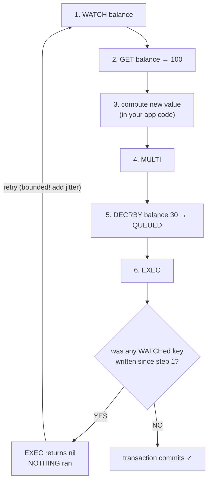

# Module 3.4 — `WATCH` & Optimistic CAS (Check-and-Set, Retry Loops, False Aborts)

> **Module 3 — Atomicity & Coordination** · [← Index](../../README.md) · Prev → [3.3 MULTI / EXEC](./3.3-multi-exec.md)

---

## In one sentence

`WATCH` makes `EXEC` **conditional**: if any watched key was modified between `WATCH` and `EXEC`, the transaction is thrown away and `EXEC` returns `nil` — so you can safely retry.

## Problem it solves

[3.3](./3.3-multi-exec.md) left a gap: `MULTI` cannot branch on values, because you don't see any reply until `EXEC`. But most real logic is **read-modify-write** — "read the balance, check it's enough, then subtract." [3.1](./3.1-execution-model-and-atomicity.md) showed that sequence races.

`WATCH` closes the gap without locking. It does not stop anyone from writing; it just guarantees you'll **find out** if they did, and can abort instead of clobbering them.

## Mental model

**Optimistic locking.** A pessimistic lock says "nobody touches this while I work." Optimistic says "I'll assume nobody will — but I'll check at commit time, and if I was wrong I'll start over."

Think of editing a wiki page. You don't lock it. You load it, type your edit, hit save — and if someone else saved in the meantime, you get "this page changed, please redo." `WATCH` is that check, done by Redis, atomically at `EXEC`.

This is a **compare-and-swap (CAS)** pattern: the "compare" is "has the key changed?", the "swap" is the queued transaction.



## How it works

The order matters and trips people up. You read **after** `WATCH` but **before** `MULTI`:

```
WATCH  balance:alice        → OK      (now monitoring this key)
GET    balance:alice        → "100"   (a real read — you SEE this value)
                                       ...your app decides: 100 >= 30, so subtract
MULTI                       → OK
DECRBY balance:alice 30     → QUEUED
EXEC                        → 1) 70          ← committed, nobody touched it
                            → (nil)          ← ABORTED, someone did. retry.
```

`WATCH` **cannot** go inside `MULTI` — that's an error (`ERR WATCH inside MULTI is not allowed`). It would be pointless anyway: everything after `MULTI` is queued, so a queued `WATCH` would only run at `EXEC` time, monitoring a window of zero length.

If `EXEC` returns `nil`, **nothing executed**. Your job is to loop back to `WATCH` and try the whole thing again with fresh data.

## Basic example — the retry loop

Pseudocode, because the loop lives in your app, not in Redis:

```python
for attempt in range(5):                      # ALWAYS bound the retries
    r.watch("balance:alice")
    balance = int(r.get("balance:alice"))

    if balance < 30:
        r.unwatch()                           # bailing out early → release the watch
        raise InsufficientFunds()

    pipe = r.multi()
    pipe.decrby("balance:alice", 30)
    if pipe.execute() is not None:            # not nil → committed
        break
    sleep(random() * 0.05 * (2 ** attempt))   # backoff + jitter before retrying
else:
    raise TooMuchContention()
```

## What Redis actually checks (and the false-abort trap)

This is the most misunderstood part of `WATCH`. Redis tracks exactly one thing:

> **"Was this key written to?"** — not *"did the value change?"*, and definitely not *"does my condition still hold?"*

Redis never saw your `if balance >= 30`. That logic lives in your app, so Redis has no way to judge whether a change actually mattered. It therefore aborts on **any** write to a watched key.

**Case 1 — someone spends the balance down.** Your abort was necessary:

```
you:      WATCH balance
you:      GET balance      → 100      (100 >= 30 ✓)
someone:  DECRBY balance 90           → balance = 10
you:      MULTI
you:        DECRBY balance 30 → QUEUED
you:      EXEC             → (nil)    ← correct! 10 - 30 would overdraw
```

**Case 2 — someone *adds* money. Your condition still holds… and it aborts anyway:**

```
you:      WATCH balance
you:      GET balance      → 100      (100 >= 30 ✓)
someone:  INCRBY balance 400          → balance = 500
you:      MULTI
you:        DECRBY balance 30 → QUEUED
you:      EXEC             → (nil)    ← aborted, even though 500 - 30 was fine!
```

That second one is a **false abort** — a retry that wasn't logically necessary. `WATCH` is deliberately conservative, because the alternative (guessing which writes are semantically harmless) is impossible without understanding your business rules.

The outcome is still *correct*, just wasteful: you retry, re-read `500`, the condition passes, you commit. One wasted round trip.

**Two consequences:**

1. **Nothing retries automatically.** Redis discards the queue, replies `nil`, clears your watches, and stops. The loop is entirely your code's job. Ignoring the `EXEC` result means the operation *silently didn't happen* — no error raised, no write applied. Any `WATCH` code that doesn't check for `nil` is broken.
2. **You must re-`WATCH` on every attempt.** Watches were cleared by the failed `EXEC`, so re-sending just `MULTI`/`EXEC` would run with no protection at all.

This is also the concrete mechanism behind "high contention → use Lua." On a hot key you eat a pile of false aborts from writes that never threatened your invariant. A Lua script evaluates the condition *inside* the atomic execution, so there is nothing to abort and no retries at all.

## Internal implementation

Each client connection holds a list of watched keys. Every write command calls an internal "signal modified key" hook, which marks the connection **dirty** for any client watching that key (`CLIENT_DIRTY_CAS`). At `EXEC`, Redis checks that flag: if dirty, it discards the queue and replies `nil`.

Two consequences worth internalizing:

- The check is **atomic and server-side** — there is no window between "check" and "commit," because both happen inside the single-threaded `EXEC`.
- Redis tracks **"was this key written to,"** not "did the value actually change."

## Important details and edge cases

- **`WATCH` must come before `MULTI`.** Calling `WATCH` inside a `MULTI` block is an error.
- **Watch every key you read and depend on.** Watching `a` while your decision depends on `b` gives you no protection on `b`. You can watch several: `WATCH k1 k2 k3`.
- **`EXEC` and `DISCARD` clear all watches automatically.** `UNWATCH` is only for when you decide *not* to run the transaction — otherwise the stale watch lingers on that connection.
- **A write with the identical value still counts as modified.** Redis flags the key on *any* write touching it, not on a value diff. `SET k "same"` will abort your watcher.
- **Expiration and eviction count as modifications too.** A watched key expiring will abort your `EXEC` even though no client wrote anything.
- **`nil` from `EXEC` means "aborted," not "failed."** It's an expected, normal outcome — your code must handle it as control flow, not as an exception.
- **Unbounded retries are a bug.** Under heavy contention on a hot key, retries can thrash and effectively livelock. Always cap attempts and add jittered backoff.
- **Not fair.** There's no queue; whoever commits first wins. A slow client can be starved indefinitely.
- **Cluster:** watched keys must be in the same hash slot as the transaction, or you'll hit `CROSSSLOT` (Module 7).
- **Connection-scoped.** Watches belong to a connection; beware connection pools that could hand your connection to someone else.

## When to use it

- Read-modify-write where **contention is low** and conflicts are rare.
- When the logic must live in your application (complex business rules).
- When you want *no* lock overhead in the happy path — the common case costs nothing extra.

## When not to use it

- **Hot keys / high contention** → retries dominate and throughput collapses. Use Lua instead.
- **When a single atomic command does it** → use [3.2](./3.2-atomic-commands.md). `DECRBY` needs no `WATCH` at all.
- **When you can't tolerate retries** (strict latency budget) → Lua's one round trip is deterministic.
- **Don't do slow work between `WATCH` and `EXEC`.** Every millisecond widens the conflict window. Never make an HTTP call in there.

## Comparison with related concepts

| | Mechanism | Cost under contention | Branch on values? |
|---|---|---|---|
| Single command ([3.2](./3.2-atomic-commands.md)) | atomic by design | none | n/a |
| `MULTI` alone ([3.3](./3.3-multi-exec.md)) | batch + isolation | none | ❌ |
| **`WATCH` + `MULTI`** | optimistic CAS | **retries, can thrash** | ✅ (in app, via retry) |
| Lua | runs atomically server-side | none — no retries | ✅ (in the script) |

- **vs pessimistic / distributed lock** — a lock (Module 9) serializes access and adds latency plus failure modes (lock expiry, split brain). `WATCH` has no lock to lose, but pays in retries.
- **vs SQL `SELECT ... FOR UPDATE`** — that's pessimistic; `WATCH` is closer to a version-column optimistic update.

## Common misunderstandings

- ❌ "`WATCH` locks the key." → It locks nothing. Other clients write freely; you just get told and abort.
- ❌ "`EXEC` returning `nil` means an error occurred." → It means the transaction was cleanly aborted. Retry.
- ❌ "I can `GET` inside the `MULTI` to check the value." → Queued commands return no value until `EXEC`. The read must happen *between* `WATCH` and `MULTI`.
- ❌ "Retrying forever is fine, it'll eventually succeed." → Under contention it may not, and you'll burn CPU and connections.
- ❌ "If the value is written back unchanged, my watch survives." → It doesn't; any write marks the key dirty.
- ❌ "It only aborts if the change would actually break my condition." → No. Redis doesn't know your condition. Even a change that leaves your check passing (balance 100 → 500) aborts you.
- ❌ "Redis retries the transaction for me." → It does nothing. It replies `nil` and clears the watches; the loop is your code.

## Production example

**Reserving the last item of stock**, where the rule is more complex than `DECR` can express (reserve only if stock ≥ requested quantity *and* the user has no existing reservation):

```bash
WATCH stock:sku991 reserved:user42
GET   stock:sku991                 # → "3"
SISMEMBER reserved:user42 sku991   # → 0
                                   # app logic: 3 >= 2 and no existing reservation → proceed
MULTI
DECRBY stock:sku991 2
SADD   reserved:user42 sku991
EXEC                               # nil? someone else bought stock → retry with fresh numbers
```

This never oversells: if another client's purchase changes `stock:sku991` after your `GET`, your `EXEC` aborts and you recompute against the real number.

Worth noting honestly: for a genuinely hot SKU during a flash sale, this exact pattern will thrash on retries — and that's the moment you move the whole thing into a Lua script.

## Quick revision

- `WATCH key` → read → `MULTI` → queue → `EXEC`. Read happens **between** `WATCH` and `MULTI`.
- `EXEC` returns `nil` if any watched key was touched → **nothing ran, retry from `WATCH`**.
- Optimistic, not a lock. No one is blocked; you just find out and abort.
- **Redis checks "was it written?", NOT "did my condition break?"** → false aborts are normal.
- **Nothing retries automatically.** Redis replies `nil` and stops; the loop is your code. Not checking for `nil` = silent no-op bug.
- `EXEC`/`DISCARD` clear watches; you must re-`WATCH` each attempt. `UNWATCH` for early bail-outs.
- Any write (even same value), plus expiry/eviction, counts as "modified."
- **Bound your retries, add jitter.** High contention → use Lua instead.

## Self-test questions

1. Write out the exact command order for a `WATCH`-based read-modify-write, and say why the `GET` cannot go inside the `MULTI`.
2. `EXEC` returns `nil`. What happened to your queued commands, and what should your code do?
3. Your decision depends on keys `a` and `b` but you only `WATCH a`. What's the bug?
4. When must you call `UNWATCH`, and what happens if you forget?
5. Another client runs `SET balance:alice 100` when it was already `100`. Does your watching `EXEC` still abort? Why?
6. You `WATCH balance` and read `100`, needing `>= 30`. Another client runs `INCRBY balance 400`. Does `EXEC` commit or abort — and is that decision logically necessary?
7. After `EXEC` returns `nil`, does Redis retry for you? What breaks if your code ignores the return value?
8. You put this pattern on a single hot counter hit 10,000×/sec. What goes wrong, and what do you switch to?

## References

- [WATCH](https://redis.io/docs/latest/commands/watch/)
- [Redis transactions (optimistic locking)](https://redis.io/docs/latest/develop/using-commands/transactions/)
- [Atomic update patterns (antirez)](https://redis.antirez.com/fundamental/atomic-updates.html)
