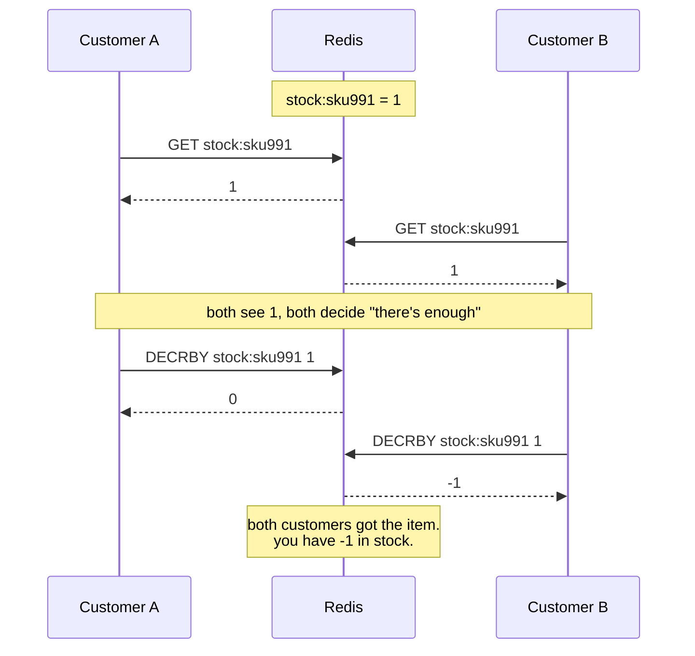
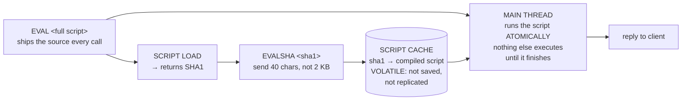

# Module 3.5 — Lua Scripting (`EVAL`, `EVALSHA`, the Script Cache)

> **Module 3 — Atomicity & Coordination** · [← Index](../../README.md) · Prev → [3.4 WATCH & optimistic CAS](./3.4-watch-optimistic-cas.md) · Project → [3.5b Sliding window rate limiter](./3.5b-project-sliding-window-rate-limiter.md)

> [!TIP]
> Sections 1–10 are the core story — read straight through. The **Appendix** at the end is reference material you don't need on a first pass.

---

## In one sentence

`EVAL` ships a Lua script to the server and Redis runs the **whole thing atomically on the main thread** — so you get read-modify-write with arbitrary logic, in one round trip, with no retries.

## Problem it solves

Two customers try to buy the last item in stock, at the same instant.



Every command here was atomic (see [3.1](./3.1-execution-model-and-atomicity.md)). The **sequence** wasn't. You sold something you didn't have.

### Why the tools you already know don't fix this

| Tool | Why it falls short here |
|---|---|
| **A single command** ([3.2](./3.2-atomic-commands.md)) | `DECR` is atomic, but it can't say *"only if at least N remain."* No built-in command expresses your condition. |
| **`MULTI`/`EXEC`** ([3.3](./3.3-multi-exec.md)) | Queued commands return nothing until `EXEC`, so you can't read the stock and then decide. No branching. |
| **`WATCH`** ([3.4](./3.4-watch-optimistic-cas.md)) | Works correctly — but every conflict costs a retry. On a hot SKU during a flash sale, you spend your time retrying instead of selling. |

`WATCH` is the right shape but the wrong economics under contention. Lua fixes the economics.

## Mental model

**Stop fetching the data to make the decision. Send the decision to the data.**

With `WATCH` you ask Redis a question, think about the answer in your app, and then hope nothing changed. With Lua you hand Redis the entire `if` statement and let it decide on the spot.

Because Redis is single-threaded (see [1.3](../module-01-foundations/1.3-single-threaded-model.md)), a running script has the whole server to itself. Nothing can interleave — so there is no window to lose a race in, and nothing to retry.



## How it works — the anatomy of `EVAL`

```bash
EVAL "return redis.call('GET', KEYS[1])" 1 mykey
#     └────────── the script ──────────┘ │   └── KEYS[1]
#                        number of keys ─┘
```

Four parts, in order:

1. **The script** — Lua source, as a string.
2. **`numkeys`** — how many of the following arguments are key names. This is the part people get wrong.
3. **`KEYS[1..numkeys]`** — the keys the script touches.
4. **`ARGV[1..]`** — everything else: values, limits, TTLs, IDs.

Inside the script:

- **`redis.call('CMD', ...)`** runs a Redis command. If it errors, the script aborts and the error goes back to the client.
- **`redis.pcall(...)`** is the same but returns the error as a value instead of aborting, so you can handle it.

> [!IMPORTANT]
> **Why `KEYS` matters.** You *can* hardcode key names in the script body and it'll work on a single Redis. But Redis Cluster uses the declared `KEYS` to route the script to the right node — so a script with undeclared keys works in dev and breaks in production. Declare them honestly, always.

## Basic example — conditional inventory

The race from the top, solved:

```lua
-- KEYS[1] = stock key
-- ARGV[1] = quantity wanted
local stock = tonumber(redis.call('GET', KEYS[1]) or '0')
local want  = tonumber(ARGV[1])

if stock < want then
  return -1                      -- rejected. nothing was written.
end

redis.call('DECRBY', KEYS[1], want)
return stock - want              -- new stock level
```

```bash
EVAL "<script above>" 1 stock:sku991 2
# → 8    committed, 8 left
# → -1   rejected, and no write happened at all
```

### Why nothing can interleave

Redis runs commands one at a time on a single thread. A script is *one unit of work* from the server's point of view — the read, the `if`, and the write all happen inside that one slot.

So the moment customer A's script starts, customer B's script cannot begin until A's finishes. B will read the stock **after** A's decrement, see the real number, and reject correctly.

No lock. No retry. No race window — because there is no gap for anyone to slip into.

Note also: `tonumber()` everywhere. Everything Redis returns is a string, so you must convert before comparing numerically.

## Important limitations

These four matter more than anything else in this note.

**1. A running script blocks the entire server.**
Not just the key. Not just that client. *Everything.* Every millisecond your script runs is a millisecond no other client gets served. Scripts should be small and fast — no loops over big keyspaces, no `KEYS *`, no heavy computation.

**2. There is no rollback.**
Same trap as [3.3](./3.3-multi-exec.md). A script is atomic in the *isolation* sense (nothing interleaves), **not** in the rollback sense:

> If your script writes two keys and then hits an error on the third command, **those two writes stay.** Redis will not undo them.

**3. So: validate first, mutate last.**
Structure every script as "check everything → then write everything." Never interleave checks and writes, because a failure partway leaves you half-applied with no way back. The inventory script above does exactly this — the `return -1` happens *before* any `DECRBY`.

**4. Declare your keys.** (see the callout above)

## `EVALSHA` and the script cache

Sending the full script text on every single call is wasteful — you're pushing the same 2 KB across the network thousands of times a second and Redis re-parses it each time.

So Redis caches compiled scripts, keyed by their SHA1 hash:

```bash
SCRIPT LOAD "return redis.call('GET', KEYS[1])"
# → "a3f1c9d8e..."                 the SHA1

EVALSHA a3f1c9d8e... 1 mykey       # 40 characters instead of the whole script
```

> [!WARNING]
> **The cache is volatile.** It is not part of your dataset — not saved to disk, not replicated to replicas, and wiped on restart, on failover, and by `SCRIPT FLUSH`.

So every client needs this fallback:

> Call `EVALSHA`. If you get a **`NOSCRIPT`** error, `SCRIPT LOAD` the source again, then retry.

Most mature client libraries do this automatically. If you're writing the plumbing yourself, that fallback is mandatory — otherwise your app breaks the first time Redis restarts. (This volatility is exactly what Redis Functions fix in 3.6.)

```bash
SCRIPT EXISTS <sha1>     # 1 = cached, 0 = not
SCRIPT FLUSH             # wipe the cache
```

## When to use it

- **Conditional read-modify-write** — logic no single command can express.
- **Several dependent commands** that must not be interrupted (count, then decide, then write).
- **Hot keys** where [WATCH](./3.4-watch-optimistic-cas.md) retries get expensive.
- Cutting round trips on a chatty sequence.

## When not to use it

- **When a built-in command already does it** → [3.2 Atomic commands](./3.2-atomic-commands.md). `INCR` needs no script.
- **Anything long-running** — you're holding the whole server hostage.
- **Business logic that belongs in your application** — scripts are harder to test, version, and debug. Keep them small and mechanical.
- **When you want named, versioned, persisted server-side code** → Redis Functions (3.6).

## Comparison with related concepts

| | Round trips | Retries? | Branch on values? | Rollback? |
|---|---|---|---|---|
| Single command ([3.2](./3.2-atomic-commands.md)) | 1 | no | n/a | n/a |
| `MULTI`/`EXEC` ([3.3](./3.3-multi-exec.md)) | 1 | no | ❌ | ❌ |
| `WATCH` ([3.4](./3.4-watch-optimistic-cas.md)) | 3+, more on conflict | **yes** | ✅ (in your app) | ❌ |
| **Lua (`EVAL`)** | **1** | **no** | ✅ (in the script) | ❌ |

- **vs `WATCH`** — Lua can't conflict, because nothing else runs. `WATCH` allows concurrency and pays when it guesses wrong. Lua wins under contention; `WATCH` keeps logic out of the server.
- **vs a SQL stored procedure** — same idea, but no rollback, and it blocks the whole server while running.

## Common misunderstandings

- ❌ "Lua scripts are transactions, so errors roll back." → They don't. Partial writes persist.
- ❌ "The script cache is durable." → Volatile. Always handle `NOSCRIPT`.
- ❌ "A script only blocks the keys it touches." → It blocks the entire server.
- ❌ "I can hardcode key names instead of using `KEYS`." → Works on one node, breaks in Cluster.
- ❌ "Values from `redis.call` are numbers." → They're strings. `tonumber()` them.

## Production example

**Safe distributed lock release** — the canonical Lua one-liner (Module 9). Deleting a lock you no longer own is a classic bug, and check-then-delete in two commands races:

```lua
-- KEYS[1] = lock key, ARGV[1] = my unique token
if redis.call('GET', KEYS[1]) == ARGV[1] then
  return redis.call('DEL', KEYS[1])
else
  return 0                   -- someone else owns it now; don't touch it
end
```

For a full worked project, see **[3.5b — Sliding window rate limiter](./3.5b-project-sliding-window-rate-limiter.md)**, where cleanup, counting, and recording a request all have to happen with nothing in between.

## Quick revision

- `EVAL script numkeys KEYS... ARGV...` runs Lua **atomically on the main thread**. Nothing interleaves.
- Solves what `WATCH` can't afford: branching logic with **no retries, one round trip**.
- `redis.call` aborts on error; `redis.pcall` returns it.
- **No rollback** → validate first, mutate last.
- A script **blocks the whole server** → keep it short.
- Declare `KEYS` properly or Cluster breaks.
- `SCRIPT LOAD` → `EVALSHA`; the cache is **volatile**, so handle `NOSCRIPT`.
- `tonumber()` everything you read back.

## Self-test questions

1. Two customers buy the last item at the same moment. Show how the race happens, and why `MULTI` alone can't fix it.
2. Why does Lua succeed where `WATCH` thrashes on a hot key? What exactly does it eliminate?
3. What are the four parts of an `EVAL` call, and what is `numkeys` for?
4. Write a script that decrements stock only if enough remains, returning the new level or a rejection.
5. Your script writes two keys, then errors on the third command. What's the state of the first two, and what design rule does that imply?
6. What is `EVALSHA` for, and what must your client do when it gets `NOSCRIPT`?
7. Why must you declare `KEYS` instead of hardcoding key names in the script body?

---

# Appendix — deeper reference

> Not needed for a first read. Come back when you're operating Lua in production.

## Effects replication (Redis 5+)

Originally Redis replicated the *script source* to replicas and the AOF, which meant scripts had to be strictly deterministic — same input, same result everywhere. Anything non-deterministic (random, time) was a correctness hazard.

Since Redis 5, Redis uses **effects replication**: while the script runs, Redis collects the **write commands the script actually performed**, wraps that sequence in a `MULTI`/`EXEC`, and sends *that* to replicas and the AOF.

Consequences:

- The old determinism restrictions largely disappear — replicas replay concrete effects, not your logic.
- Replicas never execute your Lua at all, so a slow script costs you on the primary only.

## Type conversion gotchas

- **Lua numbers → Redis integers, decimals truncated.** `return 3.7` gives the caller `3`. To return a float, return a string: `return tostring(3.7)`.
- **A `nil` inside a table terminates the array.** `return {1, nil, 3}` returns just `{1}`. Never build reply arrays with holes.
- **`false` → nil reply; `true` → `1`.**
- Everything read from Redis is a **string** — always `tonumber()` before arithmetic or comparison.

## The `BUSY` state and `SCRIPT KILL`

If a script runs longer than `busy-reply-threshold` (default 5 seconds; older name `lua-time-limit`), Redis begins replying `BUSY` to every other client. **It does not stop the script.** Only `SCRIPT KILL`, `FUNCTION KILL`, and `SHUTDOWN NOSAVE` are accepted in that state.

**`SCRIPT KILL` only works if the script has not written yet.** Once it has performed a write, killing it would leave the dataset half-mutated with no way to undo — so Redis refuses, and `SHUTDOWN NOSAVE` becomes your only exit. That is a data-loss event.

This is the single strongest practical argument for keeping scripts short.

## Read-only scripts (Redis 7+)

`EVAL_RO` and `EVALSHA_RO` run scripts guaranteed not to write — any write command inside errors out. This makes intent explicit and allows the script to be served by replicas.

## Other notes

- **No blocking commands.** `BLPOP` and friends behave as their non-blocking variants inside a script; blocking would deadlock the server.
- **Redis uses Lua 5.1**, sandboxed: no file I/O, no network, no `os` library, no `require`.
- **Cluster:** all keys a script touches must hash to the same slot (Module 7).
- **Debugging:** `redis-cli --ldb --eval script.lua key , arg` opens the Lua debugger.

## References

- [Scripting with Lua](https://redis.io/docs/latest/develop/programmability/eval-intro/)
- [EVAL](https://redis.io/docs/latest/commands/eval/)
- [Redis Lua API reference](https://redis.io/docs/latest/develop/programmability/lua-api/)
- [EVAL_RO](https://redis.io/docs/latest/commands/eval_ro/)
