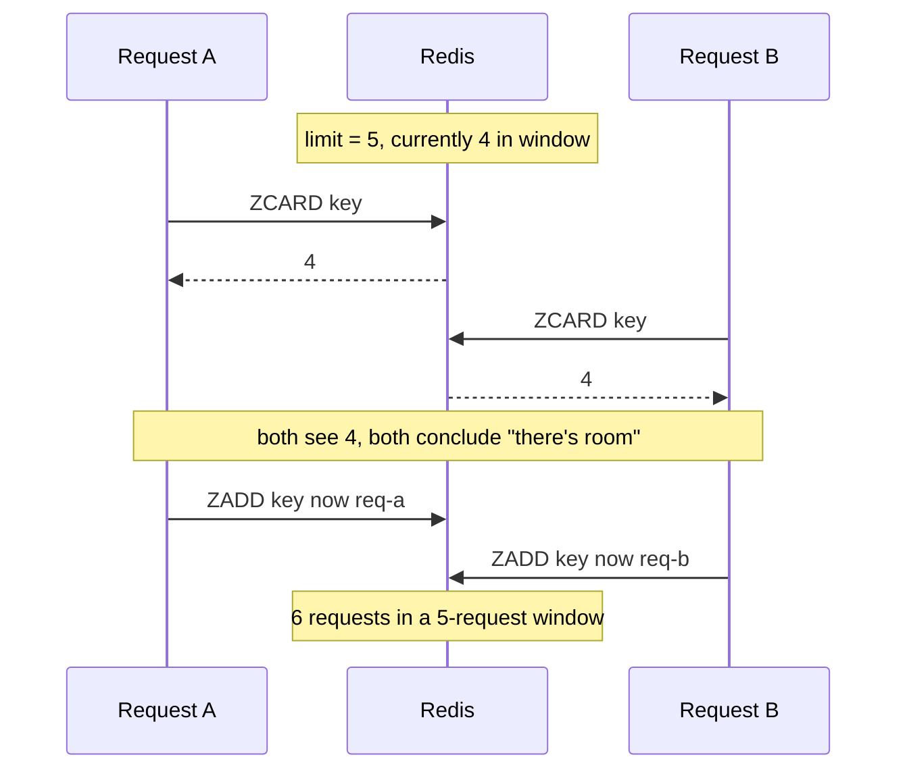

# Module 3.5b — Project: Sliding Window Rate Limiter

> **Module 3 — Atomicity & Coordination** · [← Index](../../README.md) · Builds on → [3.5 Lua scripting](./3.5-lua-scripting.md) and [2.5 Sorted sets](../module-02-data-types/2.5-sorted-sets.md)

---

## In one sentence

A sliding window rate limiter stores one **sorted set per user** (member = request ID, score = timestamp) and uses a **Lua script** to trim, count, decide, and record — all as one indivisible step.

## Why this is the right project for Lua

[3.5](./3.5-lua-scripting.md) taught the tool. This shows why the tool is necessary rather than decorative.

Rate limiting needs **five dependent operations**, and the decision in the middle depends on a value read halfway through:

1. Remove requests that have fallen outside the window.
2. Count what's left.
3. If the count has hit the limit → reject.
4. Otherwise record this request.
5. Refresh the key's expiry.

None of the earlier tools can do this:

- **A single command** can't express "count, then conditionally add."
- **`MULTI`/`EXEC`** ([3.3](./3.3-multi-exec.md)) can't branch on the count — queued commands return nothing until `EXEC`.
- **`WATCH`** ([3.4](./3.4-watch-optimistic-cas.md)) works, but the rate-limit key is *the busiest key in your system by definition*. Retries would dominate.

## Mental model

Picture a window of fixed width sliding along a timeline. Requests are dots. As the window moves right, old dots fall out the left side and stop counting.

```
        expired — outside the window          THE WINDOW (last 60s)
        ┌──────────────────────┐        ┌───────────────────────────────┐
   ●        ●        ●         │        │  ●     ●      ●      ●    ◆   │
   ─────────────────────────────────────┼───────────────────────────────┼──►  time
                                   now − window                        now

   step 1 removes these                 step 2 counts these → 4    step 4 adds ◆
```

Unlike a **fixed window** (which resets on the hour and lets someone burst 2× the limit across the boundary), the window here is always "the last N seconds from right now."

## The race it prevents



The gap between **step 2 (count)** and **step 4 (add)** is the whole vulnerability. Lua closes it by making all five steps one unit.

## The script

```lua
-- KEYS[1] = rate-limit key        e.g. ratelimit:user:42
-- ARGV[1] = current time in milliseconds
-- ARGV[2] = window duration in milliseconds
-- ARGV[3] = request limit
-- ARGV[4] = unique request ID

local now    = tonumber(ARGV[1])
local window = tonumber(ARGV[2])
local limit  = tonumber(ARGV[3])

-- 1. drop everything that fell out of the window
redis.call('ZREMRANGEBYSCORE', KEYS[1], 0, now - window)

-- 2. count what's left
local count = redis.call('ZCARD', KEYS[1])

-- 3. over the limit? reject without writing anything
if count >= limit then
  return {0, 0}
end

-- 4. record this request
redis.call('ZADD', KEYS[1], now, ARGV[4])

-- 5. let the key expire once the window has fully passed
redis.call('PEXPIRE', KEYS[1], window)

return {1, limit - count - 1}     -- {allowed, remaining}
```

Calling it:

```bash
EVAL "<script>" 1 ratelimit:user:42 1735689600000 60000 100 "req-a1b2c3"
# → 1) (integer) 1     allowed
#    2) (integer) 87   requests remaining in this window
```

## Why the request ID comes from `ARGV`

The obvious shortcut is to build the sorted-set member inside the script with `math.random()`. Don't. Pass a unique ID in from the caller instead:

- **The caller already has one.** A request ID, trace ID, or UUID almost certainly exists in your context — reuse it, and your rate-limit entries become traceable back to real requests.
- **It keeps the script deterministic and boring.** No hidden randomness, easier to reason about and to test.
- **It makes the operation idempotent-ish.** If the same request is retried with the same ID, `ZADD` updates the existing member's score instead of adding a second entry — a network retry doesn't double-charge the user.

> [!WARNING]
> **The ID must genuinely be unique per request.** Sorted set members are unique: if two *different* requests pass the same ID, `ZADD` overwrites rather than adds, and you silently undercount. Use a UUID, not a timestamp.

## Extended version — returning retry-after

A good limiter tells the caller *when* to come back. A slot frees up exactly when the **oldest** request in the window falls out of it.

```lua
-- KEYS[1] = rate-limit key
-- ARGV[1] = now (ms), ARGV[2] = window (ms), ARGV[3] = limit, ARGV[4] = request ID

local now    = tonumber(ARGV[1])
local window = tonumber(ARGV[2])
local limit  = tonumber(ARGV[3])

redis.call('ZREMRANGEBYSCORE', KEYS[1], 0, now - window)
local count = redis.call('ZCARD', KEYS[1])

if count >= limit then
  -- oldest entry still in the window
  local oldest = redis.call('ZRANGE', KEYS[1], 0, 0, 'WITHSCORES')
  local retry_after = 0
  if oldest[2] then
    retry_after = (tonumber(oldest[2]) + window) - now
    if retry_after < 0 then retry_after = 0 end
  end
  return {0, 0, retry_after}
end

redis.call('ZADD', KEYS[1], now, ARGV[4])
redis.call('PEXPIRE', KEYS[1], window)

return {1, limit - count - 1, 0}   -- {allowed, remaining, retry_after_ms}
```

Map that straight onto HTTP response headers:

```
allowed = 0  →  429 Too Many Requests
                Retry-After: <retry_after_ms / 1000>
                X-RateLimit-Remaining: 0
allowed = 1  →  X-RateLimit-Remaining: <remaining>
```

## Important details and edge cases

- **Pass the time in from the client, not `TIME` inside the script.** Using the caller's clock keeps the script's inputs explicit. If you have many app servers with drifting clocks, prefer `redis.call('TIME')` so there is a single clock — but note that returns `{seconds, microseconds}` and needs converting to ms.
- **Memory cost is O(limit) per user.** A limit of 100 means up to 100 sorted-set entries per active user. For a limit of 10,000 across millions of users this gets expensive — that's when you switch to a token bucket or a counter-based approximation.
- **`PEXPIRE` is not optional.** Without it, every user who ever made one request leaves a key behind forever. With it, idle users clean themselves up.
- **`ZREMRANGEBYSCORE` is O(log N + M)** where M is the number removed. Fine at these sizes; it's the reason to keep limits sane.
- **Cluster:** one key per script call, so slots are never an issue here.
- **The reject path writes nothing** — a rejected request doesn't count against the window or extend the TTL.
- Use `EVALSHA` in production and handle `NOSCRIPT` ([3.5](./3.5-lua-scripting.md)). This script runs on every single request; you do not want to ship its source each time.

## Comparison with related concepts

| Approach | Accuracy | Memory | Notes |
|---|---|---|---|
| **Fixed window** (`INCR` + `EXPIRE`) | poor — allows 2× burst at the boundary | O(1) | simplest; [3.2](./3.2-atomic-commands.md) |
| **Sliding window log** (this one) | exact | O(limit) per user | needs Lua for atomicity |
| **Token bucket** | good, allows controlled bursts | O(1) | needs Lua too; better at huge limits |

The fixed-window version is genuinely two commands and needs no script — reach for it when approximate is fine. Use this one when the limit must actually hold.

## Common misunderstandings

- ❌ "I can do this with `MULTI`." → You can't branch on the count inside a transaction.
- ❌ "`math.random()` is fine for the member." → Works, but throws away idempotency and traceability for nothing.
- ❌ "The window resets periodically." → It doesn't; it slides continuously. That's the point.
- ❌ "A rejected request should still be recorded." → No — recording it would extend the penalty indefinitely for someone hammering the endpoint.

## Quick revision

- Sorted set per user: **member = unique request ID, score = timestamp (ms)**.
- Five steps: `ZREMRANGEBYSCORE` → `ZCARD` → check limit → `ZADD` → `PEXPIRE`.
- The vulnerable gap is **between the count and the add** — Lua closes it.
- Pass the request ID via `ARGV`, don't generate it in the script.
- Return `{allowed, remaining}`, or add `retry_after` from the oldest entry's score.
- Memory is **O(limit) per active user**; `PEXPIRE` stops idle keys leaking.

## Self-test questions

1. Which two steps have the race between them, and what goes wrong if a request slips in there?
2. Why can't `MULTI`/`EXEC` implement this?
3. Why pass the request ID through `ARGV` instead of calling `math.random()` inside the script?
4. What breaks if two different requests reuse the same ID?
5. How do you compute `retry_after`, and why is the oldest entry the one that matters?
6. Why must a rejected request not be recorded?
7. At what point does this design get too expensive, and what do you switch to?

## References

- [ZREMRANGEBYSCORE](https://redis.io/docs/latest/commands/zremrangebyscore/)
- [ZADD](https://redis.io/docs/latest/commands/zadd/)
- [Scripting with Lua](https://redis.io/docs/latest/develop/programmability/eval-intro/)
