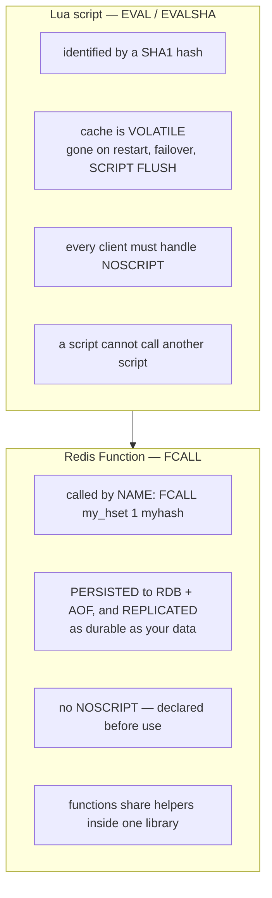

# Module 3.6 — Redis Functions (`FUNCTION LOAD`, `FCALL`)

> **Module 3 — Atomicity & Coordination** · [← Index](../../README.md) · Prev → [3.5 Lua scripting](./3.5-lua-scripting.md)

---

## In one sentence

Redis Functions (7.0+) are **named, persisted, replicated libraries** of server-side code — the same Lua execution as [3.5](./3.5-lua-scripting.md), but managed by the database instead of by your application.

## Problem it solves

[3.5](./3.5-lua-scripting.md) ended on an uncomfortable note: the script cache is **volatile**. Redis only caches loaded scripts, so they vanish on `SCRIPT FLUSH`, on restart, or on failover to a replica — and your application is responsible for noticing and reloading them.

That's survivable for one small script. It gets painful as you lean on scripting harder. The Redis docs list five specific problems:

1. **Every client instance must carry a copy of every script**, plus some mechanism to roll out updates to all of them.
2. **Calling a cached script inside a transaction makes the transaction more likely to fail** (the script might be missing), which makes scripts unattractive as building blocks.
3. **SHA1 digests are meaningless.** Debugging a `MONITOR` session full of `EVALSHA a3f1c9…` is miserable.
4. **`EVAL` invites an anti-pattern** — rendering key names directly into script text instead of passing them properly.
5. **A script can't call another script.** No shared helpers, no code reuse, no composition.

Notice the shape of all five: they're **software-lifecycle** problems, not execution problems. The Lua runs fine. It's the *managing* of it that hurts.

## Mental model

> **A Lua script belongs to your application. A Function belongs to the database.**

An `EVAL` script is a string your app happens to send to Redis. A Function is a **first-class artifact of the database** — declared once before use, stored alongside the data, backed up with the data, replicated with the data. Your app stops shipping code and starts calling an API: `FCALL my_hset ...`.

Think of the difference between pasting SQL from your codebase versus calling a stored procedure that lives in the database and has a name.



## How it works

### The shebang and registration

Every function belongs to a **library**, and every library starts with a shebang declaring its engine and name:

```
#!<engine name> name=<library name>
```

A library must register at least one function or it won't load:

```
FUNCTION LOAD "#!lua name=mylib\n"
# → (error) ERR No functions registered
```

Here's a real one:

```lua
#!lua name=mylib

local function my_hset(keys, args)
  local hash = keys[1]
  local time = redis.call('TIME')[1]
  return redis.call('HSET', hash, '_last_modified_', time, unpack(args))
end

redis.register_function('my_hset', my_hset)
```

Load it and call it:

```bash
# load from a file, keeping the whitespace intact
cat mylib.lua | redis-cli -x FUNCTION LOAD REPLACE
# → mylib          (FUNCTION LOAD returns the LIBRARY name)

FCALL my_hset 1 myhash myfield "some value"
# → (integer) 2
```

`REPLACE` overwrites an existing library — without it, reloading errors out because the library already exists.

### `keys` and `args` are parameters, not globals

This is the most visible difference from `EVAL`. Scripts read the magic globals `KEYS[]` and `ARGV[]`. Functions receive them as **the two arguments to your callback**:

```lua
local function my_fn(keys, args)   -- keys = table of key names, args = everything else
```

`FCALL name numkeys key... arg...` works exactly like `EVAL` — `numkeys` says how many of the following arguments are keys.

> [!IMPORTANT]
> The rule from [3.5](./3.5-lua-scripting.md) still holds and matters even more here: **every key the function accesses must be passed in as a key argument**, in standalone *and* clustered deployments.

## The library is the unit

A library can hold many functions, and — the thing scripts could never do — **they can share code**:

```lua
#!lua name=mylib

local function check_keys(keys)          -- shared helper
  if table.getn(keys) ~= 1 then
    return redis.error_reply('exactly one key required')
  end
  return nil
end

local function my_hset(keys, args)
  local err = check_keys(keys)
  if err then return err end
  ...
end

local function my_hlastmodified(keys, args)
  local err = check_keys(keys)           -- same helper, reused
  if err then return err end
  return redis.call('HGET', keys[1], '_last_modified_')
end

redis.register_function('my_hset', my_hset)
redis.register_function('my_hlastmodified', my_hlastmodified)
```

**Libraries are immutable as a whole.** You cannot update one function inside a library — you replace the entire library, all functions together, in one operation. That's deliberate: it means the functions in a library are always a consistent set.

## Function flags — `no-writes` and `FCALL_RO`

By default **Redis assumes a function might read *or* write**. That assumption blocks it from running where writes aren't allowed:

```
FCALL_RO my_hgetall 1 myhash
# → (error) ERR Can not execute a function with write flag using fcall_ro.
```

You get that error when you: run `FCALL` against a read-only replica, use `FCALL_RO` at all, or when Redis has detected a disk error and is refusing writes.

To declare a function read-only, register it with the **named-arguments** form and the `no-writes` flag:

```lua
redis.register_function{
  function_name = 'my_hgetall',
  callback      = my_hgetall,
  flags         = { 'no-writes' }
}
```

Now `FCALL_RO my_hgetall 1 myhash` works, including against a replica.

## Managing functions

```bash
FUNCTION LIST [LIBRARYNAME x] [WITHCODE]   # libraries, their functions, and flags
FUNCTION DELETE mylib                      # remove one library
FUNCTION FLUSH                             # remove ALL libraries
FUNCTION DUMP                              # serialize all libraries to a payload
FUNCTION RESTORE <payload> [policy]        # restore from that payload
FUNCTION STATS                             # what's running now + engine info
FUNCTION KILL                              # kill a long-running function
```

`FUNCTION DUMP` → `FUNCTION FLUSH` → `FUNCTION RESTORE` is the backup/migrate cycle.

## Important details and edge cases

- **Persistence and replication are the whole point.** Functions are written to the RDB and AOF and replicated primary → replica, so they are *as durable as your data*. No `NOSCRIPT` equivalent exists — nothing to reload at runtime.
- **Redis Cluster does NOT propagate libraries across nodes for you.** Replication covers primary → replica, but loading to every shard is the administrator's job — like loading a module or setting a config. Use:
  ```bash
  redis-cli --cluster-only-masters --cluster call host:port FUNCTION LOAD ...
  ```
  `redis-cli --cluster add-node` *does* copy functions from an existing node to the new one.
- **Cache-only deployments need help.** If persistence is off, functions vanish with a restart like anything else. Extract them with `redis-cli --functions-rdb` to produce an RDB you can load at startup, so functions exist *before* the server accepts connections.
- **Execution is atomic and blocks the entire server**, exactly like a script ([3.5](./3.5-lua-scripting.md)). Keep functions fast. All the same warnings apply.
- **Still no rollback.** A function that writes and then errors leaves those writes in place. Validate first, mutate last.
- **No Lua debugger.** Functions can use everything ephemeral scripts can, *except* the Redis Lua script debugger (which only works with `EVAL`).
- **Engine-agnostic by design.** The shebang names the engine because Redis intends to support more than Lua eventually. Today Lua 5.1 is the only one shipped.
- **`redis.setresp(3)`** switches `redis.call` replies to RESP3 inside a function, which gives you map-shaped replies you can manipulate as Lua tables.

## When to use it

- **Redis 7.0+ and you're doing anything non-trivial with scripting.** This is the modern default.
- Logic that several services or clients call — expose it once, by name, as an API.
- When you want the code backed up, replicated, and versioned with your data.
- When you want **shared helpers** across several related operations.
- When you want readable `MONITOR`/`SLOWLOG` output (`FCALL my_hset` instead of a hash).

## When not to use it

- **Redis < 7.0** — Functions don't exist; use `EVAL`/`EVALSHA`.
- **A one-off script** used by one service in one place — `EVALSHA` is less ceremony.
- **When a single command does the job** → [3.2 Atomic commands](./3.2-atomic-commands.md).
- **When you need the Lua debugger** during development — develop with `EVAL`, then promote to a Function.
- **Long-running logic** — same hard limit as scripts; you block the server.

## Comparison with related concepts

| | Lua script (`EVAL`) | Redis Function (`FCALL`) |
|---|---|---|
| Identified by | SHA1 hash | **user-defined name** |
| Lives in | volatile script cache | **the database** |
| Survives restart / failover | ❌ | ✅ (RDB + AOF) |
| Replicated to replicas | ❌ | ✅ |
| `NOSCRIPT` handling needed | ✅ required | ❌ never |
| Code sharing between units | ❌ impossible | ✅ within a library |
| Auto-propagated across Cluster nodes | n/a | ❌ still manual |
| Atomic / blocks server | ✅ / ✅ | ✅ / ✅ |
| Rollback on error | ❌ | ❌ |
| Lua debugger | ✅ | ❌ |
| Available since | 2.6 | **7.0** |

- **vs `MULTI`** ([3.3](./3.3-multi-exec.md)) — Functions can branch on values; `MULTI` can't.
- **vs modules** — Functions extend the command surface with user logic, but in sandboxed Lua rather than compiled C.

## Common misunderstandings

- ❌ "Functions replace `EVAL`, so `EVAL` is deprecated." → `EVAL` still works and is still fine for light use. Functions supersede it as the *recommended* approach for anything substantial.
- ❌ "Functions are faster than scripts." → Same engine, same execution. The win is lifecycle management, not speed.
- ❌ "Functions run in the background." → They block the whole server, exactly like scripts.
- ❌ "Redis loads my library onto every cluster node." → It doesn't. Replication yes; across shards no.
- ❌ "I can update just one function in a library." → Libraries are replaced whole.
- ❌ "Functions can roll back." → They can't, any more than scripts can.
- ❌ "`FCALL_RO` works on any read-only function." → Only if you registered it with the `no-writes` flag.

## Production example

A rate limiter ([3.5b](./3.5b-project-sliding-window-rate-limiter.md)) called from six different services is a perfect Function. As an `EVAL` script, all six deploy their own copy of the source and all six need `NOSCRIPT` handling — and the day you fix a bug you redeploy six services.

As a library, you load it once:

```lua
#!lua name=ratelimit

local function check(keys, args)
  local now, window, limit = tonumber(args[1]), tonumber(args[2]), tonumber(args[3])
  redis.call('ZREMRANGEBYSCORE', keys[1], 0, now - window)
  local count = redis.call('ZCARD', keys[1])
  if count >= limit then return {0, 0} end
  redis.call('ZADD', keys[1], now, args[4])
  redis.call('PEXPIRE', keys[1], window)
  return {1, limit - count - 1}
end

redis.register_function('rl_check', check)
```

Every service just calls `FCALL rl_check 1 ratelimit:user:42 <now> 60000 100 <req-id>`. Fixing the algorithm is one `FUNCTION LOAD REPLACE`, not six deploys. And it survives a failover.

## Quick revision

- Functions = **named, persisted, replicated** server-side code. Redis **7.0+**.
- Fixes the *lifecycle* problems of `EVAL`, not the execution: no volatile cache, no `NOSCRIPT`, meaningful names, shared helpers.
- Library first: `#!lua name=mylib`, then `redis.register_function(name, cb)`. Must register ≥1 function.
- Callback signature is **`function(keys, args)`** — parameters, not `KEYS`/`ARGV` globals.
- `FCALL name numkeys keys... args...`; `FUNCTION LOAD REPLACE` to update; libraries replaced **whole**.
- `no-writes` flag (named-args registration) is required for `FCALL_RO` and replicas.
- Persisted to RDB/AOF + replicated — but **Cluster propagation across shards is manual**.
- Still atomic, still blocks the whole server, **still no rollback**. No Lua debugger.

## Self-test questions

1. The script cache is volatile. Name three concrete problems that causes for an application, beyond "I have to reload it."
2. What does a library's shebang line declare, and what happens if you load a library with no registered functions?
3. How do `keys` and `args` in a Function differ from `KEYS` and `ARGV` in a script?
4. You want to fix a bug in one function inside a five-function library. What do you actually have to do, and why?
5. `FCALL_RO` on a function that only reads returns an error. Why, and how do you fix it?
6. Are Functions automatically available on every node of a Redis Cluster? Explain.
7. Your Redis is a cache with persistence disabled. What happens to your Functions on restart, and what's the fix?
8. Name two things Functions did *not* improve over scripts.

## References

- [Redis Functions](https://redis.io/docs/latest/develop/programmability/functions-intro/)
- [FUNCTION LOAD](https://redis.io/docs/latest/commands/function-load/)
- [FCALL](https://redis.io/docs/latest/commands/fcall/)
- [FCALL_RO](https://redis.io/docs/latest/commands/fcall_ro/)
- [Lua API — register_function](https://redis.io/docs/latest/develop/programmability/lua-api/)
