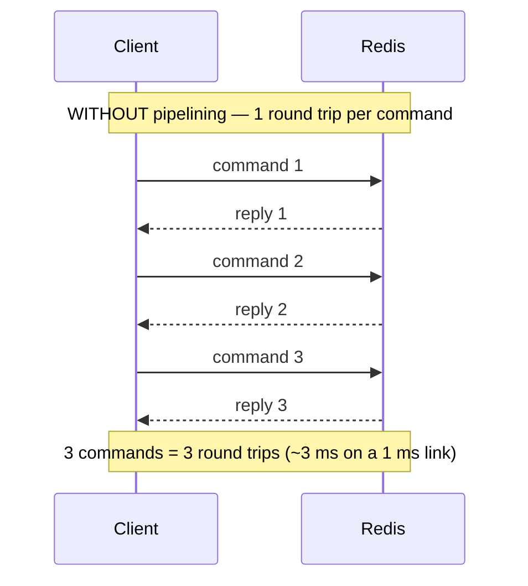
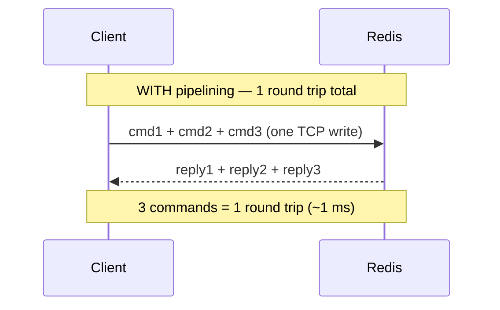
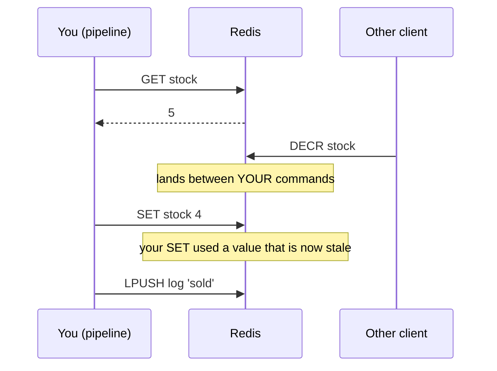

# Module 3.7 — Pipelining

> **Module 3 — Atomicity & Coordination** · [← Index](../../README.md) · Prev → [3.6 Redis Functions](./3.6-redis-functions.md)

---

## In one sentence

Pipelining sends many commands in **one network write** without waiting for each reply — so you pay for one round trip instead of N. It is a **latency** optimisation, and it gives you **no atomicity whatsoever**.

## Problem it solves

Every other topic in Module 3 has been about *correctness*. This one is about *speed*, and the bottleneck it attacks isn't Redis at all.

A Redis command executes in microseconds. But a request has to physically travel to the server and back — the **round-trip time (RTT)**. On a 1 ms link, a command that takes 50 microseconds of actual work costs you 1 ms of waiting. You are not limited by Redis. You are limited by the speed of light and your network stack.

Do that 100 times sequentially and you've burned 100 ms, of which about 5 ms was real work.

## Mental model

**Posting 100 letters.** You can walk to the postbox and back 100 times, or you can carry all 100 in one trip. The letters take the same time to write either way — you're eliminating the *walking*, not the writing.





## How it works

There's no `PIPELINE` command. Pipelining isn't a server feature you switch on — it's just **not waiting for each reply before sending the next command**.

The client writes several commands into the socket back-to-back:

```
*1\r\n$4\r\nPING\r\n*1\r\n$4\r\nPING\r\n*1\r\n$4\r\nPING\r\n
```

The server reads that buffer, parses three complete commands, executes them in order, and writes three replies back.

This works because of RESP (see [1.4](../module-01-foundations/1.4-resp-protocol.md)): **every frame is length-prefixed**, so the server always knows exactly where one command ends and the next begins. No delimiters to guess at, no ambiguity. The protocol design from Module 1 is what makes this possible.

## Basic example

```python
# ❌ 100 round trips
for i in range(100):
    r.set(f"key:{i}", i)

# ✅ 1 round trip
pipe = r.pipeline(transaction=False)   # note: transaction=False in redis-py
for i in range(100):
    pipe.set(f"key:{i}", i)
pipe.execute()                          # → list of 100 replies, in order
```

## The thing to get right: pipelining is NOT atomic

This is the whole reason this topic sits in Module 3 rather than a performance chapter.



What pipelining **does** guarantee:

- Your commands execute **in the order you sent them**.
- Reply N corresponds to command N.

What it does **not** guarantee:

- That nothing else runs in between. It absolutely can.

So the lost-update problem from [3.1](./3.1-execution-model-and-atomicity.md) is **completely unaffected** by pipelining. If you need exclusivity, that's [3.3 MULTI/EXEC](./3.3-multi-exec.md) or [3.5 Lua](./3.5-lua-scripting.md).

## Pipelining vs transactions — the difference that actually matters

Both send multiple commands. That surface similarity is why people mix them up. But they answer different questions:

- **Pipelining answers:** *"How do I get my commands to the server efficiently?"* → a **transport** concern.
- **`MULTI` answers:** *"How does the server schedule my commands once they arrive?"* → an **execution** concern.

### The decisive difference: what the server does on arrival

**With pipelining**, the server executes each command **the instant it arrives**, exactly like any other command from any other client. It just happens that three of them arrived in one TCP packet. Each returns its real answer:

```
SET a 1     → OK              ← actually executed, right now
INCR b      → (integer) 1     ← actually executed, right now
```

**With `MULTI`**, the server **refuses to run them**. It writes them down and replies `QUEUED`:

```
MULTI
SET a 1     → QUEUED          ← NOT executed. nothing has happened.
INCR b      → QUEUED          ← NOT executed.
EXEC        → 1) OK  2) (integer) 1     ← NOW the whole batch runs, uninterrupted
```

**That `QUEUED` reply is the entire difference, visible on screen.** Pipelining has no queued state — there's nothing to queue, because the work is already done by the time the reply comes back.

### They're not alternatives — they compose

These are independent axes, not an either/or choice:

| | Few round trips? | Nothing interleaves? |
|---|---|---|
| Plain commands, one at a time | ❌ | ❌ |
| **Pipelining only** | ✅ | ❌ |
| **`MULTI` only** (sent command by command) | ❌ | ✅ |
| **`MULTI` sent as a pipeline** | ✅ | ✅ |

That last row is what most client libraries actually do — which is precisely why the two concepts get welded together. In redis-py, `r.pipeline()` defaults to `transaction=True`, so the thing *called* a pipeline is quietly doing both.

> [!IMPORTANT]
> Pipelining changes **when you send**. `MULTI` changes **when the server runs**.

## Hands-on demos

Start a throwaway Redis and `FLUSHALL` between demos.

### Demo 1 — pipelining, with no client library at all

```bash
(printf 'PING\r\nPING\r\nPING\r\n'; sleep 1) | nc localhost 6379
# → +PONG
#   +PONG
#   +PONG
```

Three commands, one TCP write, three replies. No special mode, no `PIPELINE` command. *That's all pipelining is.*

### Demo 2 — the speed difference, measured

```bash
redis-benchmark -t set -n 100000 -P 1 -q     # one round trip per command
redis-benchmark -t set -n 100000 -P 16 -q    # pipeline depth 16
```

Real numbers from a local run:

```
SET: 191,570.88 requests per second, p50=0.135 msec      # -P 1
SET: 1,666,666.75 requests per second, p50=0.383 msec    # -P 16
```

**8.7× the throughput**, same server, same commands.

#### Reading that output — why p50 went UP

This looks wrong at first. Latency rose from 0.135 ms to 0.383 ms, yet throughput went up 8.7×.

The trick is **what "a request" means in each run**. With `-P 16`, commands travel in batches of 16, and the reported latency is for *the batch*:

```
0.383 ms ÷ 16 commands = 0.024 ms per command
versus 0.135 ms per command without pipelining
```

Per command you went from 0.135 ms → **0.024 ms, about 5.6× faster**. The number got bigger because the unit got bigger.

Why throughput improves: without pipelining, each connection has **one command in flight** and sits idle waiting for the reply. With `-P 16` it has **16 in flight**, so the wire stays busy.

```
throughput ≈ (connections × commands in flight) ÷ latency
```

Sweep it to show the plateau:

```bash
for p in 1 2 8 16 64 256; do
  echo -n "P=$p  "
  redis-benchmark -t set -n 100000 -P $p -q | head -1
done
```

### Demo 3 — bulk loading

```bash
for i in $(seq 1 200000); do echo "SET bulk:$i $i"; done > /tmp/cmds.txt
time redis-cli --pipe < /tmp/cmds.txt
# → errors: 0, replies: 200000
# → 0.04s user 0.03s system 23% cpu 0.307 total
```

200,000 commands in **0.307 seconds** ≈ 651,000 commands/sec.

**The clean comparison** — same process, same connection, the only variable is whether it waits:

```bash
time redis-cli < /tmp/cmds.txt > /dev/null    # sequential, waits for every reply
time redis-cli --pipe < /tmp/cmds.txt         # pipelined
```

`redis-cli` reading from stdin executes commands one at a time, blocking on each reply — so there's no process-spawn contamination. (At ~0.135 ms each, 200k sequential ≈ 27 s. Cut the file to 20k for a shorter baseline.)

> [!WARNING]
> **The unfair version.** Spawning a `redis-cli` per command looks spectacular but is misleading:
> ```bash
> time (for i in $(seq 1 2000); do redis-cli SET slow:$i $i > /dev/null; done)
> # → 0.05s user 0.26s system 7% cpu 4.418 total
> ```
> That's 2.21 ms per command versus 0.0015 ms pipelined — a **~1,400× ratio**. But the real round trip is only 0.135 ms, so **~94% of that is process startup**, not pipelining. The honest number is the 8.7× from Demo 2.
>
> The `system` time gives it away: **0.26 s of kernel time for 2,000 commands** versus 0.03 s for 200,000. That's `fork()`, `exec()`, `connect()` and teardown, 2,000 times over.

### Demo 4 — proving a pipeline is NOT one atomic unit

**Terminal 1** — a big pipeline:
```bash
for i in $(seq 1 1000000); do echo "SET big:$i $i"; done > /tmp/big.txt
redis-cli --pipe < /tmp/big.txt
```

**Terminal 2** — while it runs:
```bash
while true; do redis-cli DBSIZE; sleep 0.2; done
```

**`DBSIZE` climbs.** Keys land *progressively*, proving the pipeline is not a single indivisible unit — other clients see partial state.

### Demo 5 — the contrast: `MULTI` defers everything

Deterministic, no timing luck required. Two terminals.

**Terminal 1:**
```
FLUSHALL
MULTI
SET demo:x 1
SET demo:y 2
```
(`QUEUED` twice — nothing has executed)

**Terminal 2:**
```
GET demo:x      → (nil)     ← proof: nothing ran yet
DBSIZE          → 0
```

**Terminal 1:** `EXEC` → `1) OK  2) OK`

**Terminal 2:**
```
GET demo:x      → "1"
DBSIZE          → 2         ← both appeared at the same instant
```

Demo 4 shows keys appearing *gradually*. Demo 5 shows them appearing *all at once*. Run them back to back and the difference needs no further explanation.

### Demo 6 — watch it on the wire

```bash
redis-cli MONITOR
```

Run a pipeline and you'll see commands logged individually as they execute. Run `MULTI`/`EXEC` and you'll see the execution clustered at the `EXEC`. With a third terminal hammering the same key, `MONITOR` shows those commands landing *between* your pipelined ones.

## Important details and edge cases

- **Batch in chunks — don't send a million commands in one go.** While you stream commands in, the server **queues all the replies in memory**. The Redis docs suggest batching (their example uses 10k per batch); in practice **100–1,000 is a sensible default**, tuned by measurement.
- **Memory pressure is on both ends.** The server buffers replies for you; your client buffers them too.
- **`client-output-buffer-limit`** governs how much the server buffers for a client before disconnecting it. Blow past it with a giant pipeline and the server drops your connection.
- **Errors don't stop the pipeline.** If command 3 fails, commands 4–100 still run. You get a list where some entries are errors — **you must inspect them**.
- **`MULTI` is often pipelined by clients**, which is why the two get conflated. In redis-py, `r.pipeline()` defaults to `transaction=True`.
- **You can't branch mid-pipeline.** No replies until you've sent everything. Same limitation as `MULTI`, same solution: Lua.
- **Redis Cluster complicates it.** Keys live on different nodes, so a pipeline has to be split per-node. Most cluster clients handle this, but the win is per-node.
- **It doesn't reduce Redis's work.** Same commands, same execution cost. It removes *waiting*, not *work*.

## When to use it

- **Bulk loading** — importing a dataset, warming a cache, seeding fixtures.
- **Any loop firing N independent commands** where you don't need each result before sending the next.
- **High-latency links** — cross-AZ, cross-region, anything where RTT dominates.

## When not to use it

- **When you need atomicity** → [3.3](./3.3-multi-exec.md) or [3.5](./3.5-lua-scripting.md).
- **When command N+1 depends on the reply to command N** → use Lua.
- **When a multi-key command already exists** — `MGET`/`MSET` beat a pipeline of `GET`/`SET`: one command, one round trip, *and* atomic.
- **Unbounded batches** — memory blowups and dropped connections.

## Comparison with related concepts

| | Fewer round trips? | Atomic / isolated? | Can branch on values? |
|---|---|---|---|
| **Pipelining** | ✅ | ❌ | ❌ |
| `MULTI`/`EXEC` ([3.3](./3.3-multi-exec.md)) | ✅ | ✅ | ❌ |
| `WATCH` ([3.4](./3.4-watch-optimistic-cas.md)) | ✅ | ✅ (or aborts) | ✅ via retry |
| Lua ([3.5](./3.5-lua-scripting.md)) | ✅ | ✅ | ✅ |
| `MGET`/`MSET` ([3.2](./3.2-atomic-commands.md)) | ✅ | ✅ | n/a |

## Common misunderstandings

- ❌ "Pipelining makes my batch atomic." → It does not. Other clients interleave freely.
- ❌ "There's a `PIPELINE` command." → There isn't. It's a client-side technique the protocol happens to allow.
- ❌ "Bigger batches are always faster." → Beyond a point you're buying memory pressure and risking disconnects.
- ❌ "Pipelining makes Redis faster." → It makes your *client* wait less. Redis does the same work.
- ❌ "If one command fails the rest are skipped." → They all run. Check every reply.
- ❌ "`r.pipeline()` is just pipelining." → In redis-py it wraps in `MULTI` by default.

## Production example

**Warming a cache at deploy time.** Loading 50,000 keys one at a time across a 1 ms link is ~50 seconds of almost pure waiting. Batched 500 at a time, it's 100 round trips — under a second.

```python
pipe = r.pipeline(transaction=False)
for i, (k, v) in enumerate(items, 1):
    pipe.set(k, v)
    if i % 500 == 0:
        pipe.execute()          # flush this batch
        pipe = r.pipeline(transaction=False)
pipe.execute()                  # final partial batch
```

The `i % 500` flush is what stops the reply buffer growing without bound.

## Quick revision

- Pipelining = send N commands in one write, read N replies. **One round trip instead of N.**
- Not a command, not a server feature — just not waiting. Works because RESP frames are length-prefixed.
- **Order is preserved. Exclusivity is not.** Other clients interleave. **Not atomic.**
- **vs `MULTI`:** pipelining changes *when you send*; `MULTI` changes *when the server runs*. A pipelined command returns its **real answer**; a `MULTI`'d command returns **`QUEUED`**.
- They **compose**: `MULTI` sent as a pipeline gives you both.
- Batch in chunks (100–1,000 typical); errors don't halt the pipeline; watch `client-output-buffer-limit`.

## Self-test questions

1. What exactly does pipelining eliminate, and what does it *not* speed up?
2. Why can the server tell where one pipelined command ends and the next begins?
3. Show a pipeline that still suffers a lost update, and explain why pipelining doesn't help.
4. `redis-benchmark -P 16` reports *higher* p50 latency than `-P 1`. Explain why that's expected, and compute the real per-command latency.
5. Why not put a million commands in one pipeline? Name the two resources under pressure.
6. Command 3 of 100 fails. What happens to commands 4–100?
7. Both pipelining and `MULTI` "send multiple commands." State the difference in one sentence, then name the observable proof in `redis-cli`.
8. Can you use pipelining and `MULTI` together? What does each contribute?
9. You run a huge `redis-cli --pipe` and poll `DBSIZE` from another terminal. What do you see, and what does it prove?

## References

- [Redis pipelining](https://redis.io/docs/latest/develop/using-commands/pipelining/)
- [RESP protocol](https://redis.io/docs/latest/develop/reference/protocol-spec/)
- [redis-benchmark](https://redis.io/docs/latest/operate/oss_and_stack/management/optimization/benchmarks/)
