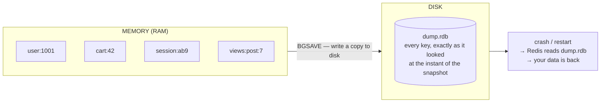
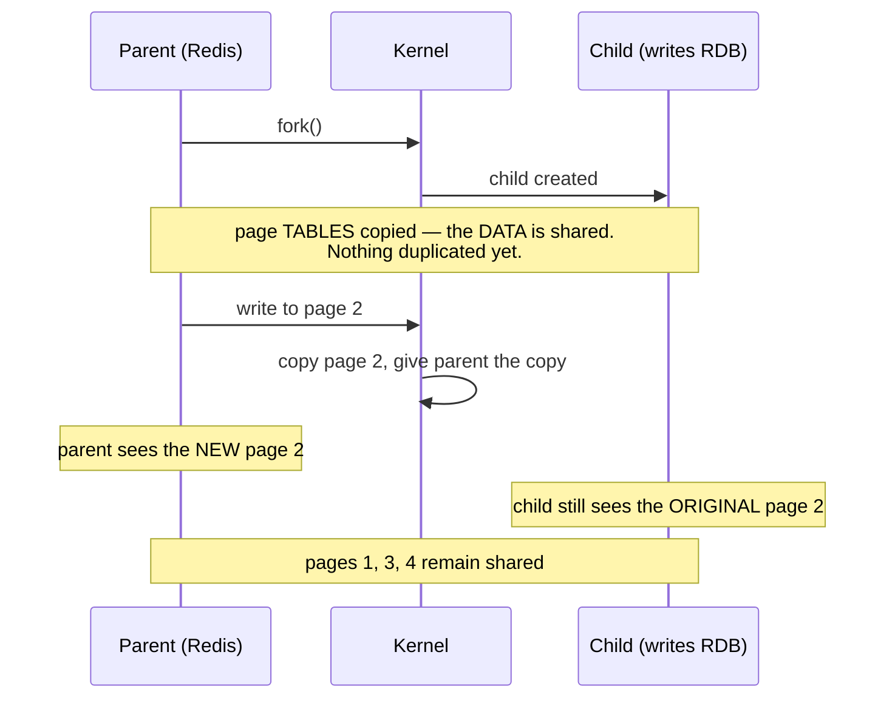

# Module 4.1 — RDB Snapshots & `fork()`

> **Module 4 — Persistence** · [← Index](../../README.md) · Prev → [3.7 Pipelining](../module-03-atomicity-coordination/3.7-pipelining.md)

---

## In one sentence

RDB takes a **point-in-time snapshot** of your whole dataset and writes it to one compact binary file — by forking a child process that gets a frozen view of memory for free, thanks to copy-on-write.

## Problem it solves

Module 3 kept promising this one. Every time atomicity came up, the same caveat appeared: **atomic is not durable** (see [3.1](../module-03-atomicity-coordination/3.1-execution-model-and-atomicity.md)). A command can be perfectly indivisible and still vanish when the power goes out, because Redis lives in RAM.

Persistence is how Redis gets data onto disk so a restart doesn't mean starting from nothing. RDB is the first of the two mechanisms.

The hard part isn't writing a file. It's writing a **consistent** file, of a dataset that is actively changing, **without blocking the single thread** (see [1.3](../module-01-foundations/1.3-single-threaded-model.md)) for the entire duration.

## Mental model

**A photograph, not a video.**

RDB captures exactly what the dataset looked like at one instant. Everything that happens after the shutter closes isn't in the picture — and that gap is the whole trade-off.

Compare with AOF (4.2), which is the video: every change recorded as it happens.



> [!WARNING]
> **The catch: it's a photograph, not a video.** Anything written *after* the snapshot isn't in the file. That gap is the whole trade-off.

## How it works

Two commands produce a snapshot:

```bash
SAVE      # ❌ blocks the ENTIRE server until the file is written. never use in production.
BGSAVE    # ✅ forks a child; the parent keeps serving clients
```

And the automatic trigger, configured with `save <seconds> <changes>`:

```
save 900 1      # snapshot if ≥1 key changed in 900s
save 300 10     # ...or ≥10 keys changed in 300s
save 60 10000   # ...or ≥10000 keys changed in 60s

save ""         # disable RDB entirely
```

Multiple `save` lines are OR'd together — any one triggering fires a `BGSAVE`.

What `BGSAVE` actually does:

1. Redis calls **`fork()`**, creating a child process.
2. The child writes the dataset to a **temporary** file.
3. When finished, the child **atomically renames** it over the old `dump.rdb`.

The parent process never performs disk I/O for the snapshot. It forks and gets back to work.

## The key mechanism: copy-on-write

This is the part worth understanding properly, because it explains both why RDB is fast *and* how it can blow up your memory.



When `fork()` runs, the child does **not** get a copy of the dataset. Parent and child share the exact same physical memory pages. The kernel only duplicates the **page tables** — the index, not the data. That's why forking a 10 GB Redis doesn't need 10 GB of copying.

The pages are marked read-only. Then:

- **If nobody writes**, parent and child keep sharing everything. Zero extra memory.
- **When the parent writes to a page**, the kernel intercepts it, copies *that one page*, and gives the parent the copy. The child keeps the original.

So the child sees a **frozen, consistent view** of memory as of the instant of the fork — without anything being copied up front, and without the parent having to pause.

That's copy-on-write, and it's the entire trick behind Redis snapshotting.

## The cost: memory can spike

Every page the parent modifies during the snapshot gets duplicated. So:

- **Read-heavy workload** → almost no extra memory. The pages stay shared.
- **Write-heavy workload** → in the worst case, *every* page gets touched and you approach **2× the dataset size** in RAM while the snapshot runs.

This is the classic way a Redis box gets OOM-killed during a `BGSAVE` that worked fine in staging.

### Two kernel settings that matter

**1. `vm.overcommit_memory = 1`**

Redis will log a warning if this isn't set:

```
WARNING overcommit_memory is set to 0! Background save may fail under low
memory condition. To fix this issue add 'vm.overcommit_memory = 1' to /etc/sysctl.conf
```

With the default `0`, the kernel refuses a `fork()` when it can't guarantee the theoretical worst case (2× memory) — even though copy-on-write means that's almost never actually needed. Setting `1` lets the fork succeed.

```bash
echo 'vm.overcommit_memory = 1' >> /etc/sysctl.conf
sysctl vm.overcommit_memory=1
```

**2. Disable Transparent Huge Pages (THP)**

THP makes the kernel use **2 MB pages** instead of 4 KB ones. Under copy-on-write that's a disaster: changing a single byte forces the kernel to copy a whole 2 MB page instead of 4 KB — up to **500× amplification** in copied memory, plus latency spikes.

```bash
echo never > /sys/kernel/mm/transparent_hugepage/enabled
```

These two settings are the most common cause of "Redis was fine until it forked."

## The trade-off: your data-loss window

```
config:  save 300 10   →   snapshot every 5 min if ≥10 keys changed

   ┌──────── safe: this is in dump.rdb ────────┐  ┌── LOST ──┐
   │                                           │  │ ● ● ● ●  │   ← writes after 12:10
   ───┬───────────────┬───────────────┬────────────────────┬──►  time
      │               │               │                    │
   snapshot        snapshot        snapshot              CRASH
    12:00           12:05           12:10                12:13
```

Everything written **since the last snapshot** is gone if the process dies. With `save 300 10`, that's up to five minutes of writes.

That isn't a flaw — it's the deliberate trade. RDB buys you a compact file and near-zero runtime cost, and charges you a data-loss window. If that window is unacceptable, you need AOF (4.2).

## Basic example

```bash
redis-cli BGSAVE
# → Background saving started

redis-cli LASTSAVE                    # unix timestamp of the last successful save
redis-cli INFO persistence            # the section that actually matters
```

Fields worth knowing from `INFO persistence`:

```
rdb_bgsave_in_progress:0              # is a snapshot running right now?
rdb_last_bgsave_status:ok             # ← if this says "err", your backups are silently broken
rdb_last_save_time:1735689600
rdb_changes_since_last_save:42        # unsaved writes sitting in memory
rdb_last_cow_size:1048576             # how much memory COW actually cost last time
```

`rdb_last_bgsave_status` is the one to alert on. A failing `BGSAVE` doesn't stop Redis serving traffic — you just quietly stop having backups.

## Configuration reference

```
save 300 10                  # snapshot triggers (multiple lines allowed)
dbfilename dump.rdb          # file name
dir /var/lib/redis           # directory — RDB and AOF both live here
rdbcompression yes           # LZF-compress strings; small CPU cost, much smaller file
rdbchecksum yes              # CRC64 at the end; ~10% cost on load, detects corruption
stop-writes-on-bgsave-error yes   # refuse writes if snapshots are failing
```

**`stop-writes-on-bgsave-error`** is worth a thought. Default `yes` means a failed snapshot makes Redis reject writes — loud and safe. Set it to `no` and Redis keeps accepting writes with no working persistence, which is quieter and much more dangerous.

## Important details and edge cases

- **`SAVE` blocks everything.** It's the synchronous version and has essentially no production use. `BGSAVE` is the one you want.
- **`fork()` itself is not free.** It's fast relative to copying data, but on a very large dataset it can stall the server for **milliseconds to a second** while page tables are copied. On huge instances this shows up as a periodic latency spike.
- **RDB files are immutable once written.** Redis writes to a temp file then renames, so **copying `dump.rdb` while Redis is running is completely safe** — which makes backups trivial.
- **Replicas use RDB too.** A full resync ships an RDB from primary to replica (Module 6).
- **A shutdown via `SHUTDOWN` saves first**; `SHUTDOWN NOSAVE` doesn't. Recall from [3.5](../module-03-atomicity-coordination/3.5-lua-scripting.md) that `SHUTDOWN NOSAVE` is your only escape from a runaway script that has already written — and now you can see exactly what it costs you.
- **Redis won't run a `BGSAVE` and an AOF rewrite simultaneously** (since 2.4) — both are fork-and-write-heavy, so it serialises them.
- **If both RDB and AOF are enabled, AOF wins on restart**, because it's more complete.
- **`DEBUG RELOAD`** saves and reloads from RDB — a handy way to verify your snapshot actually round-trips.

## When to use it

- **Backups and disaster recovery** — one compact file, easy to ship to S3 or another datacentre.
- **Faster restarts** on large datasets: loading an RDB beats replaying an AOF.
- **Caches and derived data** where losing a few minutes is genuinely fine.
- **Replication** — it's the mechanism for full resync regardless of your choice.

## When not to use it (alone)

- **When minutes of data loss is unacceptable** → add AOF.
- **Very large datasets on weak CPUs** where fork pauses hurt your latency budget.
- **Write-heavy workloads on memory-tight boxes** — the COW spike is a real OOM risk.

## Comparison with related concepts

| | RDB | AOF (4.2) |
|---|---|---|
| What it stores | point-in-time **snapshot** | **log of every write** |
| Worst-case loss | minutes | 1 second (default) |
| File size | compact | larger |
| Restart speed | **fast** | slower (replay) |
| Runtime cost | periodic fork | continuous append + fsync |
| Good for backups | **yes** | awkward (multi-file since 7.0) |

The docs' own recommendation: use **both** if you want durability comparable to a traditional database. RDB alone is fine if you can live with minutes of loss. AOF alone is discouraged — you lose the easy backups and fast restarts.

## Common misunderstandings

- ❌ "`fork()` copies all the memory." → It copies page tables. Data is shared until written.
- ❌ "`BGSAVE` doesn't affect the parent at all." → The fork can pause it briefly, and COW can double memory.
- ❌ "RDB means my data is safe." → Only up to the last snapshot.
- ❌ "Copying `dump.rdb` while Redis runs could corrupt it." → It's safe; the file is never modified in place.
- ❌ "If `BGSAVE` fails I'll notice." → Not unless you're watching `rdb_last_bgsave_status`.
- ❌ "THP is a performance feature, so it'll help." → For Redis it's actively harmful. Turn it off.

## Production example

A 40 GB Redis with `save 60 10000` on a 64 GB box. It runs fine for months. Then a bulk import starts touching most of the keyspace, a `BGSAVE` fires mid-import, copy-on-write duplicates a large fraction of the pages, memory climbs past 64 GB, and the OOM killer takes Redis down — losing everything since the last snapshot.

The fixes are all boring: `vm.overcommit_memory = 1`, THP off, keep `maxmemory` well under physical RAM so there's headroom for the fork, and alert on `rdb_last_bgsave_status`.

## Quick revision

- RDB = **point-in-time snapshot** → one compact `dump.rdb`.
- `BGSAVE` forks; `SAVE` blocks everything (don't).
- `save <sec> <changes>`, multiple lines OR'd; `save ""` disables.
- **Copy-on-write:** fork shares pages, copies only what the parent writes. Child gets a frozen consistent view for free.
- **Cost:** write-heavy + snapshot → up to **2× memory**. Set `vm.overcommit_memory = 1` and **disable THP** (else 500× COW amplification).
- **Loss window = time since last snapshot.**
- Safe to copy `dump.rdb` while running (written to temp, then renamed).
- Watch `rdb_last_bgsave_status` — a failing snapshot is silent.

## Self-test questions

1. Why is `fork()` cheap even on a 10 GB dataset? What does the kernel actually copy?
2. How does the child get a consistent view of the data without the parent pausing?
3. Under what workload does `BGSAVE` roughly double your memory, and why?
4. What does `vm.overcommit_memory = 1` fix, and what breaks without it?
5. Why does Transparent Huge Pages make copy-on-write dramatically worse? Give the rough factor.
6. Your box has `save 300 10` and crashes at 12:09 with the last snapshot at 12:05. What's lost?
7. Is it safe to `cp dump.rdb` while Redis is serving traffic? Why?
8. Which `INFO persistence` field tells you your backups are silently broken?
9. When would you choose RDB alone, and when is that the wrong call?

## References

- [Redis persistence](https://redis.io/docs/latest/operate/oss_and_stack/management/persistence/)
- [BGSAVE](https://redis.io/docs/latest/commands/bgsave/)
- [Redis administration (kernel tuning)](https://redis.io/docs/latest/operate/oss_and_stack/management/admin/)
