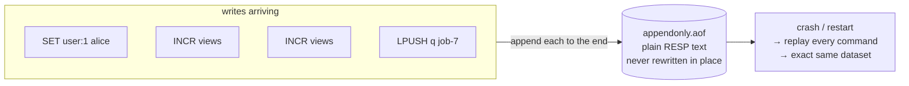
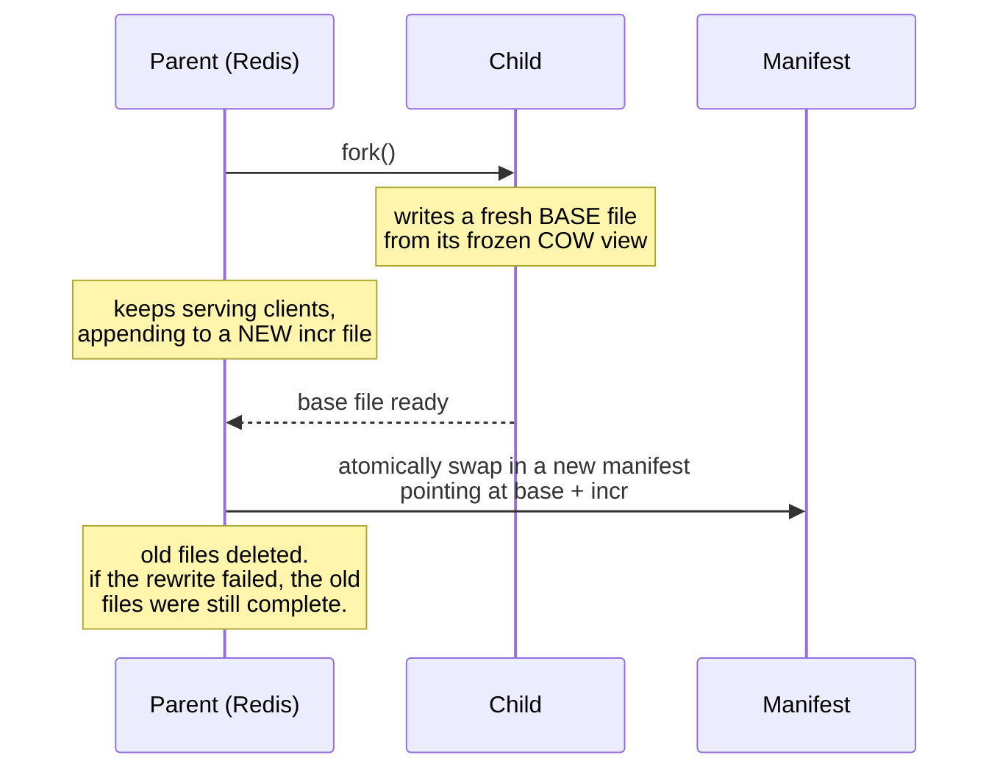

# Module 4.2 — AOF & fsync Policies

> **Module 4 — Persistence** · [← Index](../../README.md) · Prev → [4.1 RDB snapshots and fork()](./4.1-rdb-snapshots-and-fork.md)

---

## In one sentence

The AOF (Append-Only File) records **every write command as it happens**, so a restart replays the log and rebuilds the exact dataset — cutting the worst-case data loss from *minutes* down to about *one second*.

## Problem it solves

[4.1](./4.1-rdb-snapshots-and-fork.md) ended on an uncomfortable number. With `save 300 10`, a crash costs you **up to five minutes of writes**. Everything since the last photograph is gone.

For a cache, fine. For anything a user would notice losing, not fine.

The AOF closes that gap by changing what gets stored: instead of periodically capturing the *result*, it continuously records the *actions*.

## Mental model

**RDB is a photograph. The AOF is the video.**

A snapshot captures one instant. The AOF captures the whole sequence — so you can replay it and arrive at exactly the same place.



The log is **plain text in RESP format** (see [1.4](../module-01-foundations/1.4-resp-protocol.md)) — the same encoding clients use. You can literally `cat` the file and read your own commands back.

## How it works

Turn it on:

```
appendonly yes
```

From then on, every command that **changes** the dataset gets appended to the file. Reads aren't logged — there's nothing to replay.

On startup, Redis replays the whole file to rebuild state. If both RDB and AOF are enabled, **AOF wins**, because it's the more complete record.

## The part that actually matters: `appendfsync`

Here's the thing most people miss. **Appending to the file does not mean the data is on disk.**

When Redis calls `write()`, the data lands in the **OS page cache** — which is still RAM. It only reaches the physical disk when someone calls `fsync()`. Pull the power in between and that data is gone, even though Redis "wrote" it.

```
   Redis  ──write()──▶  OS page cache  ──fsync()──▶  physical disk
                        (STILL RAM!)                  (durable)
                             ▲
                             └── power cut here = this data is LOST
```

`appendfsync` controls how often that `fsync()` happens, and it's the entire durability dial.

| Policy | What it does | Worst-case loss | Speed |
|---|---|---|---|
| `always` | fsync on every batch of writes | **~nothing** | slowest |
| `everysec` | fsync once per second — **the default** | **up to 1 second** | fast |
| `no` | never fsync; the OS decides (~30s on Linux) | **up to ~30 seconds** | fastest |

> [!TIP]
> **Use `everysec`.** It's the default for good reason: near-RDB performance, and your worst case is one second instead of minutes.

`always` is genuinely slow — reserve it for data where losing a single write is unacceptable. (It does group-commit: a batch of commands from multiple clients or a pipeline becomes one write and one fsync.)

`no` gives you AOF's file format with none of AOF's durability, which is rarely what anyone actually wants.

## The rewrite: stopping the log growing forever

The AOF has an obvious problem. `INCR views` a hundred times and you get **a hundred lines** describing **one key**. The file grows without bound, and a restart replays every redundant entry.

The fix is a **rewrite**: Redis writes the shortest sequence of commands needed to reproduce the current dataset. Those hundred `INCR`s become a single `SET views 100`.

Triggered manually with `BGREWRITEAOF`, or automatically:

```
auto-aof-rewrite-percentage 100    # rewrite when the file is 100% bigger than after the last one
auto-aof-rewrite-min-size 64mb     # ...but never bother below 64mb
```

Both conditions must hold, which stops it thrashing on a tiny file.

### Multi-part AOF (Redis 7.0+)

Since 7.0 the AOF isn't one file — it's a **directory** (`appenddirname`, default `appendonlydir`) holding:

| File | Holds |
|---|---|
| `.base.rdb` | a snapshot of everything as of the last rewrite (RDB format by default) |
| `.incr.aof` | every write since then, appended live |
| `.manifest` | the index saying which files currently count |

The rewrite uses the same `fork()` + copy-on-write trick as [4.1](./4.1-rdb-snapshots-and-fork.md):



## Hands-on demos

> Run these once before relying on them — written from the command semantics, not captured from a live session.

### Demo 1 — read your own AOF

The best demo in the set, because it demystifies the whole thing.

```bash
redis-cli CONFIG SET appendonly yes
redis-cli SET user:1 alice
redis-cli INCR views
redis-cli INCR views

redis-cli CONFIG GET dir
redis-cli CONFIG GET appenddirname

cat appendonlydir/*.incr.aof
```

You'll see your commands in RESP:

```
*3
$3
SET
$6
user:1
$5
alice
*2
$4
INCR
$5
views
```

**That's the whole file format** — the same protocol from [1.4](../module-01-foundations/1.4-resp-protocol.md).

### Demo 2 — watch it grow, then shrink

```bash
# hammer one key
for i in $(seq 1 10000); do echo "INCR counter"; done | redis-cli --pipe

ls -la appendonlydir/                    # incr file has ballooned
wc -l appendonlydir/*.incr.aof           # thousands of lines for ONE key

redis-cli BGREWRITEAOF
sleep 2
ls -la appendonlydir/                    # a fresh, tiny base file
```

Ten thousand `INCR`s collapse into a single value.

### Demo 3 — the durability difference (the money demo)

Two runs, same brutal ending.

**Run A — RDB only:**

```bash
redis-server --save "900 1" --appendonly no --dir /tmp/rdbtest &
redis-cli SET important "do not lose me"
redis-cli GET important                  # → "do not lose me"

kill -9 $(pgrep -f "dir /tmp/rdbtest")   # hard kill, no clean shutdown

redis-server --dir /tmp/rdbtest &
redis-cli GET important                  # → (nil)   ← GONE
```

No snapshot had fired yet, so the write never reached disk.

**Run B — AOF on:**

```bash
redis-server --appendonly yes --dir /tmp/aoftest &
redis-cli SET important "do not lose me"

kill -9 $(pgrep -f "dir /tmp/aoftest")

redis-server --appendonly yes --dir /tmp/aoftest &
redis-cli GET important                  # → "do not lose me"   ← SURVIVED
```

Same crash. Completely different outcome. `kill -9` is the right tool — it denies Redis any chance to shut down cleanly, which is what a power cut looks like.

### Demo 4 — prove `everysec` really is a 1-second window

```bash
redis-server --appendonly yes --appendfsync everysec --dir /tmp/fsynctest &

for i in $(seq 1 100000); do echo "SET k:$i $i"; done | redis-cli --pipe &
sleep 2
kill -9 $(pgrep -f "dir /tmp/fsynctest")

redis-server --appendonly yes --dir /tmp/fsynctest &
redis-cli DBSIZE      # slightly fewer keys than were sent — that's the fsync window
```

You lose the tail, not the dataset. Contrast with Demo 3's Run A, where you lose *everything*.

### Demo 5 — inspect and validate

```bash
redis-cli INFO persistence | grep aof_
```

```
aof_enabled:1
aof_rewrite_in_progress:0
aof_last_bgrewrite_status:ok      # ← alert on this
aof_last_write_status:ok          # ← and this
aof_base_size:1024
aof_current_size:5120             # compare these two to see rewrite pressure
```

```bash
redis-check-aof appendonlydir/appendonly.aof.1.incr.aof
redis-check-aof --fix <file>      # only if actually corrupted
```

## Important details and edge cases

> [!WARNING]
> **Switching to AOF on a live server must be done with `CONFIG SET`, not by editing the config and restarting.** The docs are emphatic: changing the file and restarting **can lose data**.
> ```bash
> redis-cli CONFIG SET appendonly yes
> redis-cli CONFIG REWRITE      # persist it, or the setting vanishes on restart
> ```

- **A truncated AOF is recoverable.** If the process died mid-write, the last command may be incomplete. `aof-load-truncated yes` (the default) discards that final partial command and loads anyway, logging a warning. A *corrupted* file — bad bytes in the middle — needs `redis-check-aof`.
- **AOF files are bigger than RDB**, and restarts are slower because Redis replays commands rather than loading a compact dump.
- **Redis won't run a `BGSAVE` and an AOF rewrite at the same time** — both are fork-heavy, so it serialises them.
- **Backups are fiddlier than RDB.** Copying the directory mid-rewrite can produce an invalid backup. Disable rewrites (`CONFIG SET auto-aof-rewrite-percentage 0`), confirm `aof_rewrite_in_progress:0`, copy, then re-enable.
- **`appendfsync always` doesn't mean one fsync per command** — commands from a batch or pipeline are appended and fsynced together, before replies are sent.
- **AOF alone is discouraged** by the docs — you lose RDB's easy backups and fast restarts. Run both.

## When to use it

- **Any dataset where minutes of loss is unacceptable** — sessions, carts, queues, counters that feed billing.
- **When you want a readable audit trail** of recent writes.
- **Alongside RDB**, which is the recommended production setup.

## When not to use it

- **Pure caches** where the data is rebuildable and loss is free.
- **When restart speed is critical** on a huge dataset — replaying an AOF is slower than loading an RDB.
- **When disk I/O is your bottleneck** and you genuinely can't afford the continuous append.

## Comparison with related concepts

| | RDB ([4.1](./4.1-rdb-snapshots-and-fork.md)) | AOF |
|---|---|---|
| Stores | point-in-time **snapshot** | **log of every write** |
| Worst-case loss | minutes | **1 second** (`everysec`) |
| File size | compact | larger |
| Restart speed | **fast** | slower (replay) |
| Human-readable | ❌ binary | ✅ RESP text |
| Backups | **trivial** (one immutable file) | fiddlier (multi-file, rewrites) |
| Runtime cost | periodic fork | continuous append + fsync |

**The recommendation from the docs: run both.** RDB for backups and fast restarts, AOF for the small loss window. That's 4.3.

## Common misunderstandings

- ❌ "AOF means zero data loss." → Only with `always`. The default `everysec` still risks ~1 second.
- ❌ "Once Redis appends to the AOF, it's on disk." → It's in the **OS page cache** until `fsync()`. That gap is the whole point of `appendfsync`.
- ❌ "The AOF stores my data." → It stores the **commands**. State is rebuilt by replaying them.
- ❌ "The AOF grows forever." → Rewrites compact it; `INCR` ×100 becomes one `SET`.
- ❌ "I can enable AOF by editing redis.conf and restarting." → That can lose data. Use `CONFIG SET` then `CONFIG REWRITE`.
- ❌ "A half-written AOF is unrecoverable." → `aof-load-truncated` handles the common case automatically.

## Production example

A session store where users get logged out on every deploy. Investigation shows RDB-only persistence with `save 900 1` — so a restart within 15 minutes of the last snapshot discards every session created since.

The fix is `appendonly yes` with `everysec`. Worst case becomes one second of sessions instead of fifteen minutes, and the rewrite keeps the file from growing unbounded. RDB stays on for nightly backups.

## Quick revision

- AOF = **log of every write command**, plain RESP text. Replayed on restart.
- **`appendfsync` is the durability dial:** `always` (~0 loss, slow) · **`everysec` (≤1s, default, use this)** · `no` (~30s, fastest).
- Appending ≠ on disk. Data sits in the **OS page cache** until `fsync()`.
- **Rewrite** compacts the log: `BGREWRITEAOF`, or auto at `auto-aof-rewrite-percentage 100` + `auto-aof-rewrite-min-size 64mb`.
- **7.0+ multi-part AOF:** `.base.rdb` + `.incr.aof` + `.manifest` in `appenddirname`.
- Enable on a live server with **`CONFIG SET appendonly yes` + `CONFIG REWRITE`** — never by editing the file and restarting.
- If both RDB and AOF are on, **AOF is used on restart**.
- Watch `aof_last_bgrewrite_status` and `aof_last_write_status`.

## Self-test questions

1. What does the AOF actually store, and how is that different from what RDB stores?
2. Redis has appended a command to the AOF. Is it safe from a power cut? Explain.
3. Name the three `appendfsync` policies with their worst-case loss, and say which you'd pick.
4. Why does the AOF need rewriting? Give the `INCR` example.
5. What are the three kinds of file in a Redis 7 AOF directory, and what does each hold?
6. How does a rewrite avoid blocking the server, and what happens if it fails halfway?
7. Why is editing `redis.conf` and restarting the wrong way to enable AOF?
8. Your AOF's last command is half-written after a crash. Does Redis start? What setting decides?
9. Both RDB and AOF are enabled. Which is used on restart, and why?

## References

- [Redis persistence](https://redis.io/docs/latest/operate/oss_and_stack/management/persistence/)
- [BGREWRITEAOF](https://redis.io/docs/latest/commands/bgrewriteaof/)
- [RESP protocol](https://redis.io/docs/latest/develop/reference/protocol-spec/)
